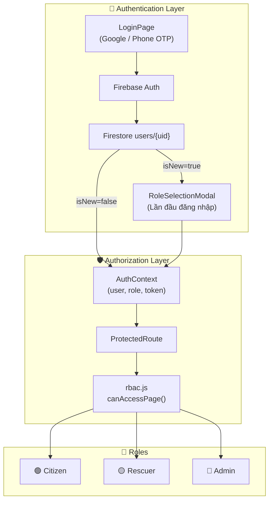
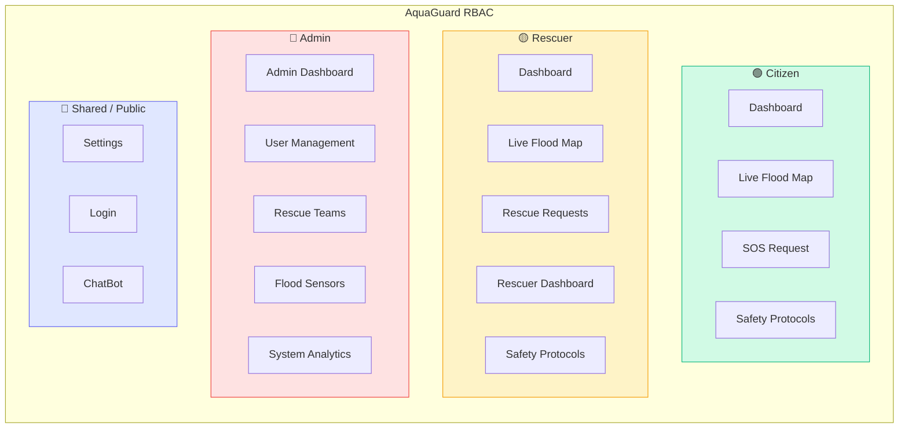
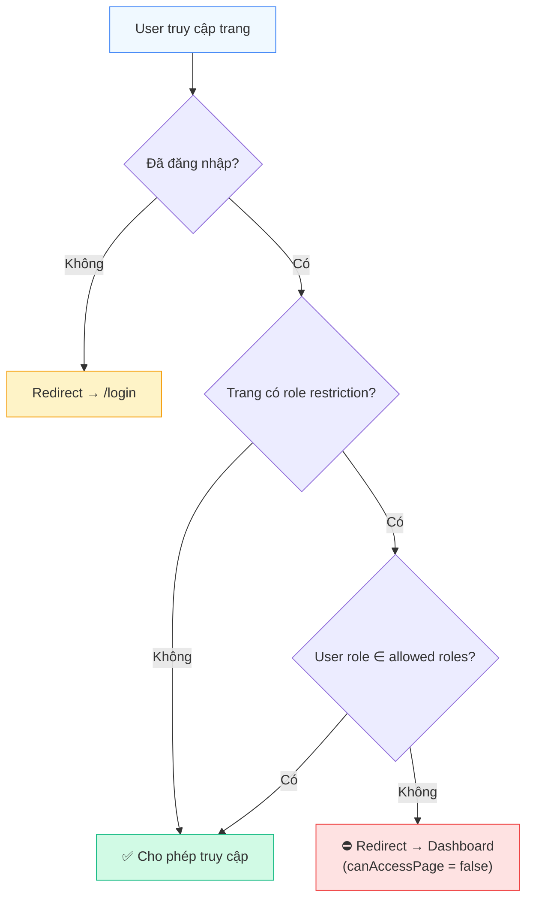
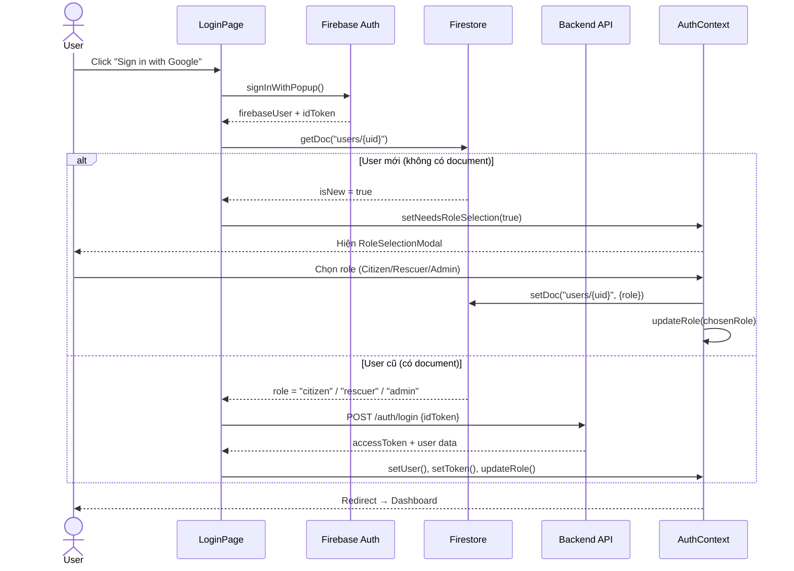
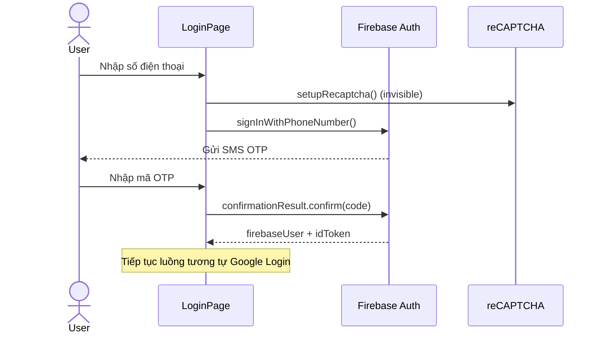
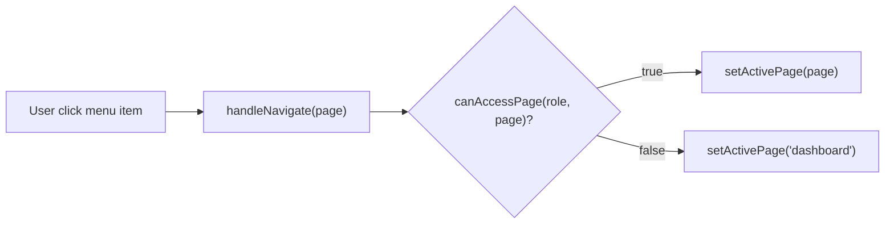

# 📘 AquaGuard WebApp — Tài liệu tổng hợp dự án

> **Phiên bản:** 1.0.0  
> **Ngày cập nhật:** 21/03/2026  
> **Công nghệ:** React 19 + Vite 6 + Firebase + Leaflet + TailwindCSS 4

---

## 📑 Mục lục

1. [Tổng quan dự án](#1-tổng-quan-dự-án)
2. [Công nghệ sử dụng](#2-công-nghệ-sử-dụng)
3. [Cấu trúc thư mục](#3-cấu-trúc-thư-mục)
4. [Hệ thống phân quyền RBAC](#4-hệ-thống-phân-quyền-rbac)
5. [Sơ đồ phân quyền RBAC](#5-sơ-đồ-phân-quyền-rbac)
6. [Luồng xác thực (Authentication Flow)](#6-luồng-xác-thực-authentication-flow)
7. [Chi tiết các trang theo Role](#7-chi-tiết-các-trang-theo-role)
8. [Danh sách Components](#8-danh-sách-components)
9. [Cấu hình Firebase](#9-cấu-hình-firebase)
10. [Routing & Navigation](#10-routing--navigation)

---

## 1. Tổng quan dự án

**AquaGuard** là một ứng dụng web quản lý thiên tai lũ lụt, cung cấp:
- 🗺️ Bản đồ lũ lụt trực tiếp (Live Flood Map) với dữ liệu từ Firebase Firestore
- 🆘 Hệ thống gửi yêu cầu cứu hộ SOS
- 🚑 Dashboard quản lý đội cứu hộ
- 🛡️ Giao thức an toàn (Safety Protocols)
- 💬 Chatbot hỗ trợ
- 📊 Bảng điều khiển cho Admin quản lý hệ thống
- 🌤️ Overlay thời tiết trên bản đồ (OpenWeatherMap)

---

## 2. Công nghệ sử dụng

| Công nghệ | Phiên bản | Mô tả |
|---|---|---|
| **React** | 19.0.0 | UI Framework |
| **Vite** | 6.0.0 | Build tool & dev server |
| **Firebase** | 12.10.0 | Auth (Google, Phone OTP) + Firestore DB |
| **Leaflet** | 1.9.4 | Bản đồ tương tác |
| **React Leaflet** | 5.0.0 | Leaflet wrapper cho React |
| **React Router DOM** | 7.13.1 | Routing SPA |
| **TailwindCSS** | 4.0.0 | CSS utility-first framework |

---

## 3. Cấu trúc thư mục

```
AquaGuard-WebApp/
├── index.html                    # Entry HTML
├── package.json                  # Dependencies & scripts
├── vite.config.js                # Vite configuration
├── vercel.json                   # Vercel deployment config
├── .env                          # Environment variables (Firebase keys)
├── public/                       # Static assets
├── dist/                         # Production build output
└── src/
    ├── main.jsx                  # React entry point
    ├── App.jsx                   # Root component + Routing
    ├── index.css                 # Global styles
    ├── config/
    │   ├── firebase.js           # Firebase initialization (lazy)
    │   └── rbac.js               # RBAC roles, permissions, nav config
    ├── contexts/
    │   └── AuthContext.jsx        # Authentication state management
    ├── pages/
    │   ├── LoginPage.jsx          # Trang đăng nhập (Google + Phone OTP)
    │   ├── Dashboard.jsx          # Layout chính + page routing
    │   ├── DashboardHome.jsx      # Trang chủ dashboard
    │   ├── UnauthorizedPage.jsx   # Trang không có quyền truy cập
    │   ├── RescueRequestPage.jsx  # Yêu cầu cứu hộ
    │   ├── SafetyProtocolPage.jsx # Giao thức an toàn
    │   ├── ReportsPage.jsx        # Tin tức & cảnh báo
    │   ├── SettingsPage.jsx       # Cài đặt (Profile, Family, Theme)
    │   ├── AboutUsPage.jsx        # Giới thiệu
    │   ├── admin/
    │   │   └── AdminDashboard.jsx # Dashboard Admin (multi-tab)
    │   ├── citizen/
    │   │   └── CitizenSOSPage.jsx # Trang SOS cho Citizen
    │   └── rescuer/
    │       └── RescuerDashboard.jsx # Dashboard cho Rescuer
    └── components/
        ├── auth/
        │   ├── ProtectedRoute.jsx      # Route guard (auth + role check)
        │   └── RoleSelectionModal.jsx   # Modal chọn role lần đầu
        ├── layout/
        │   ├── Sidebar.jsx             # Sidebar navigation (desktop)
        │   ├── Header.jsx              # Header cho Map view
        │   ├── MobileHeader.jsx        # Header mobile
        │   ├── MobileBottomNav.jsx     # Bottom nav bar mobile
        │   └── RightPanel.jsx          # Panel phải (alerts, info)
        ├── map/
        │   ├── FloodMap.jsx            # Bản đồ lũ lụt chính
        │   ├── AdminFloodMapEditor.jsx # Editor bản đồ cho Admin
        │   ├── MapControls.jsx         # Điều khiển bản đồ
        │   ├── MapLegend.jsx           # Chú thích bản đồ
        │   └── MapPin.jsx              # Pin marker trên bản đồ
        ├── dashboard/
        │   ├── DashboardAlerts.jsx     # Cảnh báo trên dashboard
        │   ├── DashboardQuickActions.jsx # Quick actions
        │   ├── StatsOverview.jsx       # Thống kê tổng quan
        │   └── StatusCard.jsx          # Card trạng thái
        ├── chat/
        │   └── ChatBot.jsx             # Chatbot hỗ trợ
        ├── actions/
        │   ├── QuickActions.jsx        # Hành động nhanh
        │   └── EmergencySupport.jsx    # Hỗ trợ khẩn cấp
        ├── alerts/
        │   ├── ActiveAlerts.jsx        # Cảnh báo đang hoạt động
        │   └── AlertCard.jsx           # Card cảnh báo
        ├── reports/
        │   ├── FloodNewsFeed.jsx       # Feed tin tức lũ lụt
        │   └── ReportIssueForm.jsx     # Form báo cáo sự cố
        ├── rescue/
        │   ├── RescueRequestCard.jsx   # Card yêu cầu cứu hộ
        │   └── RescueRequestForm.jsx   # Form yêu cầu cứu hộ
        ├── safety/
        │   ├── SafetyGuides.jsx        # Hướng dẫn an toàn
        │   └── EmergencyContacts.jsx   # Liên hệ khẩn cấp
        ├── common/
        │   └── ImageCarousel.jsx       # Carousel ảnh
        └── logo/
            ├── 1.png, 2.png
            ├── AG-2.png, AG-4.png
            ├── dark_mode_logo.png
            └── light_mode_logo.png
```

---

## 4. Hệ thống phân quyền RBAC

### 4.1. Định nghĩa Roles

Hệ thống có **3 vai trò (roles)** chính, được định nghĩa trong `src/config/rbac.js`:

| Role | Giá trị | Tên hiển thị | Mô tả |
|---|---|---|---|
| 🟢 **Citizen** | `"citizen"` | Citizen | Người dân — user mặc định |
| 🟡 **Rescuer** | `"rescuer"` | Rescue Team | Đội cứu hộ |
| 🔴 **Admin** | `"admin"` | System Administrator | Quản trị viên hệ thống |

### 4.2. Ma trận phân quyền trang (Page Access Matrix)

| Trang (Page) | Citizen | Rescuer | Admin | Mobile Nav |
|---|:---:|:---:|:---:|:---:|
| **Dashboard** | ✅ | ✅ | ❌ | ✅ |
| **Live Flood Map** | ✅ | ✅ | ❌ | ✅ |
| **SOS Request** | ✅ | ❌ | ❌ | ✅ |
| **Rescue Requests** | ❌ | ✅ | ❌ | ✅ |
| **Rescuer Dashboard** | ❌ | ✅ | ❌ | ❌ |
| **Safety Protocols** | ✅ | ✅ | ❌ | ✅ |
| **News & Alerts** | ❌ | ❌ | ❌ | ❌ |
| **About Us** | ❌ | ❌ | ❌ | ❌ |
| **Admin Dashboard** | ❌ | ❌ | ✅ | ✅ |
| **User Management** | ❌ | ❌ | ✅ | ✅ |
| **Rescue Teams** | ❌ | ❌ | ✅ | ❌ |
| **Flood Sensors** | ❌ | ❌ | ✅ | ❌ |
| **System Analytics** | ❌ | ❌ | ✅ | ❌ |
| **Settings** | ✅ | ✅ | ✅ | — |
| **Login** | 🔓 | 🔓 | 🔓 | — |

> **Ghi chú:**  
> - 🔓 = Trang công khai (không cần đăng nhập)  
> - "News & Alerts" và "About Us" hiện đang ẩn khỏi navigation (`roles: []`)  
> - Settings truy cập qua Sidebar, không nằm trong mobile nav

### 4.3. Các hàm RBAC chính

| Hàm | Mô tả |
|---|---|
| `getNavItemsForRole(role)` | Lấy danh sách menu sidebar theo role |
| `getMobileNavItemsForRole(role)` | Lấy menu mobile bottom nav (tối đa 5 items) |
| `canAccessPage(role, page)` | Kiểm tra role có quyền truy cập page không |
| `getRoleLabel(role)` | Lấy tên hiển thị cho role |
| `getRoleBadgeClasses(role)` | Lấy CSS classes cho badge role |

---

## 5. Sơ đồ phân quyền RBAC

### 5.1. Sơ đồ tổng quan hệ thống RBAC



### 5.2. Sơ đồ phân quyền theo Role



### 5.3. Luồng kiểm tra quyền truy cập



---

## 6. Luồng xác thực (Authentication Flow)

### 6.1. Đăng nhập bằng Google



### 6.2. Đăng nhập bằng Phone OTP



### 6.3. Quản lý Session

| Thành phần | Lưu trữ | Mô tả |
|---|---|---|
| `aquaguard_token` | `localStorage` | JWT token hoặc Firebase idToken |
| `aquaguard_role` | `localStorage` | Role hiện tại của user |
| `aquaguard_user` | `localStorage` | Profile cơ bản (uid, name, email, avatar) |
| `onAuthStateChanged` | Firebase SDK | Tự động khôi phục session khi reload |

---

## 7. Chi tiết các trang theo Role

### 7.1. 🟢 Citizen (Người dân)

| Trang | Component | Chức năng |
|---|---|---|
| Dashboard | `DashboardHome.jsx` | Tổng quan tình hình lũ lụt, thống kê, cảnh báo, quick actions |
| Live Flood Map | `FloodMap.jsx` | Xem bản đồ lũ lụt realtime với markers từ Firestore |
| SOS Request | `CitizenSOSPage.jsx` | Gửi yêu cầu cứu hộ khẩn cấp |
| Safety Protocols | `SafetyProtocolPage.jsx` | Xem hướng dẫn an toàn và liên hệ khẩn cấp |
| Settings | `SettingsPage.jsx` | Quản lý profile, gia đình, giao diện (dark/light) |

### 7.2. 🟡 Rescuer (Đội cứu hộ)

| Trang | Component | Chức năng |
|---|---|---|
| Dashboard | `DashboardHome.jsx` | Tổng quan tình hình (chung với Citizen) |
| Live Flood Map | `FloodMap.jsx` | Xem bản đồ lũ lụt, vị trí cần cứu hộ |
| Rescue Requests | `RescueRequestPage.jsx` | Xem và xử lý yêu cầu cứu hộ từ Citizens |
| Rescuer Dashboard | `RescuerDashboard.jsx` | Dashboard riêng cho đội cứu hộ |
| Safety Protocols | `SafetyProtocolPage.jsx` | Giao thức an toàn |
| Settings | `SettingsPage.jsx` | Cài đặt cá nhân |

### 7.3. 🔴 Admin (Quản trị viên)

| Trang | Component | Chức năng |
|---|---|---|
| Admin Dashboard | `AdminDashboard.jsx` | Bảng điều khiển tổng hợp (multi-tab) |
| User Management | `AdminDashboard.jsx` (tab) | Quản lý người dùng hệ thống |
| Rescue Teams | `AdminDashboard.jsx` (tab) | Quản lý đội cứu hộ |
| Flood Sensors | `AdminDashboard.jsx` (tab) | Quản lý cảm biến lũ lụt |
| System Analytics | `AdminDashboard.jsx` (tab) | Phân tích & thống kê hệ thống |
| Settings | `SettingsPage.jsx` | Cài đặt cá nhân |

> **Lưu ý:** Admin sử dụng `AdminDashboard.jsx` là component multi-tab duy nhất, nhận `activePage` prop để hiển thị tab tương ứng.

---

## 8. Danh sách Components

### 8.1. Phân loại theo chức năng

| Nhóm | Components | Mô tả |
|---|---|---|
| **auth** | `ProtectedRoute`, `RoleSelectionModal` | Bảo vệ route & chọn role |
| **layout** | `Sidebar`, `Header`, `MobileHeader`, `MobileBottomNav`, `RightPanel` | Layout & navigation |
| **map** | `FloodMap`, `AdminFloodMapEditor`, `MapControls`, `MapLegend`, `MapPin` | Bản đồ & map controls |
| **dashboard** | `DashboardAlerts`, `DashboardQuickActions`, `StatsOverview`, `StatusCard` | Widgets trên dashboard |
| **chat** | `ChatBot` | Chatbot hỗ trợ |
| **actions** | `QuickActions`, `EmergencySupport` | Hành động nhanh |
| **alerts** | `ActiveAlerts`, `AlertCard` | Cảnh báo |
| **reports** | `FloodNewsFeed`, `ReportIssueForm` | Tin tức & báo cáo |
| **rescue** | `RescueRequestCard`, `RescueRequestForm` | Cứu hộ |
| **safety** | `SafetyGuides`, `EmergencyContacts` | An toàn |
| **common** | `ImageCarousel` | UI tái sử dụng |

---

## 9. Cấu hình Firebase

### 9.1. Khởi tạo (Lazy Initialization)

Firebase được khởi tạo **lazy** trong `src/config/firebase.js` — chỉ tạo instance khi cần:

```javascript
// Các hàm getter - lazy init
getFirebaseApp()    // Firebase App instance
getFirebaseAuth()   // Firebase Auth instance
getGoogleProvider() // Google Auth Provider
getFirebaseDb()     // Firestore Database instance
```

### 9.2. Biến môi trường (.env)

```
VITE_FIREBASE_API_KEY=...
VITE_FIREBASE_AUTH_DOMAIN=...
VITE_FIREBASE_PROJECT_ID=...
VITE_FIREBASE_STORAGE_BUCKET=...
VITE_FIREBASE_MESSAGING_SENDER_ID=...
VITE_FIREBASE_APP_ID=...
VITE_API_BASE_URL=...              # Backend API endpoint
```

### 9.3. Firestore Collections

| Collection | Document ID | Fields | Mô tả |
|---|---|---|---|
| `users` | `{uid}` | `email`, `displayName`, `role`, `createdAt` | Thông tin user + role |
| `flood_zones` | auto | `location`, `severity`, `description` | Vùng ngập lụt (marker trên map) |

---

## 10. Routing & Navigation

### 10.1. Route chính (App.jsx)

```
/login         → LoginPage         (public)
/unauthorized  → UnauthorizedPage  (public)
/              → Dashboard         (protected - any authenticated user)
/*             → Redirect to /     (catch-all)
```

### 10.2. Navigation nội bộ (Dashboard.jsx)

Dashboard sử dụng **client-side page switching** (không phải React Router nested routes), quản lý bằng state `activePage`:

```
activePage="dashboard"         → DashboardHome
activePage="map"               → FloodMap + RightPanel
activePage="sos"               → CitizenSOSPage
activePage="rescue"            → RescueRequestPage
activePage="safety"            → SafetyProtocolPage
activePage="news"              → ReportsPage
activePage="settings"          → SettingsPage
activePage="about"             → AboutUsPage
activePage="admin"             → AdminDashboard
activePage="admin-users"       → AdminDashboard (tab)
activePage="admin-teams"       → AdminDashboard (tab)
activePage="admin-sensors"     → AdminDashboard (tab)
activePage="admin-analytics"   → AdminDashboard (tab)
activePage="rescuer-dashboard" → RescuerDashboard
```

### 10.3. Kiểm soát truy cập Navigation



---

> **📝 Ghi chú cuối:**  
> - Trang "News & Alerts" và "About Us" hiện đang **ẩn** khỏi navigation (roles = [])  
> - Chọn Admin role khi lần đầu đăng nhập yêu cầu nhập mật khẩu xác nhận  
> - Mobile bottom nav giới hạn tối đa **5 items** cho UX tối ưu  
> - ChatBot hiển thị cho **tất cả** user đã đăng nhập, không phân biệt role
