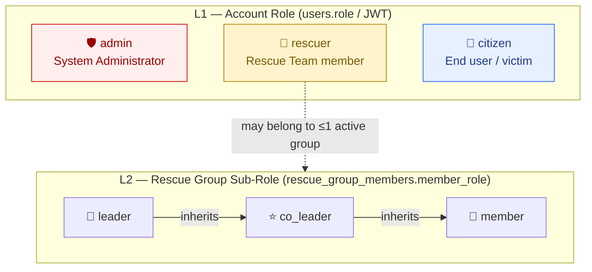
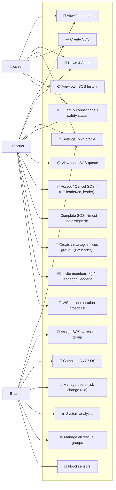
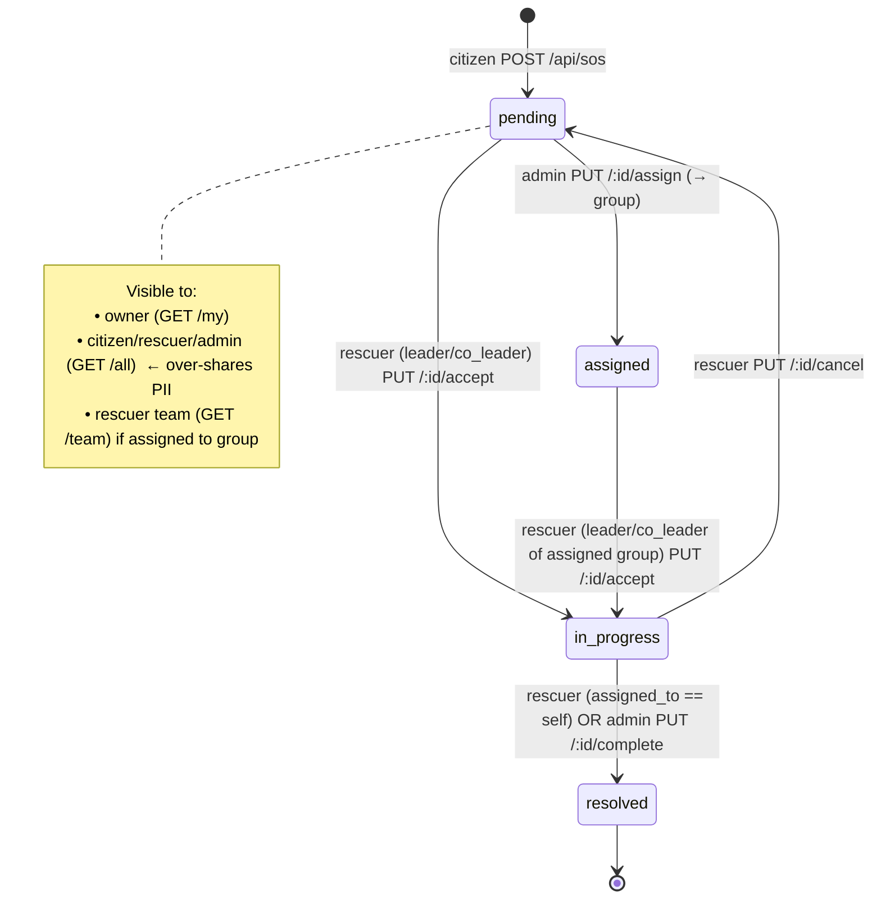
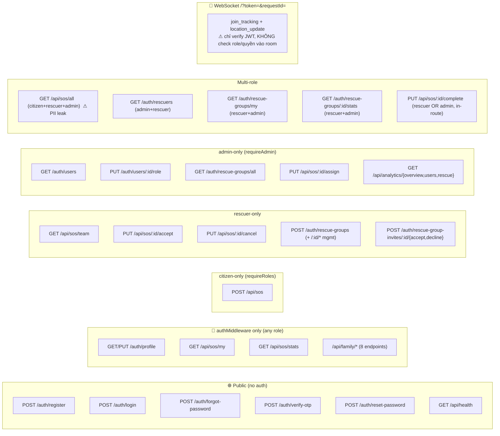

# AquaGuard — RBAC Review (in-depth)

> Review date: **2026-05-15**
> Scope: `frontend/src/config/rbac.js`, `backend/middleware/auth.js`, all `backend/routes/*.js`, `backend/index.js` (WebSocket auth), `frontend/src/contexts/AuthContext.jsx`, `Dashboard.jsx`.

---

## 1. Tổng quan

AquaGuard dùng **2 lớp RBAC chồng nhau**:

| Layer | Scope | Roles | Nguồn truth |
|-------|-------|-------|-------------|
| **L1 — Account role** | Toàn hệ thống | `citizen`, `rescuer`, `admin` | Cột `users.role` (DB) → JWT payload `req.user.role` |
| **L2 — Group sub-role** | Trong 1 rescue group | `leader`, `co_leader`, `member` | `rescue_group_members.member_role` (DB), check ad-hoc trong route |

Quyền hiệu dụng = **(L1 role) ∩ (L2 group role nếu route đụng tới group)**.
Không có policy engine tập trung — kiểm tra rải rác theo route.

### Các điểm enforcement

```
┌────────────────────────────── Frontend (advisory) ──────────────────────────────┐
│  config/rbac.js                                                                  │
│   • ROLES, ALL_NAV_ITEMS, getNavItemsForRole(), canAccessPage()                 │
│  Dashboard.jsx                                                                   │
│   • useEffect → if !canAccessPage(role, page) redirect                          │
│  Sidebar / MobileBottomNav                                                       │
│   • render theo getNavItemsForRole / getMobileNavItemsForRole                   │
└──────────────────────────────────┬───────────────────────────────────────────────┘
                                   │   (không tin được — UI guard chỉ là UX)
                                   ▼
┌────────────────────────────── Backend (authoritative) ──────────────────────────┐
│  middleware/auth.js                                                              │
│   • authMiddleware  → verify JWT → req.user = {id, phone_number, role}          │
│   • requireAdmin    → req.user.role === 'admin'                                  │
│   • requireRoles([...]) → role ∈ list                                            │
│  routes/*.js                                                                     │
│   • Per-route: requireAdmin / requireRoles(...)                                  │
│   • Per-route ad-hoc: SELECT member_role FROM rescue_group_members ...          │
│  index.js  (WebSocket)                                                           │
│   • jwt.verify(token from query string) — KHÔNG check role                       │
└──────────────────────────────────────────────────────────────────────────────────┘
```

---

## 2. RBAC Diagram

### 2.1 Roles, sub-roles & inheritance



> **NOTE — không có inheritance giữa L1 roles.** `admin` *không tự động* có quyền của `rescuer`/`citizen`; nếu cần overlap thì route phải khai báo cả 3 (xem `GET /api/sos/all` dùng `requireRoles(["citizen","rescuer","admin"])`).

### 2.2 Capability matrix (L1 — toàn hệ thống)



### 2.3 SOS lifecycle — ai làm được gì



### 2.4 Rescue Group permission matrix (L2)

| Action | Endpoint | leader | co_leader | member | non-member rescuer | admin |
|---|---|:--:|:--:|:--:|:--:|:--:|
| Create group | `POST /api/auth/rescue-groups` | n/a | n/a | n/a | ✅ (becomes leader) | ❌ |
| List all groups | `GET /api/auth/rescue-groups/all` | ❌ | ❌ | ❌ | ❌ | ✅ |
| List my group | `GET /api/auth/rescue-groups/my` | ✅ | ✅ | ✅ | ✅ (empty) | ✅ |
| Invite member | `POST /api/auth/rescue-groups/:id/invite` | ✅ | ✅ | ❌ | ❌ | ❌ |
| Accept invite | `POST /api/auth/rescue-group-invites/:id/accept` | n/a | n/a | n/a | ✅ | ❌ |
| Decline invite | `POST /api/auth/rescue-group-invites/:id/decline` | n/a | n/a | n/a | ✅ | ❌ |
| Edit group meta | `PUT /api/auth/rescue-groups/:id` | ✅ | ❌ | ❌ | ❌ | ❌ |
| Change member role | `PUT /api/auth/rescue-groups/:id/members/:userId/role` | ✅ | ❌ | ❌ | ❌ | ❌ |
| Remove member | `DELETE /api/auth/rescue-groups/:id/members/:userId` | ✅ | ❌ | ❌ | ❌ | ❌ |
| Leave group | `POST /api/auth/rescue-groups/:id/leave` | ⚠️ leader phải transfer trước | ✅ | ✅ | n/a | n/a |
| Disband group | `DELETE /api/auth/rescue-groups/:id` | ✅ | ❌ | ❌ | ❌ | ❌ |
| Accept SOS | `PUT /api/sos/:id/accept` | ✅ | ✅ | ❌ | ❌ | ❌ |
| Cancel SOS | `PUT /api/sos/:id/cancel` | ✅ | ✅ | ⚠️ chỉ check L1 | ❌ | ❌ |
| Complete SOS | `PUT /api/sos/:id/complete` | ⚠️ chỉ check `assigned_to == self`, không check group | ⚠️ same | ⚠️ same | ⚠️ same | ✅ |

⚠️ = check không đủ chặt — xem mục **§4 Findings**.

### 2.5 Endpoint × Role guard map



---

## 3. Implementation deep-dive

### 3.1 Backend — `middleware/auth.js`

```js
authMiddleware    → Bearer token → jwt.verify → req.user = decoded
requireAdmin      → req.user.role === 'admin'  → 403 nếu không
requireRoles([])  → req.user.role ∈ list       → 403 nếu không
```

✅ Đơn giản, đúng pattern.
❌ JWT_SECRET có **fallback hardcoded** (`"aquaguard_jwt_secret_2026"`) ở 3 file (`middleware/auth.js:3`, `routes/auth.js:17`, `index.js:17`). Nếu env miss → secret leak công khai.
❌ Không có scope/permission ở giữa role và endpoint — mọi quyết định finer-grained phải tự query DB trong từng route → trùng lắp + dễ quên (xem §4).

### 3.2 Frontend — `config/rbac.js`

- `ALL_NAV_ITEMS`: nguồn truth duy nhất cho cả sidebar, mobile nav, và `canAccessPage()`. Mỗi item có `roles: [...]` whitelist.
- `canAccessPage(role, page)`: dùng để guard navigation trong `Dashboard.jsx:41,62,72`.
- ⚠️ **Dead nav items**: `news` và `about` có `roles: []` → không ai thấy. Sai sót config (nên là `[CITIZEN, RESCUER]` theo comment trong file).
- ⚠️ Frontend RBAC chỉ là **UX guard**. Một user đổi `localStorage.role` → router cho phép vào page admin nhưng API vẫn 403 (đúng kiến trúc, defence-in-depth ổn).

### 3.3 JWT lifecycle

1. `POST /auth/login` → JWT chứa `{ id, phone_number, role }`, sign HS256, expiry 7d.
2. Client lưu vào **`localStorage`** (`utils/authStorage.js`) — dễ XSS đánh cắp (Bẫy #6 trong CLAUDE.md).
3. Backend verify mỗi request qua `Authorization: Bearer ...`.
4. **Role không refresh:** nếu admin đổi role của user qua `PUT /auth/users/:id/role`, user đó vẫn dùng JWT cũ với role cũ cho tới khi token hết hạn hoặc logout. Không có revocation list.

### 3.4 Sub-role (group) check pattern

Lặp lại ~7 lần trong `routes/auth.js` và `routes/sos.js`:

```sql
SELECT m.member_role
FROM rescue_group_members m
INNER JOIN rescue_groups g ON g.id = m.group_id
WHERE m.user_id = $1
  AND m.join_status = 'active'
  AND g.status = 'active'
LIMIT 1
```

Sau đó kiểm tra `["leader","co_leader"].includes(memberRole)` hoặc `=== "leader"`.

→ Cần tách ra helper `getCallerGroupRole(userId, groupId?)` (đã có ghi chú trong CLAUDE.md mục 6.20).

---

## 4. Findings

### 🔴 Critical

| # | Issue | File:Line | Impact | Fix |
|---|---|---|---|---|
| F1 | **IDOR — `PUT /api/sos/:id/complete`** chỉ check `assigned_to == req.user.id`. Nếu rescuer A bị reassign sang group khác mà `assigned_to` chưa update, hoặc rescuer member (không phải `assigned_to`, mà chỉ leader là) sẽ không complete được — nhưng nguy hiểm hơn: **không kiểm tra cùng `assigned_group_id`**. Member cùng group không complete được, nhưng admin của route lại có thể complete bất kỳ request nào (đúng yêu cầu) — vấn đề là tiêu chí cho rescuer quá hẹp + không định nghĩa cho cả group. | `sos.js:492-515` | Group member khác leader không thể đóng case dù cùng đội; và logic không nhất quán với `accept` (vốn cho phép leader/co_leader) | Đổi guard: `assigned_group_id IN (SELECT group_id FROM rescue_group_members WHERE user_id=$user AND join_status='active')` AND `member_role IN ('leader','co_leader')`. |
| F2 | **PII leak — `GET /api/sos/all`** cho phép `citizen` xem SĐT, địa chỉ, GPS của mọi nạn nhân khác (CLAUDE.md Bẫy #4). | `sos.js:125` | Mọi user dân thường truy vấn được dataset cá nhân của toàn hệ thống. | Loại `citizen` khỏi whitelist; với citizen dùng `/my`. Nếu cần map view cho citizen, tạo endpoint riêng trả về **chỉ vị trí ẩn danh** (round 100m, no PII). |
| F3 | **Self-register admin** — `ROLE_PASSWORD` mặc định `"123456"`, so sánh dùng `!==` không timing-safe (CLAUDE.md Bẫy #2). | `routes/auth.js:19,190` | Bất kỳ ai biết default → register admin. | Throw nếu env miss. So sánh `crypto.timingSafeEqual`. Tốt hơn: bỏ self-register admin, admin phải được seed hoặc promote bởi admin khác qua `PUT /users/:id/role`. |
| F4 | **JWT_SECRET fallback hardcoded** ở 3 file (CLAUDE.md Bẫy #1). | `middleware/auth.js:3`, `routes/auth.js:17`, `index.js:17` | Nếu deploy quên set env → secret công khai → forge token bất kỳ role. | `if (!process.env.JWT_SECRET) throw new Error(...)`. Gom vào `backend/config/env.js`. |
| F5 | **WebSocket không check authorization vào room** — `index.js:127` chỉ verify JWT, sau đó cho phép **bất kỳ** user join `requestId` bất kỳ và broadcast/persist location. | `index.js:127-220` | User X có thể join tracking room của SOS Y không thuộc về mình → đọc realtime location của citizen + rescuer khác. Có thể gửi `location_update` giả mạo → ghi đè `rescue_requests.rescuer_latitude`. | Trên `join_tracking`: query DB xác nhận `req.user.id` là citizen-owner HOẶC rescuer thuộc `assigned_group_id`. Trên `location_update`: kiểm tra `ws.userRole === 'rescuer'` chỉ update khi `assigned_to == userId`. |

### 🟠 High

| # | Issue | File:Line | Impact | Fix |
|---|---|---|---|---|
| F6 | **Race condition — accept SOS** không có `SELECT ... FOR UPDATE`. 2 group cùng accept 1 pending request có thể ghi đè nhau (CLAUDE.md Bẫy #12). | `sos.js:385-408` | Inconsistent state, double-dispatch. | Dùng `BEGIN; SELECT ... FOR UPDATE; UPDATE; COMMIT;`. |
| F7 | **Stale role trong JWT** — admin đổi role user A từ `rescuer` → `citizen`, nhưng A vẫn dùng token cũ → vẫn accept SOS được trong 7 ngày. | toàn hệ thống | Privilege downgrade không hiệu lực ngay. | (a) Rút ngắn TTL + refresh token, hoặc (b) thêm `users.token_version`, JWT chứa version, mỗi route check khớp DB. |
| F8 | **CORS `!origin` + credentials true + LAN regex** (CLAUDE.md Bẫy #5). | `index.js:34-48` | CSRF surface mở rộng cho non-browser clients & LAN. | Chỉ allow whitelist tuyệt đối; tách CORS prod vs dev qua `NODE_ENV`. |
| F9 | **`GROQ_API_KEY` được expose qua `VITE_*`** trong bundle frontend (CLAUDE.md Bẫy #7). | `.env` frontend | Key public → quota/abuse, không phải lỗi RBAC trực tiếp nhưng là privilege leak. | Proxy qua backend route; backend giữ key. |
| F10 | **Frontend nav config sai** — `news` và `about` có `roles: []` → không hiển thị cho ai mặc dù comment ghi "Shared (citizen + rescuer)". | `frontend/src/config/rbac.js:31,33` | UX bug; hidden pages | Set `roles: [ROLES.CITIZEN, ROLES.RESCUER]` (hoặc xác nhận ý định). |

### 🟡 Medium

| # | Issue | File:Line | Fix |
|---|---|---|---|
| F11 | `POST /api/sos` thiếu validate `latitude/longitude` (CLAUDE.md Bẫy #11) — không phải RBAC nhưng input cho route đã pass authz. | `sos.js:42-76` | Ép `Number()` + range check `[-90,90]/[-180,180]`. |
| F12 | `parseInt(req.params.id)` không radix, không validate (rải rác). | `sos.js`, `family.js` | `const n = Number(req.params.id); if (!Number.isInteger(n) || n <= 0) return 400`. |
| F13 | Group-role check duplicate query 7+ lần. | nhiều file | Helper `getCallerGroupRole(userId, groupId?)` trong `backend/utils/groupAuth.js`. |
| F14 | Multi-role pages dùng `requireRoles([...])` viết tay → dễ thiếu. Ví dụ `/api/sos/stats` (`sos.js:242`) là `authMiddleware` only — bất kỳ role nào (kể cả citizen) đếm được tổng SOS toàn hệ thống. | `sos.js:242` | Whitelist rõ ràng. Hoặc filter `WHERE user_id = $self` cho citizen. |
| F15 | `requireAdmin` trùng chức năng `requireRoles(['admin'])`. Nên giữ một, hoặc làm `requireAdmin = requireRoles(['admin'])` để đỡ drift. | `middleware/auth.js:28-46` | Refactor. |

### 🔵 Low / Hygiene

- F16 — Không có audit log cho thay đổi role (`PUT /users/:id/role`) hoặc disband group. Thêm vào `rescue_request_logs` (đã có) hoặc bảng `audit_logs` mới.
- F17 — `getRoleLabel` ở frontend không đồng bộ với `t('roles.*')` trong i18n — text hiển thị 2 nguồn khác nhau (`SettingsPage.jsx:404` dùng i18n, `MobileHeader.jsx:30` cũng i18n, nhưng `getRoleLabel` hardcode tiếng Anh).
- F18 — Không có concept "disabled user". `users.is_active` được SELECT vài chỗ nhưng `authMiddleware` không check → user bị deactivate vẫn dùng được token cũ.

---

## 5. Recommendations (priority order)

1. **Fix F1 (SOS complete IDOR) + F2 (PII leak) + F5 (WS room authz)** — đây là 3 lỗ hổng đọc/ghi data người dùng khác trong cùng app. Ưu tiên #1.
2. **Loại bỏ secret fallback (F3, F4)** — 1 PR, đụng 3 file. Tạo `backend/config/env.js` validate ở startup.
3. **Refactor sub-role check vào `getCallerGroupRole(userId, groupId?)`** (F13) — cắt giảm bug surface; phải làm trước khi sửa F1 để consistent.
4. **Thêm `users.token_version`** → invalidate token khi đổi role / deactivate (F7, F18). 1-line check trong `authMiddleware`.
5. **Sửa CORS prod (F8) + proxy GROQ (F9)** — không phải RBAC nhưng cùng PR security pass.
6. **Frontend nav cleanup (F10)** + di chuyển `getRoleLabel` về i18n (F17).
7. (Nice-to-have) **Tách RBAC khỏi route handler** — định nghĩa `permissions/policies.js` (action × role × condition). Khi codebase có thêm route, sẽ rất đáng đầu tư.

---

## 6. Quick reference — guard cheatsheet

```js
// ── Backend ──
authMiddleware                              // có JWT
authMiddleware, requireAdmin                // admin only
authMiddleware, requireRoles(['rescuer'])   // 1 role
authMiddleware, requireRoles(['rescuer','admin'])  // multi-role

// Group sub-role (manual, lặp 7+ lần — TODO refactor)
const r = await pool.query(
  `SELECT m.member_role FROM rescue_group_members m
   INNER JOIN rescue_groups g ON g.id = m.group_id
   WHERE m.user_id=$1 AND m.join_status='active' AND g.status='active' LIMIT 1`,
  [req.user.id]
);
if (!['leader','co_leader'].includes(r.rows[0]?.member_role)) return 403;

// ── Frontend ──
import { canAccessPage, ROLES } from "@/config/rbac";
if (!canAccessPage(role, "admin-users")) navigate("/");
```
