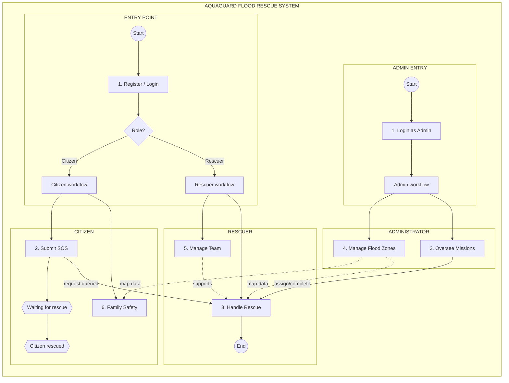
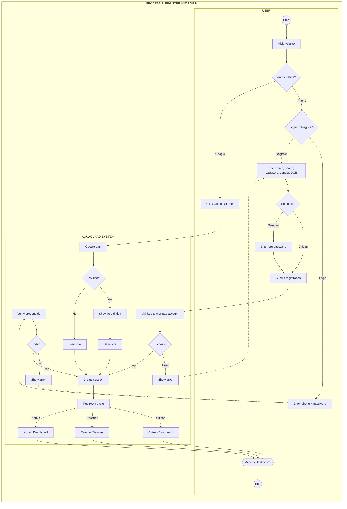
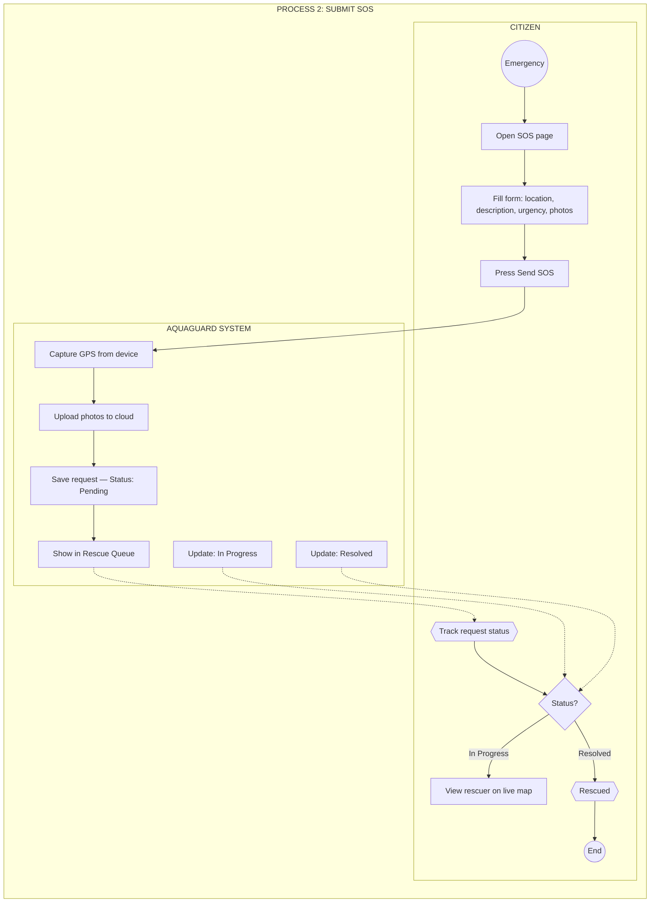
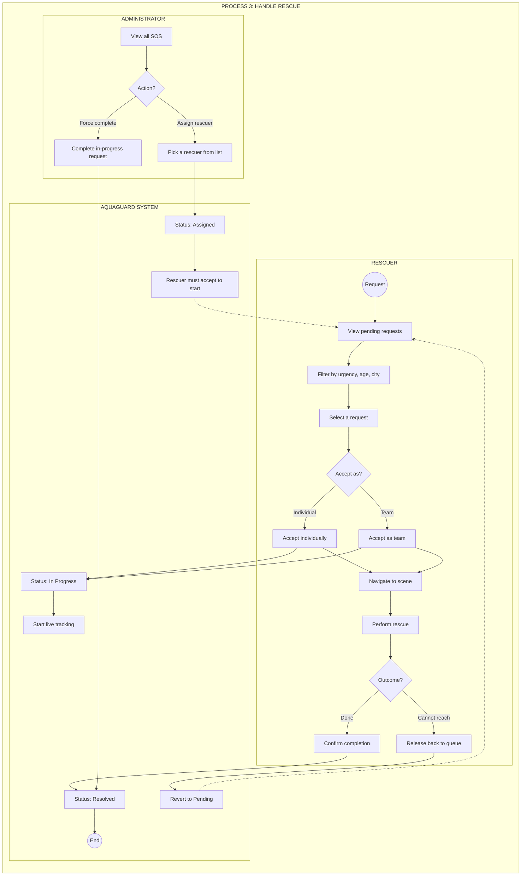
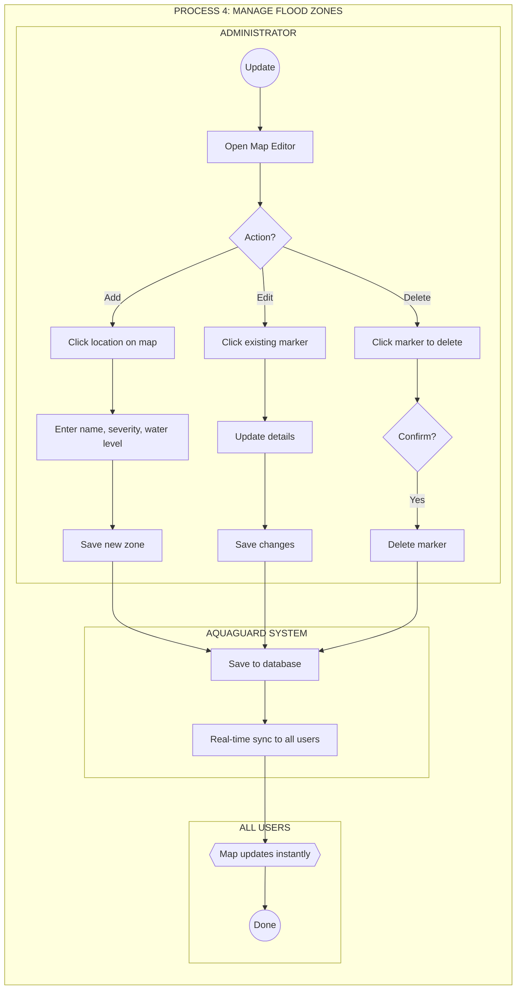
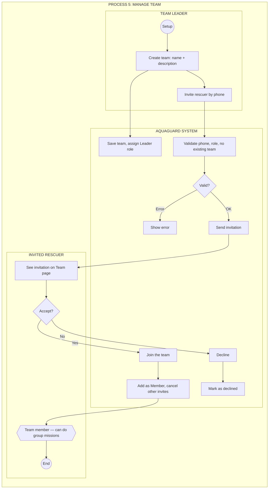
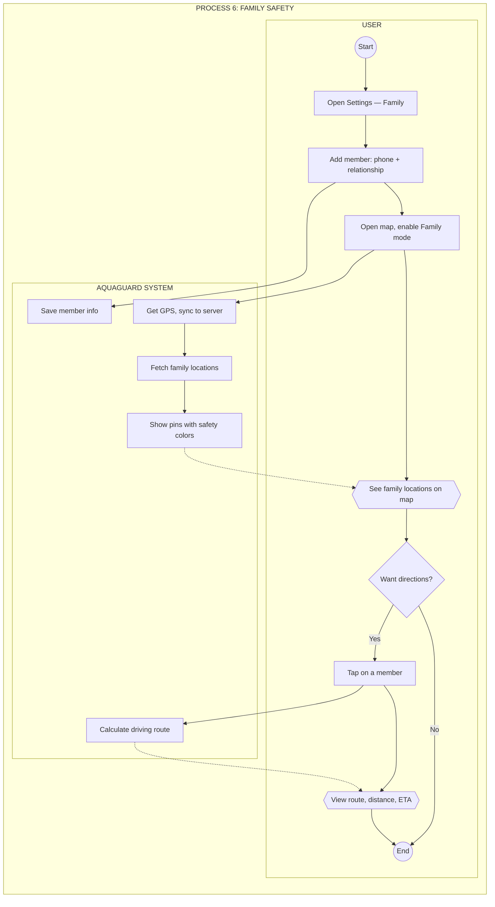

# AquaGuard — Mermaid BPMN Code

Copy từng block vào [mermaid.live](https://mermaid.live) để vẽ.

---

## 0. Level 1 — Business Process Overview



---

## 1. Registration & Login



---

## 2. Submitting an Emergency SOS Request



---

## 3. Rescue Request Handling & Operations


        end
    end
```

---

## 4. Flood Zone Management



---

## 5. Rescue Team Management



---

## 6. Family Safety Tracking


