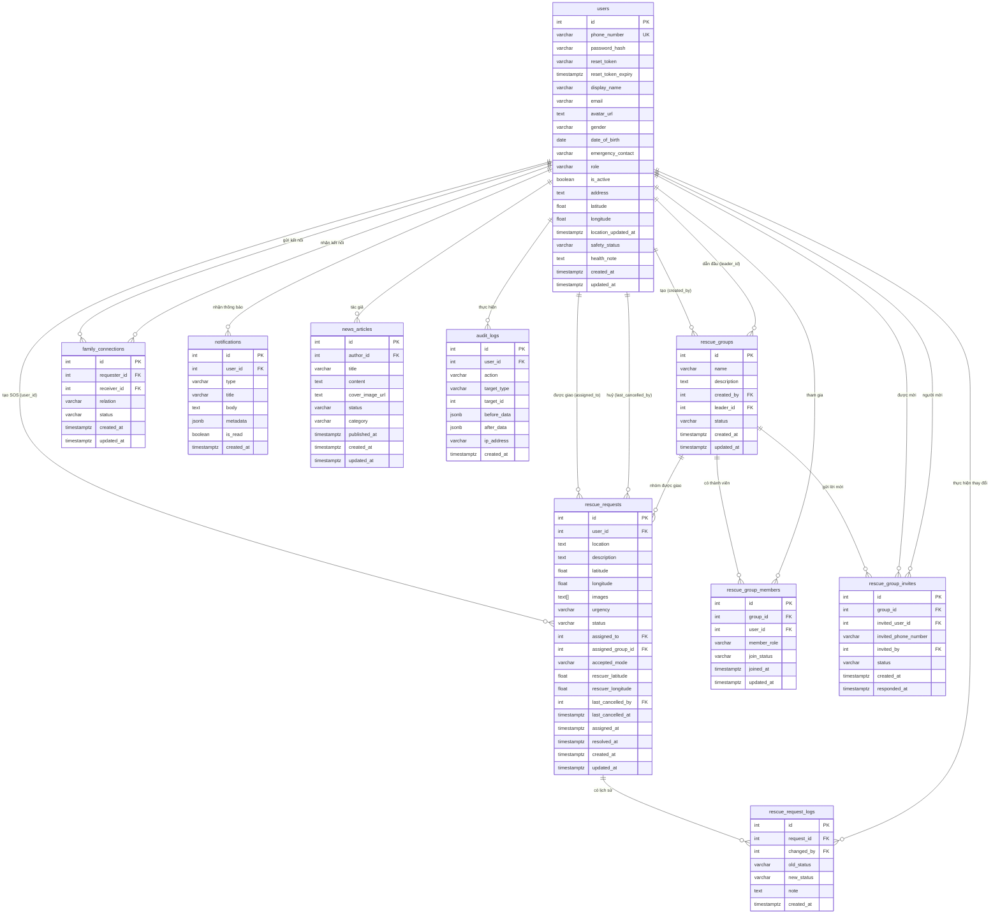

# AquaGuard — Tài Liệu Kỹ Thuật Toàn Diện

> **Version:** 2.0 | **Cập nhật lần cuối:** 2026-04-14  
> Hệ thống cảnh báo lũ lụt, quản lý cứu hộ và theo dõi gia đình theo thời gian thực.

---

## Mục Lục

1. [Data Dictionary](#1-data-dictionary)
2. [Entity Relationship Diagram (ERD)](#2-entity-relationship-diagram-erd)
3. [API Reference](#3-api-reference)
4. [Integration](#4-integration)
5. [Security](#5-security)
6. [Data Privacy](#6-data-privacy)

---

## 1. Data Dictionary

> Mô tả chi tiết cấu trúc dữ liệu của **10 bảng** trong PostgreSQL database.

---

### 1.1 `users` — Bảng người dùng trung tâm

| Cột | Kiểu dữ liệu | Nullable | Mặc định | Mô tả |
|-----|-------------|----------|----------|-------|
| `id` | `SERIAL` | NO | auto | Khóa chính tự tăng |
| `phone_number` | `VARCHAR(15)` | NO | — | Số điện thoại (định dạng `+84xxxxxxxxx`), duy nhất |
| `password_hash` | `VARCHAR(255)` | NO | — | Mật khẩu đã băm bằng bcrypt (salt rounds = 10) |
| `reset_token` | `VARCHAR(255)` | YES | NULL | Token tạm dùng cho việc đặt lại mật khẩu (OTP-based) |
| `reset_token_expiry` | `TIMESTAMPTZ` | YES | NULL | Thời điểm token đặt lại mật khẩu hết hạn (10 phút) |
| `display_name` | `VARCHAR(100)` | YES | `'User'` | Tên hiển thị trong ứng dụng |
| `email` | `VARCHAR(255)` | YES | `''` | Email (tùy chọn, không bắt buộc) |
| `avatar_url` | `TEXT` | YES | `''` | URL ảnh đại diện (lưu trên Cloudinary) |
| `gender` | `VARCHAR(10)` | YES | `''` | Giới tính: `male`, `female`, `other`, hoặc rỗng |
| `date_of_birth` | `DATE` | YES | NULL | Ngày sinh (định dạng `YYYY-MM-DD`) |
| `emergency_contact` | `VARCHAR(15)` | YES | `''` | Số điện thoại liên lạc khẩn cấp |
| `role` | `VARCHAR(20)` | YES | `'citizen'` | Vai trò: `citizen`, `rescuer`, `admin` |
| `is_active` | `BOOLEAN` | YES | `TRUE` | Trạng thái tài khoản (FALSE = bị khóa) |
| `address` | `TEXT` | YES | `''` | Địa chỉ dạng văn bản |
| `latitude` | `DOUBLE PRECISION` | YES | NULL | Vĩ độ GPS hiện tại |
| `longitude` | `DOUBLE PRECISION` | YES | NULL | Kinh độ GPS hiện tại |
| `location_updated_at` | `TIMESTAMPTZ` | YES | NULL | Thời điểm cập nhật vị trí GPS gần nhất |
| `safety_status` | `VARCHAR(20)` | YES | `'unknown'` | Trạng thái an toàn: `unknown`, `safe`, `danger`, `injured` |
| `health_note` | `TEXT` | YES | `''` | Ghi chú sức khỏe hiện tại |
| `created_at` | `TIMESTAMPTZ` | YES | `NOW()` | Thời điểm tạo tài khoản |
| `updated_at` | `TIMESTAMPTZ` | YES | `NOW()` | Thời điểm cập nhật gần nhất (auto-trigger) |

**Indexes:** `idx_users_phone`, `idx_users_role`, `idx_users_active` (partial: `is_active = TRUE`)

**Ràng buộc:**
- `gender` ∈ `('', 'male', 'female', 'other')`
- `role` ∈ `('citizen', 'rescuer', 'admin')`
- `safety_status` ∈ `('unknown', 'safe', 'danger', 'injured')`
- `phone_number` là UNIQUE

---

### 1.2 `rescue_requests` — Yêu cầu cứu hộ (SOS)

| Cột | Kiểu dữ liệu | Nullable | Mặc định | Mô tả |
|-----|-------------|----------|----------|-------|
| `id` | `SERIAL` | NO | auto | Khóa chính tự tăng |
| `user_id` | `INTEGER` | YES | NULL | FK → `users.id` (người tạo yêu cầu SOS) — SET NULL nếu xoá |
| `location` | `TEXT` | NO | — | Mô tả vị trí dạng văn bản |
| `description` | `TEXT` | NO | — | Mô tả chi tiết tình huống khẩn cấp |
| `latitude` | `DOUBLE PRECISION` | YES | NULL | Vĩ độ GPS của nạn nhân |
| `longitude` | `DOUBLE PRECISION` | YES | NULL | Kinh độ GPS của nạn nhân |
| `images` | `TEXT[]` | YES | `'{}'` | Mảng URL ảnh đính kèm (tối đa 5 ảnh, lưu Cloudinary) |
| `urgency` | `VARCHAR(20)` | YES | `'medium'` | Mức độ khẩn cấp: `low`, `medium`, `high`, `critical` |
| `status` | `VARCHAR(20)` | YES | `'pending'` | Trạng thái: `pending`, `assigned`, `in_progress`, `resolved`, `cancelled` |
| `assigned_to` | `INTEGER` | YES | NULL | FK → `users.id` (rescuer được giao) |
| `assigned_group_id` | `INTEGER` | YES | NULL | FK → `rescue_groups.id` (nhóm cứu hộ được giao) |
| `accepted_mode` | `VARCHAR(20)` | YES | `'individual'` | Chế độ nhận: `individual`, `group` |
| `rescuer_latitude` | `DOUBLE PRECISION` | YES | NULL | Vĩ độ GPS của rescuer (cập nhật qua WebSocket) |
| `rescuer_longitude` | `DOUBLE PRECISION` | YES | NULL | Kinh độ GPS của rescuer (cập nhật qua WebSocket) |
| `last_cancelled_by` | `INTEGER` | YES | NULL | FK → `users.id` (người huỷ gần nhất) |
| `last_cancelled_at` | `TIMESTAMPTZ` | YES | NULL | Thời điểm huỷ gần nhất |
| `assigned_at` | `TIMESTAMPTZ` | YES | NULL | Thời điểm được giao/chấp nhận |
| `resolved_at` | `TIMESTAMPTZ` | YES | NULL | Thời điểm giải quyết xong |
| `created_at` | `TIMESTAMPTZ` | YES | `NOW()` | Thời điểm tạo yêu cầu SOS |
| `updated_at` | `TIMESTAMPTZ` | YES | `NOW()` | Thời điểm cập nhật gần nhất |

**Indexes:** `idx_rr_status`, `idx_rr_user_id`, `idx_rr_assigned`, `idx_rr_group`, `idx_rr_pending` (partial), `idx_rr_created`

**Vòng đời trạng thái:**
```
pending → assigned (admin giao) → in_progress (rescuer nhận) → resolved
pending ← in_progress (rescuer huỷ)
```

---

### 1.3 `rescue_request_logs` — Nhật ký thay đổi trạng thái SOS

| Cột | Kiểu dữ liệu | Nullable | Mặc định | Mô tả |
|-----|-------------|----------|----------|-------|
| `id` | `SERIAL` | NO | auto | Khóa chính tự tăng |
| `request_id` | `INTEGER` | NO | — | FK → `rescue_requests.id` (CASCADE DELETE) |
| `changed_by` | `INTEGER` | YES | NULL | FK → `users.id` (người thực hiện thay đổi) |
| `old_status` | `VARCHAR(20)` | YES | NULL | Trạng thái trước khi thay đổi (NULL nếu là tạo mới) |
| `new_status` | `VARCHAR(20)` | NO | — | Trạng thái sau khi thay đổi |
| `note` | `TEXT` | YES | `''` | Ghi chú bổ sung (ví dụ: "Rescuer cancelled") |
| `created_at` | `TIMESTAMPTZ` | YES | `NOW()` | Thời điểm ghi log |

**Chức năng:** Audit trail bất biến; theo dõi toàn bộ lịch sử thay đổi trạng thái của mỗi SOS request.

---

### 1.4 `rescue_groups` — Nhóm cứu hộ

| Cột | Kiểu dữ liệu | Nullable | Mặc định | Mô tả |
|-----|-------------|----------|----------|-------|
| `id` | `SERIAL` | NO | auto | Khóa chính tự tăng |
| `name` | `VARCHAR(120)` | NO | — | Tên nhóm cứu hộ |
| `description` | `TEXT` | YES | `''` | Mô tả nhóm |
| `created_by` | `INTEGER` | YES | NULL | FK → `users.id` (người tạo nhóm) |
| `leader_id` | `INTEGER` | YES | NULL | FK → `users.id` (trưởng nhóm hiện tại) |
| `status` | `VARCHAR(20)` | YES | `'active'` | Trạng thái: `active`, `archived` |
| `created_at` | `TIMESTAMPTZ` | YES | `NOW()` | Thời điểm tạo nhóm |
| `updated_at` | `TIMESTAMPTZ` | YES | `NOW()` | Thời điểm cập nhật gần nhất |

**Quy tắc nghiệp vụ:**
- Mỗi rescuer chỉ được thuộc **1 nhóm active** tại một thời điểm.
- Người tạo nhóm tự động trở thành `leader`.

---

### 1.5 `rescue_group_members` — Thành viên nhóm cứu hộ (N:N junction)

| Cột | Kiểu dữ liệu | Nullable | Mặc định | Mô tả |
|-----|-------------|----------|----------|-------|
| `id` | `SERIAL` | NO | auto | Khóa chính tự tăng |
| `group_id` | `INTEGER` | NO | — | FK → `rescue_groups.id` (CASCADE DELETE) |
| `user_id` | `INTEGER` | NO | — | FK → `users.id` (CASCADE DELETE) |
| `member_role` | `VARCHAR(20)` | YES | `'member'` | Vai trò trong nhóm: `leader`, `co_leader`, `member` |
| `join_status` | `VARCHAR(20)` | YES | `'active'` | Trạng thái: `active`, `left`, `removed` |
| `joined_at` | `TIMESTAMPTZ` | YES | `NOW()` | Thời điểm gia nhập nhóm |
| `updated_at` | `TIMESTAMPTZ` | YES | `NOW()` | Thời điểm cập nhật gần nhất |

**Ràng buộc:** UNIQUE `(group_id, user_id)` — mỗi user chỉ có một bản ghi per nhóm.

---

### 1.6 `rescue_group_invites` — Lời mời nhóm cứu hộ

| Cột | Kiểu dữ liệu | Nullable | Mặc định | Mô tả |
|-----|-------------|----------|----------|-------|
| `id` | `SERIAL` | NO | auto | Khóa chính tự tăng |
| `group_id` | `INTEGER` | NO | — | FK → `rescue_groups.id` (CASCADE DELETE) |
| `invited_user_id` | `INTEGER` | NO | — | FK → `users.id` (người được mời) |
| `invited_phone_number` | `VARCHAR(15)` | NO | — | Số điện thoại người được mời (lưu tại thời điểm mời) |
| `invited_by` | `INTEGER` | YES | NULL | FK → `users.id` (người gửi lời mời) |
| `status` | `VARCHAR(20)` | YES | `'pending'` | Trạng thái: `pending`, `accepted`, `declined`, `cancelled` |
| `created_at` | `TIMESTAMPTZ` | YES | `NOW()` | Thời điểm gửi lời mời |
| `responded_at` | `TIMESTAMPTZ` | YES | NULL | Thời điểm phản hồi lời mời |

---

### 1.7 `family_connections` — Kết nối gia đình

| Cột | Kiểu dữ liệu | Nullable | Mặc định | Mô tả |
|-----|-------------|----------|----------|-------|
| `id` | `SERIAL` | NO | auto | Khóa chính tự tăng |
| `requester_id` | `INTEGER` | NO | — | FK → `users.id` (người gửi lời mời kết nối) |
| `receiver_id` | `INTEGER` | NO | — | FK → `users.id` (người nhận lời mời) |
| `relation` | `VARCHAR(50)` | YES | NULL | Quan hệ (vd: "Bố", "Mẹ", "Con") |
| `status` | `VARCHAR(20)` | YES | `'pending'` | Trạng thái: `pending`, `accepted`, `rejected` |
| `created_at` | `TIMESTAMPTZ` | YES | `NOW()` | Thời điểm gửi lời mời |
| `updated_at` | `TIMESTAMPTZ` | YES | `NOW()` | Thời điểm cập nhật gần nhất |

**Ràng buộc:** UNIQUE `(requester_id, receiver_id)` và `requester_id ≠ receiver_id`.

**Chức năng:** Cho phép theo dõi vị trí GPS và trạng thái an toàn của thành viên gia đình trên bản đồ.

---

### 1.8 `notifications` — Thông báo trong ứng dụng

| Cột | Kiểu dữ liệu | Nullable | Mặc định | Mô tả |
|-----|-------------|----------|----------|-------|
| `id` | `SERIAL` | NO | auto | Khóa chính tự tăng |
| `user_id` | `INTEGER` | NO | — | FK → `users.id` (người nhận thông báo, CASCADE DELETE) |
| `type` | `VARCHAR(50)` | NO | — | Loại thông báo (vd: `sos_accepted`, `family_request`) |
| `title` | `VARCHAR(255)` | NO | — | Tiêu đề thông báo |
| `body` | `TEXT` | YES | `''` | Nội dung chi tiết thông báo |
| `metadata` | `JSONB` | YES | `'{}'` | Dữ liệu bổ sung dạng JSON (vd: requestId, groupId) |
| `is_read` | `BOOLEAN` | YES | `FALSE` | Trạng thái đọc (FALSE = chưa đọc) |
| `created_at` | `TIMESTAMPTZ` | YES | `NOW()` | Thời điểm tạo thông báo |

**Indexes:** `idx_notif_unread` (partial: `is_read = FALSE`) để tối ưu truy vấn thông báo chưa đọc.

---

### 1.9 `news_articles` — Bài viết tin tức

| Cột | Kiểu dữ liệu | Nullable | Mặc định | Mô tả |
|-----|-------------|----------|----------|-------|
| `id` | `SERIAL` | NO | auto | Khóa chính tự tăng |
| `author_id` | `INTEGER` | YES | NULL | FK → `users.id` (tác giả — SET NULL nếu xoá) |
| `title` | `VARCHAR(500)` | NO | — | Tiêu đề bài viết |
| `content` | `TEXT` | NO | — | Nội dung bài viết (HTML/Markdown) |
| `cover_image_url` | `TEXT` | YES | `''` | URL ảnh bìa (lưu Cloudinary) |
| `status` | `VARCHAR(20)` | YES | `'draft'` | Trạng thái: `draft`, `published`, `archived` |
| `category` | `VARCHAR(50)` | YES | `'general'` | Danh mục bài viết |
| `published_at` | `TIMESTAMPTZ` | YES | NULL | Thời điểm xuất bản (chỉ có khi status = `published`) |
| `created_at` | `TIMESTAMPTZ` | YES | `NOW()` | Thời điểm tạo bài viết |
| `updated_at` | `TIMESTAMPTZ` | YES | `NOW()` | Thời điểm cập nhật gần nhất |

---

### 1.10 `audit_logs` — Nhật ký kiểm toán (Append-only)

| Cột | Kiểu dữ liệu | Nullable | Mặc định | Mô tả |
|-----|-------------|----------|----------|-------|
| `id` | `SERIAL` | NO | auto | Khóa chính tự tăng |
| `user_id` | `INTEGER` | YES | NULL | FK → `users.id` (người thực hiện hành động) |
| `action` | `VARCHAR(100)` | NO | — | Tên hành động (vd: `UPDATE_USER_ROLE`, `DELETE_REQUEST`) |
| `target_type` | `VARCHAR(50)` | YES | NULL | Loại đối tượng bị tác động (vd: `user`, `rescue_request`) |
| `target_id` | `INTEGER` | YES | NULL | ID của đối tượng bị tác động |
| `before_data` | `JSONB` | YES | NULL | Dữ liệu trước khi thay đổi |
| `after_data` | `JSONB` | YES | NULL | Dữ liệu sau khi thay đổi |
| `ip_address` | `VARCHAR(45)` | YES | NULL | Địa chỉ IP của client (hỗ trợ IPv6) |
| `created_at` | `TIMESTAMPTZ` | YES | `NOW()` | Thời điểm ghi log |

**Lưu ý:** Bảng **chỉ ghi thêm** (append-only), không có trigger `updated_at`. Không được phép UPDATE/DELETE.

---

## 2. Entity Relationship Diagram (ERD)



### Tóm tắt mối quan hệ

| Quan hệ | Loại | Mô tả |
|---------|------|-------|
| `users` → `rescue_requests` | 1:N (×3) | Nạn nhân, rescuer được giao, người huỷ |
| `rescue_groups` → `rescue_requests` | 1:N | Nhóm được giao cho SOS |
| `rescue_requests` → `rescue_request_logs` | 1:N | Log lịch sử trạng thái |
| `rescue_groups` ↔ `users` | N:N (qua `rescue_group_members`) | Thành viên nhóm |
| `users` ↔ `users` | N:N (qua `family_connections`) | Kết nối gia đình 2 chiều |
| `rescue_groups` → `rescue_group_invites` | 1:N | Lời mời gia nhập nhóm |

---

## 3. API Reference

> **Base URL:** `http://localhost:5001/api`  
> **Protocol:** HTTP/1.1 REST + WebSocket (ws://)  
> **Auth:** Bearer JWT Token (Header: `Authorization: Bearer <token>`)

### 3.1 Quy ước chung

**Request Headers:**
```
Content-Type: application/json
Authorization: Bearer <access_token>
```

**Response format chuẩn:**
```json
{
  "success": true | false,
  "message": "Thông báo",
  "data": { ... }
}
```

**HTTP Status Codes:**

| Code | Ý nghĩa |
|------|---------|
| `200` | Thành công |
| `201` | Tạo mới thành công |
| `400` | Dữ liệu đầu vào không hợp lệ |
| `401` | Chưa xác thực (thiếu hoặc token sai) |
| `403` | Không có quyền truy cập |
| `404` | Không tìm thấy tài nguyên |
| `409` | Xung đột dữ liệu (đã tồn tại) |
| `429` | Rate limit — quá nhiều request |
| `500` | Lỗi server nội bộ |

---

### 3.2 Authentication API (`/api/auth`)

#### `POST /api/auth/register` — Đăng ký tài khoản
**Quyền:** Public | **Rate limit:** 5 req / 15 phút / IP

**Request Body:**
```json
{
  "phone_number": "+84901234567",
  "password": "matkhau123",
  "display_name": "Nguyễn Văn A",
  "role": "citizen",
  "role_password": "secret",
  "gender": "male",
  "date_of_birth": "1990-01-15"
}
```

| Trường | Bắt buộc | Mô tả |
|--------|----------|-------|
| `phone_number` | ✅ | Định dạng `+84xxxxxxxxx` (9–10 chữ số sau +84) |
| `password` | ✅ | Tối thiểu 6 ký tự |
| `display_name` | ❌ | Mặc định: `"User"` |
| `role` | ❌ | `citizen` (default), `rescuer`, `admin` |
| `role_password` | ✅ nếu role là rescuer/admin | Mật khẩu xác nhận vai trò đặc quyền |
| `gender` | ❌ | `male`, `female`, `other` |
| `date_of_birth` | ❌ | Định dạng `YYYY-MM-DD` |

**Response 201:**
```json
{
  "success": true,
  "message": "Registration successful!",
  "data": {
    "user": {
      "id": 1,
      "uid": "phone_1",
      "phoneNumber": "+84901234567",
      "displayName": "Nguyễn Văn A",
      "role": "citizen",
      "avatarUrl": ""
    },
    "accessToken": "<JWT_7d>"
  }
}
```

---

#### `POST /api/auth/login` — Đăng nhập
**Quyền:** Public | **Rate limit:** 10 req / 15 phút / IP

**Request Body:**
```json
{
  "phone_number": "+84901234567",
  "password": "matkhau123"
}
```

**Response 200:**
```json
{
  "success": true,
  "message": "Sign in successful!",
  "data": {
    "user": { "id": 1, "role": "citizen", ... },
    "accessToken": "<JWT_7d>"
  }
}
```

---

#### `POST /api/auth/forgot-password` — Gửi OTP quên mật khẩu
**Quyền:** Public | **Rate limit:** 5 req / 15 phút / IP + 60s giữa từng lần / phone

**Request Body:** `{ "phone_number": "+84901234567" }`

**Response 200:** `{ "success": true, "message": "OTP sent to your phone number." }`

---

#### `POST /api/auth/verify-otp` — Xác minh OTP
**Quyền:** Public

**Request Body:** `{ "phone_number": "+84901234567", "otp": "123456" }`

**Response 200:** `{ "success": true, "data": { "sessionToken": "<hex_64>" } }`

---

#### `POST /api/auth/reset-password` — Đặt lại mật khẩu
**Quyền:** Public (cần `sessionToken` từ bước verify-otp)

**Request Body:**
```json
{
  "phone_number": "+84901234567",
  "sessionToken": "<hex_64>",
  "newPassword": "matkhaumoi123"
}
```

---

#### `GET /api/auth/users` — Danh sách tất cả người dùng
**Quyền:** `admin`

**Response 200:** Mảng user objects (không có password_hash).

---

#### `GET /api/auth/rescuers` — Danh sách rescuer
**Quyền:** `admin`, `rescuer`

**Response 200:** Mảng rescuer objects với thêm trường:
- `hasActiveGroup` (boolean) — đang trong nhóm active không
- `hasPendingInviteFromMe` (boolean) — đã gửi lời mời cho người này chưa

---

#### `PUT /api/auth/users/:id/role` — Cập nhật vai trò người dùng
**Quyền:** `admin`

**Request Body:** `{ "role": "rescuer" }`

---

#### `GET /api/auth/profile` — Lấy thông tin cá nhân
**Quyền:** Authenticated

---

#### `PUT /api/auth/profile` — Cập nhật thông tin cá nhân
**Quyền:** Authenticated

**Request Body:** (multipart/form-data hoặc JSON)
```json
{
  "display_name": "Tên mới",
  "email": "email@example.com",
  "gender": "male",
  "date_of_birth": "1990-01-15",
  "address": "123 Đường ABC",
  "emergency_contact": "+84901234567"
}
```

---

#### `PUT /api/auth/change-password` — Đổi mật khẩu
**Quyền:** Authenticated

**Request Body:** `{ "currentPassword": "...", "newPassword": "..." }`

---

### 3.3 Rescue Group API (`/api/auth/rescue-groups`)

#### `GET /api/auth/rescue-groups/my` — Nhóm cứu hộ hiện tại
**Quyền:** `rescuer`, `admin`

**Response:** Thông tin nhóm active + danh sách thành viên + lời mời pending.

---

#### `POST /api/auth/rescue-groups` — Tạo nhóm cứu hộ
**Quyền:** `rescuer`

**Request Body:** `{ "name": "Đội cứu hộ A", "description": "Mô tả nhóm" }`

---

#### `PUT /api/auth/rescue-groups/:id` — Chỉnh sửa nhóm
**Quyền:** `rescuer` (chỉ leader)

---

#### `GET /api/auth/rescue-groups/:id/stats` — Thống kê nhóm
**Quyền:** `rescuer` (thành viên nhóm), `admin`

**Response:** `{ activeMissions, completedMissions, pendingMissions, teamSize }`

---

#### `POST /api/auth/rescue-groups/:id/invite` — Mời thành viên
**Quyền:** `rescuer` (leader / co_leader)

**Request Body:** `{ "phone_number": "+84912345678" }`

---

#### `POST /api/auth/rescue-group-invites/:id/accept` — Chấp nhận lời mời
**Quyền:** `rescuer`

---

#### `POST /api/auth/rescue-group-invites/:id/decline` — Từ chối lời mời
**Quyền:** `rescuer`

---

#### `DELETE /api/auth/rescue-groups/:id/leave` — Rời nhóm
**Quyền:** `rescuer`

---

#### `DELETE /api/auth/rescue-groups/:id/members/:userId` — Xoá thành viên
**Quyền:** `rescuer` (leader / co_leader)

---

#### `PUT /api/auth/rescue-groups/:id/members/:userId/role` — Thăng/giáng cấp
**Quyền:** `rescuer` (leader)

**Request Body:** `{ "role": "co_leader" | "member" }`

---

### 3.4 SOS API (`/api/sos`)

#### `POST /api/sos` — Tạo yêu cầu SOS
**Quyền:** `citizen` | **Content-Type:** `multipart/form-data`

| Trường | Bắt buộc | Mô tả |
|--------|----------|-------|
| `location` | ✅ | Mô tả vị trí dạng text |
| `description` | ✅ | Tình huống cụ thể |
| `urgency` | ❌ | `low`, `medium`, `high`, `critical` (default: `medium`) |
| `latitude` | ❌ | Vĩ độ GPS |
| `longitude` | ❌ | Kinh độ GPS |
| `images` | ❌ | Tối đa 5 file ảnh (upload Cloudinary) |

---

#### `GET /api/sos/my` — Yêu cầu SOS của tôi
**Quyền:** Authenticated

Trả về danh sách SOS của người dùng hiện tại kèm thông tin rescuer được giao.

---

#### `GET /api/sos/all` — Tất cả yêu cầu SOS
**Quyền:** `rescuer`, `admin`

Trả về toàn bộ danh sách kèm thông tin chi tiết nạn nhân (tên, tuổi, giới tính, địa chỉ).

---

#### `GET /api/sos/stats` — Thống kê nhanh
**Quyền:** Authenticated

**Response:** `{ pending, in_progress, resolved, total }`

---

#### `PUT /api/sos/:id/assign` — Admin giao rescuer
**Quyền:** `admin`

**Request Body:** `{ "rescuerId": 5 }`

Chuyển status: `pending → assigned`

---

#### `PUT /api/sos/:id/accept` — Rescuer nhận nhiệm vụ
**Quyền:** `rescuer`

**Request Body:** `{ "latitude": 10.77, "longitude": 106.68, "acceptMode": "individual" | "group" }`

Chuyển status: `pending/assigned → in_progress`

---

#### `PUT /api/sos/:id/cancel` — Rescuer huỷ nhiệm vụ
**Quyền:** `rescuer`

Chuyển status: `in_progress → pending` (reset assignment)

---

#### `PUT /api/sos/:id/complete` — Hoàn thành nhiệm vụ
**Quyền:** `rescuer`, `admin`

Chuyển status: `in_progress → resolved`

---

### 3.5 Family API (`/api/family`)

#### `GET /api/family/search?phone=+84...` — Tìm người dùng theo SĐT
**Quyền:** Authenticated

---

#### `POST /api/family/request` — Gửi lời mời kết nối gia đình
**Quyền:** Authenticated

**Request Body:** `{ "receiver_id": 2, "relation": "Bố" }`

---

#### `GET /api/family/requests` — Lời mời đang chờ (nhận được)
**Quyền:** Authenticated

---

#### `PUT /api/family/requests/:id/accept` — Chấp nhận kết nối
**Quyền:** Authenticated (chỉ người nhận)

---

#### `PUT /api/family/requests/:id/reject` — Từ chối kết nối
**Quyền:** Authenticated (chỉ người nhận)

---

#### `GET /api/family/members` — Danh sách gia đình đã kết nối
**Quyền:** Authenticated

Trả về thông tin đầy đủ: vị trí GPS, trạng thái an toàn, ghi chú sức khỏe.

---

#### `DELETE /api/family/members/:connectionId` — Xóa kết nối gia đình
**Quyền:** Authenticated (một trong hai bên)

---

#### `PUT /api/family/status` — Cập nhật trạng thái an toàn
**Quyền:** Authenticated

**Request Body:** `{ "safety_status": "safe", "health_note": "Tôi khỏe" }`

---

#### `PUT /api/family/location` — Cập nhật vị trí GPS
**Quyền:** Authenticated

**Request Body:** `{ "latitude": 10.77, "longitude": 106.68, "address": "123 ABC" }`

---

### 3.6 Analytics API (`/api/analytics`)

> **Quyền:** `admin` cho tất cả endpoints

#### `GET /api/analytics/overview` — Tổng quan KPI

**Response:**
```json
{
  "totalUsers": 150,
  "newUsers7d": 12,
  "totalRequests": 89,
  "pendingRequests": 5,
  "activeRequests": 3,
  "resolvedRequests": 78,
  "avgResponseMinutes": 8,
  "resolutionRate": 87
}
```

---

#### `GET /api/analytics/users` — Tăng trưởng người dùng

**Response:** `{ growth: [{date, count}], roles: [{role, count}] }` — 30 ngày gần nhất.

---

#### `GET /api/analytics/rescue` — Xu hướng cứu hộ

**Response:**
```json
{
  "trend": [{"date": "2026-04-01", "count": 3}],
  "urgency": [{"urgency": "high", "count": 10}],
  "status": [{"status": "resolved", "count": 78}],
  "performance": { "fastest": 2, "slowest": 45, "average": 8 }
}
```

---

### 3.7 Health Check

#### `GET /api/health` — Kiểm tra server
**Quyền:** Public

**Response:** `{ "status": "ok", "timestamp": "2026-04-14T09:00:00.000Z" }`

---

### 3.8 WebSocket API (`ws://localhost:5001`)

**Kết nối:** `ws://localhost:5001?token=<JWT_TOKEN>`

Token phải hợp lệ. Server đóng kết nối ngay nếu thiếu hoặc token sai.

#### Messages (Client → Server)

**`join_tracking`** — Tham gia phòng theo dõi:
```json
{ "type": "join_tracking", "requestId": 42 }
```

**`location_update`** — Gửi vị trí GPS:
```json
{ "type": "location_update", "latitude": 10.77, "longitude": 106.68 }
```

#### Messages (Server → Client)

**`location_update`** — Nhận vị trí từ người kia trong phòng:
```json
{
  "type": "location_update",
  "userId": 5,
  "role": "rescuer",
  "latitude": 10.77,
  "longitude": 106.68,
  "timestamp": 1713085200000
}
```

**`tracking_started`** — Rescuer vừa nhận nhiệm vụ:
```json
{
  "type": "tracking_started",
  "requestId": 42,
  "rescuerId": 5,
  "rescuerName": "Trần Cứu Hộ",
  "rescuerLatitude": 10.77,
  "rescuerLongitude": 106.68,
  "citizenLatitude": 10.78,
  "citizenLongitude": 106.69
}
```

**`tracking_cancelled`** — Rescuer huỷ nhiệm vụ:
```json
{ "type": "tracking_cancelled", "requestId": 42 }
```

**`tracking_ended`** — Nhiệm vụ hoàn thành:
```json
{ "type": "tracking_ended", "requestId": 42 }
```

**Tối ưu hoá:** GPS chỉ persist xuống DB khi di chuyển ≥ 0.00005 độ **hoặc** sau mỗi 5 giây. Heartbeat ping mỗi 30 giây để dọn kết nối chết.

---

## 4. Integration

### 4.1 Bản đồ — Firebase Firestore + Leaflet

| Thành phần | Mô tả |
|-----------|-------|
| **Firebase Firestore** | Lưu trữ dữ liệu đa giác vùng ngập lụt theo thời gian thực |
| **React Leaflet** | Render tương tác bản đồ OpenStreetMap |
| **Leaflet Draw** | Cho phép admin vẽ/chỉnh sửa vùng ngập lụt trực tiếp trên bản đồ |

**Luồng dữ liệu:**
1. Admin vẽ vùng ngập → Lưu polygon (lat/lng array) lên Firestore
2. Người dùng mở bản đồ → Subscribe Firestore real-time → Hiển thị các vùng ngập

**Biến môi trường:**
```
VITE_FIREBASE_API_KEY
VITE_FIREBASE_AUTH_DOMAIN
VITE_FIREBASE_PROJECT_ID
VITE_FIREBASE_STORAGE_BUCKET
VITE_FIREBASE_MESSAGING_SENDER_ID
VITE_FIREBASE_APP_ID
```

---

### 4.2 Thời tiết — OpenWeatherMap

| Thuộc tính | Giá trị |
|-----------|---------|
| **API** | OpenWeatherMap Weather Map Tiles |
| **Dữ liệu** | Lớp bản đồ mưa, mây, nhiệt độ theo thời gian thực |
| **Cách dùng** | Tile layer overlay trên Leaflet Map |
| **Biến môi trường** | `VITE_OWM_API_KEY` |

---

### 4.3 Dự báo gió — Windy

| Thuộc tính | Giá trị |
|-----------|---------|
| **API** | Windy Map Forecast API |
| **Dữ liệu** | Bản đồ gió, áp suất, sóng theo giờ |
| **Cách dùng** | Nhúng iframe/layer forecast trên bản đồ |
| **Biến môi trường** | `VITE_WINDY_API_KEY` |

---

### 4.4 Địa chỉ — Google Maps Geocoding

| Thuộc tính | Giá trị |
|-----------|---------|
| **API** | Google Maps Geocoding API |
| **Chức năng** | Chuyển đổi tọa độ GPS ↔ địa chỉ văn bản |
| **Dùng khi** | Tự động điền địa chỉ khi người dùng bật GPS |
| **Biến môi trường** | `VITE_GOOGLE_MAPS_API_KEY` |

---

### 4.5 AI Assistant — Groq

| Thuộc tính | Giá trị |
|-----------|---------|
| **API** | Groq Cloud API (LLM inference) |
| **Model** | Llama 3 / Mixtral (nhanh, miễn phí) |
| **Chức năng** | Chatbot tư vấn phòng chống lũ lụt |
| **Kết nối** | Từ frontend trực tiếp (client-side fetch) |
| **Biến môi trường** | `VITE_GROQ_API_KEY` |

> ⚠️ **Rủi ro bảo mật:** API key Groq nhúng vào frontend. Cân nhắc proxy qua backend trong production.

---

### 4.6 Lưu trữ ảnh — Cloudinary

| Thuộc tính | Giá trị |
|-----------|---------|
| **Dịch vụ** | Cloudinary Cloud Storage |
| **Upload từ** | Backend (server-side, dùng SDK) |
| **Dùng cho** | Ảnh đính kèm SOS, ảnh đại diện, ảnh bài viết |
| **Kết quả** | URL HTTPS công khai trong DB |
| **Biến môi trường** | `CLOUDINARY_URL` (server) |

---

### 4.7 SMS OTP — Twilio Verify

| Thuộc tính | Giá trị |
|-----------|---------|
| **Dịch vụ** | Twilio Verify API (SMS) |
| **Dùng cho** | Xác minh OTP khi quên mật khẩu |
| **Luồng** | `forgot-password` → Twilio gửi OTP → `verify-otp` → `reset-password` |
| **Hết hạn OTP** | Quản lý bởi Twilio (thường 10 phút) |
| **Biến môi trường** | `TWILIO_ACCOUNT_SID`, `TWILIO_AUTH_TOKEN`, `TWILIO_VERIFY_SERVICE_SID` |

---

### 4.8 Kiến trúc Deployment

```
                   ┌──────────────────────────────────┐
                   │         NGINX (Reverse Proxy)     │
                   │  :80/:443 → frontend :5173        │
                   │           → backend  :5001        │
                   └────────────────┬─────────────────┘
                                    │ Docker Compose
              ┌─────────────────────┼─────────────────────┐
              ▼                     ▼                       ▼
     ┌─────────────┐     ┌──────────────────┐    ┌─────────────────┐
     │  Frontend   │     │   Backend Node   │    │   PostgreSQL    │
     │  Vite/React │     │   Express.js     │    │   :5432         │
     │  :5173      │◄────│   :5001          │────│   aquaguard_db  │
     └─────────────┘     │   + WebSocket    │    └─────────────────┘
                         └──────────────────┘
                                    │
                   ┌────────────────┼────────────────────┐
                   ▼                ▼                     ▼
            Cloudinary          Twilio               Firebase
           (Image CDN)         (SMS OTP)           (Flood Map)
```

---

## 5. Security

### 5.1 Xác thực & Phân quyền

| Cơ chế | Chi tiết |
|--------|---------|
| **Xác thực** | JWT (JSON Web Token), ký bằng `HS256`, hết hạn sau **7 ngày** |
| **Lưu token** | `sessionStorage` (ưu tiên) hoặc `localStorage` — phía client |
| **Header** | `Authorization: Bearer <token>` |
| **Payload JWT** | `{ id, phone_number, role, iat, exp }` |
| **Phân quyền** | RBAC (Role-Based Access Control) — 3 role: `citizen`, `rescuer`, `admin` |

**Ma trận phân quyền:**

| Tính năng | citizen | rescuer | admin |
|-----------|:-------:|:-------:|:-----:|
| Tạo SOS | ✅ | ❌ | ❌ |
| Xem SOS của mình | ✅ | ❌ | ❌ |
| Xem tất cả SOS | ❌ | ✅ | ✅ |
| Nhận / huỷ nhiệm vụ | ❌ | ✅ | ❌ |
| Giao rescuer (assign) | ❌ | ❌ | ✅ |
| Hoàn thành nhiệm vụ | ❌ | ✅ | ✅ |
| Quản lý nhóm cứu hộ | ❌ | ✅ | 👁 |
| Xem/quản lý người dùng | ❌ | ❌ | ✅ |
| Đổi role người dùng | ❌ | ❌ | ✅ |
| Xem analytics | ❌ | ❌ | ✅ |
| Kết nối gia đình | ✅ | ✅ | ✅ |

---

### 5.2 Rate Limiting

Sử dụng in-memory rate limiter (custom middleware, không cần Redis):

| Endpoint | Giới hạn | Cửa sổ |
|---------|---------|--------|
| `POST /api/auth/login` | 10 req | 15 phút / IP |
| `POST /api/auth/register` | 5 req | 15 phút / IP |
| `POST /api/auth/forgot-password` | 5 req | 15 phút / IP |
| OTP per phone | 1 req | 60 giây / phone |
| Twilio OTP (server-side) | Giới hạn bởi Twilio (code 60203) |

**Response khi vượt giới hạn (HTTP 429):**
```json
{ "success": false, "message": "Too many login attempts. Please try again later." }
```

---

### 5.3 Bảo mật Mật khẩu

| Biện pháp | Chi tiết |
|----------|---------|
| **Hashing** | bcrypt với `saltRounds = 10` |
| **Validation** | Tối thiểu 6 ký tự khi đăng ký và đổi mật khẩu |
| **Reset flow** | OTP qua SMS → session token (64-byte hex, TTL 10 phút) → đặt lại mật khẩu |
| **Token cleanup** | `reset_token` và `reset_token_expiry` bị xoá ngay sau khi đặt lại thành công |
| **Không lưu plain text** | Mật khẩu gốc **không bao giờ** được lưu hoặc log |

---

### 5.4 CORS

Chỉ cho phép các origin được whitelist:

```
http://localhost:5173   (dev frontend)
http://localhost:5174   (dev alt port)
http://localhost:3000   (dev alt)
http://frontend:5173    (Docker internal)
FRONTEND_URL            (từ biến môi trường — production domain)
```

Credentials được bật (`credentials: true`) để hỗ trợ cookie cross-origin.

---

### 5.5 WebSocket Security

| Biện pháp | Mô tả |
|----------|-------|
| **Auth bắt buộc** | Token JWT truyền qua query string `?token=<jwt>` khi kết nối |
| **Đóng ngay nếu sai** | `ws.close(4001, "Missing token")` hoặc `ws.close(4002, "Invalid token")` |
| **Heartbeat** | Ping mỗi 30 giây, terminate nếu không nhận pong |
| **Room isolation** | Mỗi tracking room độc lập theo `requestId` — user không thể can thiệp room khác |
| **GPS throttling** | Chỉ broadcast khi di chuyển đủ ngưỡng (tránh spam) |

---

### 5.6 Input Validation

| Trường | Quy tắc |
|--------|---------|
| `phone_number` | Regex: `/^\+84\d{9,10}$/` |
| `password` | Minimum 6 ký tự |
| `gender` | Enum: `male`, `female`, `other`, `""` |
| `date_of_birth` | Format `YYYY-MM-DD`, không được trong tương lai |
| `role` | Enum: `citizen`, `rescuer`, `admin` |
| `urgency` | Enum: `low`, `medium`, `high`, `critical` |
| `safety_status` | Enum: `unknown`, `safe`, `danger`, `injured` |
| `latitude/longitude` | `Number.isFinite()` check trước khi persist |

---

### 5.7 Audit & Monitoring

| Bảng | Mục đích |
|------|---------|
| `rescue_request_logs` | Ghi lại mọi thay đổi trạng thái SOS (ai, khi nào, từ trạng thái nào) |
| `audit_logs` | Ghi lại hành động admin quan trọng kèm IP address và before/after data |

---

### 5.8 Biến Môi Trường nhạy cảm

> Không bao giờ commit các giá trị thật vào git. Dùng `.env` (đã có trong `.gitignore`).

| Biến | Nơi dùng | Mức độ nhạy cảm |
|------|---------|-----------------|
| `JWT_SECRET` | Server | 🔴 Rất cao |
| `DATABASE_URL` | Server | 🔴 Rất cao |
| `CLOUDINARY_URL` | Server | 🟠 Cao |
| `TWILIO_AUTH_TOKEN` | Server | 🔴 Rất cao |
| `VITE_GROQ_API_KEY` | Frontend (public!) | 🟡 Trung bình — cần proxy |
| `VITE_FIREBASE_API_KEY` | Frontend | 🟡 Trung bình — bảo vệ bằng Firestore Rules |
| `VITE_GOOGLE_MAPS_API_KEY` | Frontend | 🟡 Trung bình — giới hạn domain |

---

## 6. Data Privacy

### 6.1 Dữ liệu Cá nhân Thu thập

| Loại dữ liệu | Mục đích | Bắt buộc |
|-------------|---------|----------|
| Số điện thoại | Định danh tài khoản, nhận OTP | ✅ |
| Mật khẩu (hash) | Xác thực đăng nhập | ✅ |
| Tên hiển thị | Hiển thị trong ứng dụng | ❌ |
| Email | Thông tin tùy chọn | ❌ |
| Ảnh đại diện | Nhận diện trực quan | ❌ |
| Giới tính | Thông tin nhân khẩu học | ❌ |
| Ngày sinh | Tính tuổi, hỗ trợ cứu hộ | ❌ |
| Địa chỉ | Hỗ trợ tìm kiếm và cứu hộ | ❌ |
| **Tọa độ GPS** | Theo dõi gia đình, hỗ trợ cứu hộ | ❌ (chỉ khi bật) |
| Trạng thái an toàn | Chia sẻ với gia đình | ❌ |
| Ghi chú sức khỏe | Hỗ trợ đội cứu hộ | ❌ |
| SĐT khẩn cấp | Liên lạc trong tình huống khẩn | ❌ |
| Ảnh SOS | Mô tả hiện trường cứu hộ | ❌ |
| IP address | Audit logging | Tự động |

---

### 6.2 Nguyên tắc Thu thập Dữ liệu (Data Minimization)

- **Chỉ thu thập dữ liệu cần thiết** cho từng tính năng cụ thể.
- **Vị trí GPS** chỉ được chia sẻ với:
  - Thành viên gia đình đã **chấp nhận** kết nối (status = `accepted`)
  - Rescuer được **giao nhiệm vụ** cứu hộ cụ thể
  - Admin hệ thống (bản đồ tổng quan)
- **Ảnh SOS** chỉ được xem bởi rescuer và admin.
- Số điện thoại không được hiển thị công khai trong các danh sách công cộng.

---

### 6.3 Quyền Truy cập Dữ liệu theo Role

| Dữ liệu | citizen | rescuer | admin |
|---------|:-------:|:-------:|:------:|
| Thông tin cá nhân bản thân | ✅ | ✅ | ✅ |
| Vị trí GPS gia đình đã kết nối | ✅ | ✅ | ✅ |
| Thông tin người dùng khác | ❌ | Tên + SĐT (rescuer) | ✅ Toàn bộ |
| Lịch sử SOS của mình | ✅ | ❌ | ✅ |
| Tất cả SOS | ❌ | ✅ | ✅ |
| Ảnh SOS | Chỉ ảnh mình đăng | ✅ | ✅ |
| Dữ liệu analytics | ❌ | ❌ | ✅ |
| Audit logs | ❌ | ❌ | ✅ |

---

### 6.4 Lưu trữ & Xoá Dữ liệu

| Hành động | Chính sách |
|----------|-----------|
| Xoá tài khoản | `user_id` được SET NULL trong các bảng liên quan (không xoá dữ liệu lịch sử) |
| Thông báo | Xoá CASCADE khi xoá user |
| Kết nối gia đình | Xoá CASCADE khi một bên xoá tài khoản |
| Thành viên nhóm | Xoá CASCADE khi user bị xoá |
| SOS request | Giữ lại (SET NULL user_id) để bảo toàn lịch sử cứu hộ |
| Audit logs | Không bao giờ xoá (append-only permanence) |
| Reset token | Tự hết hạn sau 10 phút; xoá ngay khi dùng xong |
| Ảnh Cloudinary | Tham chiếu URL vẫn lưu trong DB; cần quy trình dọn dẹp CDN riêng |

---

### 6.5 Bảo vệ Dữ liệu Nhạy cảm

| Biện pháp | Mô tả |
|----------|-------|
| **Mật khẩu** | Chỉ lưu bcrypt hash — không thể reverse |
| **Reset token** | Hex ngẫu nhiên 64-byte qua `crypto.randomBytes(32)` |
| **GPS precision** | Ngưỡng 0.00005 độ (~5m) để tránh theo dõi liên tục |
| **API keys** | Lưu trong `.env`, không commit vào git |
| **Audit trail** | IP address được ghi lại để phát hiện hành vi bất thường |
| **HTTPS** | Toàn bộ giao tiếp qua HTTPS/WSS trong môi trường production (NGINX) |

---

### 6.6 Third-party Data Sharing

| Bên thứ ba | Dữ liệu chia sẻ | Mục đích | Chính sách |
|-----------|----------------|---------|-----------|
| **Twilio** | Số điện thoại | Gửi OTP SMS | [Twilio Privacy Policy](https://www.twilio.com/en-us/legal/privacy) |
| **Cloudinary** | File ảnh (upload) | Lưu trữ CDN | [Cloudinary Privacy](https://cloudinary.com/privacy) |
| **Firebase** | Không có PII, chỉ geodata lũ lụt | Lưu vùng ngập | [Firebase Privacy](https://firebase.google.com/support/privacy) |
| **Google Maps** | Tọa độ GPS (geocoding) | Chuyển đổi địa chỉ | [Google Privacy](https://policies.google.com/privacy) |
| **Groq AI** | Câu hỏi người dùng (chat) | AI chatbot | [Groq Privacy](https://groq.com/privacy-policy/) |
| **OpenWeatherMap** | Không có PII | Dữ liệu thời tiết | [OWM Privacy](https://openweather.co.uk/privacy-policy) |
| **Windy** | Không có PII | Dự báo gió | [Windy Privacy](https://account.windy.com/legal/privacy) |

---

### 6.7 Khuyến nghị Nâng cao Bảo mật (Future Work)

| Hạng mục | Khuyến nghị |
|---------|------------|
| **Groq API key** | Chuyển sang proxy backend thay vì nhúng trong frontend |
| **JWT refresh** | Triển khai Refresh Token để giảm thời gian hết hạn Access Token xuống 15 phút |
| **Rate limit** | Chuyển từ in-memory → Redis để hỗ trợ multi-instance scaling |
| **OTP brute force** | Thêm lockout sau N lần nhập sai OTP |
| **HTTPS** | Enforce HTTPS toàn bộ (HSTS header) trong production |
| **Content Security Policy** | Thêm CSP headers từ NGINX |
| **Sensitive data encryption** | Mã hoá trường `health_note` và `emergency_contact` tại rest |
| **GDPR compliance** | Thêm tính năng export/xoá toàn bộ dữ liệu cá nhân theo yêu cầu |
| **Firestore Rules** | Kiểm tra lại Security Rules để đảm bảo chỉ admin mới ghi được |

---

*Tài liệu này được tạo tự động từ mã nguồn AquaGuard v2.0. Mọi thay đổi cấu trúc DB hoặc API cần cập nhật tài liệu này đồng bộ.*
