# AquaGuard — System Architecture

> **Version:** 2.0 | **Last updated:** 2026-04-15  
> This document describes the High-Level Architecture of the AquaGuard system — a web application for flood disaster management, rescue operations, and family tracking.

---

## Table of Contents

1. [System Overview](#1-system-overview)
2. [High-Level Architecture Diagram](#2-high-level-architecture-diagram)
3. [Layered Architecture](#3-layered-architecture)
4. [Deployment Architecture](#4-deployment-architecture)
5. [Frontend Architecture](#5-frontend-architecture)
6. [Backend Architecture](#6-backend-architecture)
7. [Database Architecture](#7-database-architecture)
8. [Communication Protocols](#8-communication-protocols)
9. [External Services Integration](#9-external-services-integration)
10. [Security Architecture](#10-security-architecture)
11. [Tech Stack Summary](#11-tech-stack-summary)

---

## 1. System Overview

### 1.1 Description

**AquaGuard** is a comprehensive web application for flood disaster management, built on a **3-Tier Client-Server Architecture**:

- **Presentation Tier** — Frontend SPA (React 19 + Vite 6)
- **Application Tier** — Backend REST API + WebSocket (Express.js + Node.js)
- **Data Tier** — PostgreSQL (primary data) + Firebase Firestore (real-time map data)

### 1.2 Core Features

| # | Feature | Description |
|---|---------|-------------|
| 1 | 🗺️ Live Flood Map | Display flood zones, weather, and wind forecast in real-time |
| 2 | 🆘 SOS Rescue System | Send/receive emergency rescue requests with GPS tracking |
| 3 | 👨‍👩‍👧‍👦 Family Connection | Track location and safety status of family members |
| 4 | 🚑 Rescue Team Management | Rescue groups, leader/member role assignment |
| 5 | 📊 Analytics & Dashboard | KPI statistics, rescue trends for Admin |
| 6 | 🤖 AI Advisory Chatbot | Flood prevention Q&A (Groq LLM) |
| 7 | 🔐 RBAC Authorization | 3 roles: Citizen, Rescuer, Admin |

### 1.3 System Actors

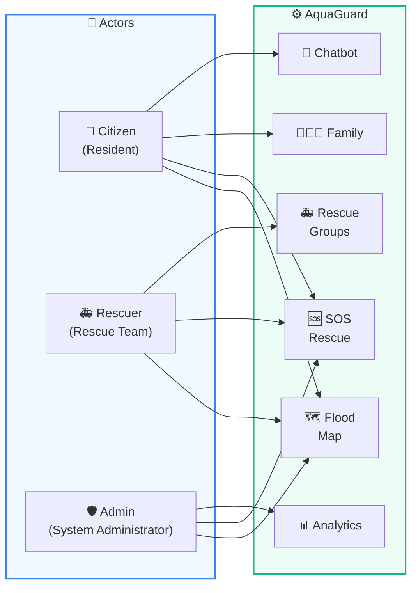

---

## 2. High-Level Architecture Diagram

### 2.1 High-Level Architecture Diagram

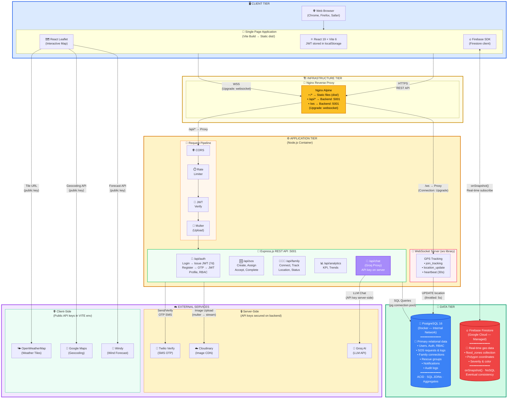

### 2.2 Authentication Flow

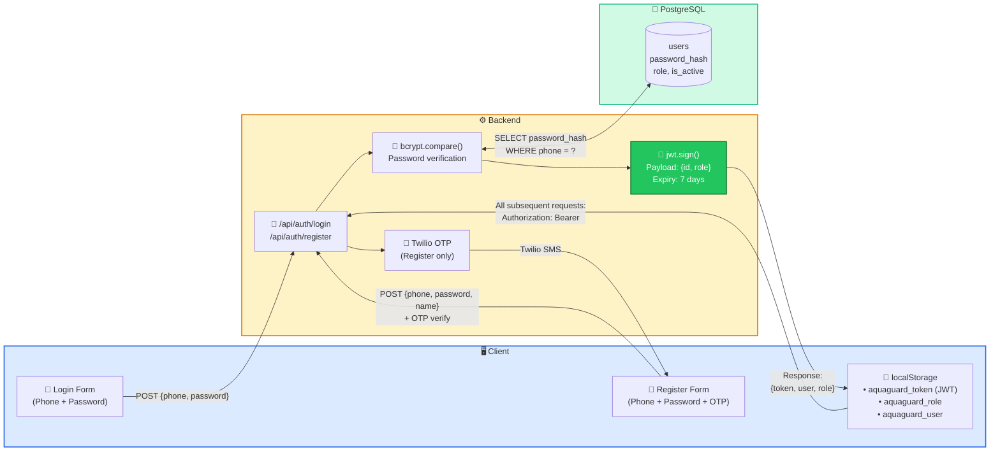

### 2.3 Deployment & Infrastructure

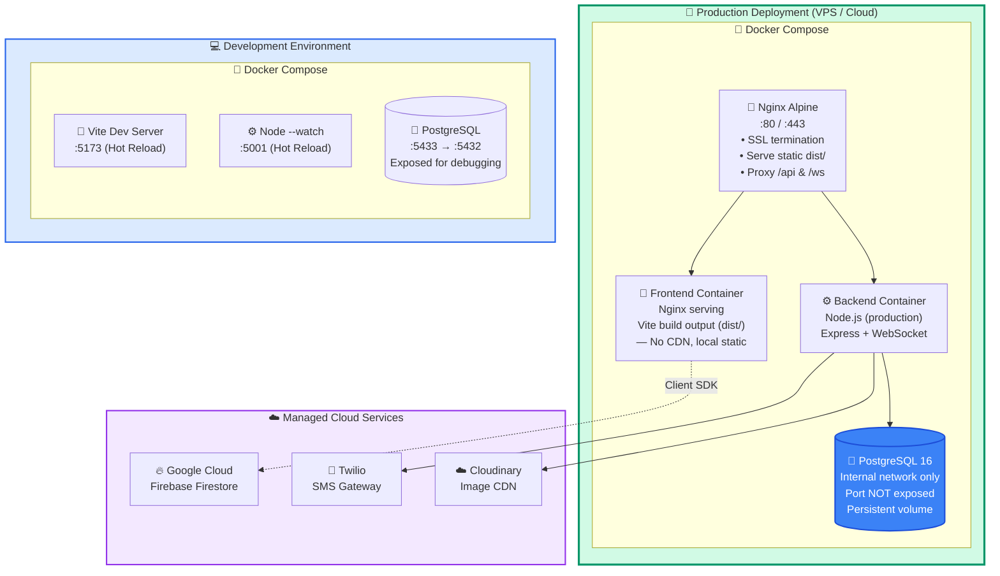

### 2.4 Error Handling & Fallback Strategy

| External Service | Failure Scenario | Fallback Strategy | User Impact |
|-----------------|------------------|-------------------|-------------|
| **Twilio** (SMS OTP) | Service down / rate limited | Return HTTP 503 with retry message; user retries after cooldown | Registration/password reset temporarily blocked |
| **Cloudinary** (Image CDN) | Upload failure / timeout | Return HTTP 500; allow form submission without image; log error for admin | SOS/profile submission proceeds without photo |
| **Groq AI** (LLM Chatbot) | API key invalid / service down | Backend proxy returns fallback message: "Service temporarily unavailable" | Chatbot shows error state; core features unaffected |
| **Firebase Firestore** (Flood Map) | Connection lost / quota exceeded | Leaflet map displays base tiles without flood overlay; cached last-known data | Map remains functional, flood zones temporarily hidden |
| **OpenWeatherMap** (Weather) | Tile server timeout | Weather layer fails silently; map shows without overlay | No weather layer; map still usable |
| **Google Maps** (Geocoding) | API quota exhausted | Display raw GPS coordinates instead of text address | Coordinates shown instead of readable address |
| **Windy** (Wind Forecast) | API/embed failure | Wind layer hidden; no forecast panel | Wind forecast unavailable; other layers unaffected |
| **PostgreSQL** (Primary DB) | Connection pool exhausted | Express returns HTTP 503; healthcheck triggers container restart | All API requests fail; system recovers on restart |
| **WebSocket** (GPS Tracking) | Connection dropped | Client auto-reconnects with exponential backoff (ws heartbeat 30s) | Brief tracking gap; resumes automatically |

### 2.5 Main Data Flow Summary

| # | Flow | Description | Protocol |
|---|------|-------------|----------|
| 1 | Client → Nginx → Middleware → Express | REST API calls (CRUD, auth, SOS, family, analytics) | HTTPS |
| 2 | Client ↔ Nginx ↔ WebSocket Server | Real-time GPS tracking between citizen & rescuer | WSS (Upgrade header) |
| 3 | Client ↔ Firebase Firestore | Read/write real-time flood zone polygons | Firestore SDK (client) |
| 4 | Client → Backend → Groq AI | AI chatbot Q&A (proxied — API key secured on server) | HTTPS (server proxy) |
| 5 | Client → OWM / Google / Windy | Weather tiles, geocoding, wind forecast (public keys) | HTTPS (client-direct) |
| 6 | Backend → Twilio | Send/verify OTP via SMS (secret key on server) | HTTPS (server-side) |
| 7 | Backend → Cloudinary | Upload/manage images via multer stream (secret key) | HTTPS (server-side) |
| 8 | Backend → PostgreSQL | Primary data CRUD via connection pool (internal network) | TCP (pg protocol) |

---

## 3. Layered Architecture

### 3.1 Layered Architecture Diagram

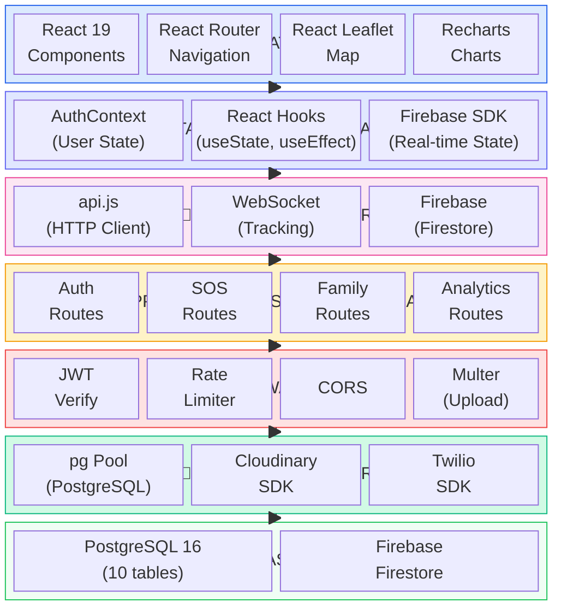

### 3.2 Layer Details

| Layer | Technology | Responsibility |
|-------|-----------|----------------|
| **Presentation** | React 19, TailwindCSS 4, React Leaflet, Recharts | User interface, rendering components, interaction |
| **State Management** | AuthContext, React Hooks, Firebase SDK | Application state management (auth, data, real-time) |
| **Service / API** | Fetch API (api.js), WebSocket, Firebase SDK | Communication with backend and external services |
| **Application Logic** | Express.js Routes (auth, sos, family, analytics) | Business logic processing, validation, orchestration |
| **Middleware** | JWT, Rate Limiter, CORS, Multer | Authentication, authorization, security, file upload |
| **Data Access** | pg Pool, Cloudinary SDK, Twilio SDK | Database access, image service, SMS |
| **Database** | PostgreSQL 16, Firebase Firestore | Persistent and real-time data storage |

---

## 4. Deployment Architecture

### 4.1 Development Environment

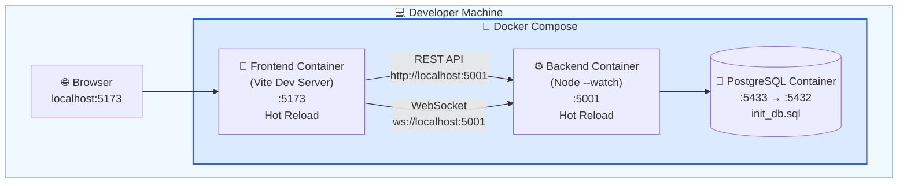

### 4.2 Production Environment

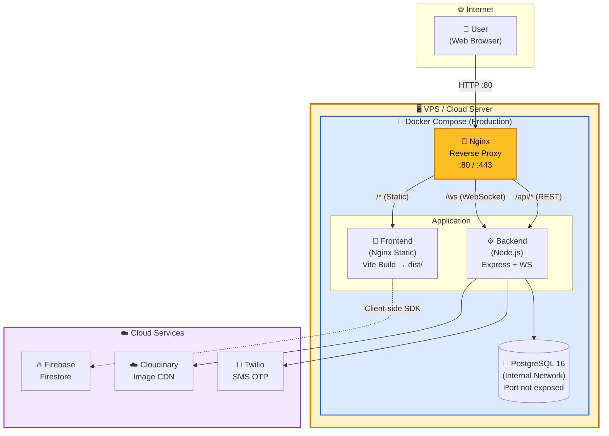

### 4.3 Dev vs Production Comparison

| Component | Development | Production |
|-----------|-------------|------------|
| **Frontend** | Vite Dev Server (:5173), Hot Reload | Vite Build → Static files, served by Nginx |
| **Backend** | `node --watch` (:5001), bind mount source | `node index.js`, fixed build |
| **PostgreSQL** | Expose :5433 to host | Internal network, port not exposed |
| **Nginx** | Not used | Reverse proxy :80/:443, SSL termination |
| **File Upload** | Bind mount volumes | Copied into container |
| **Environment** | `.env` files, hot reload | ENV vars, `NODE_ENV=production` |

---

## 5. Frontend Architecture

### 5.1 Component Architecture Diagram

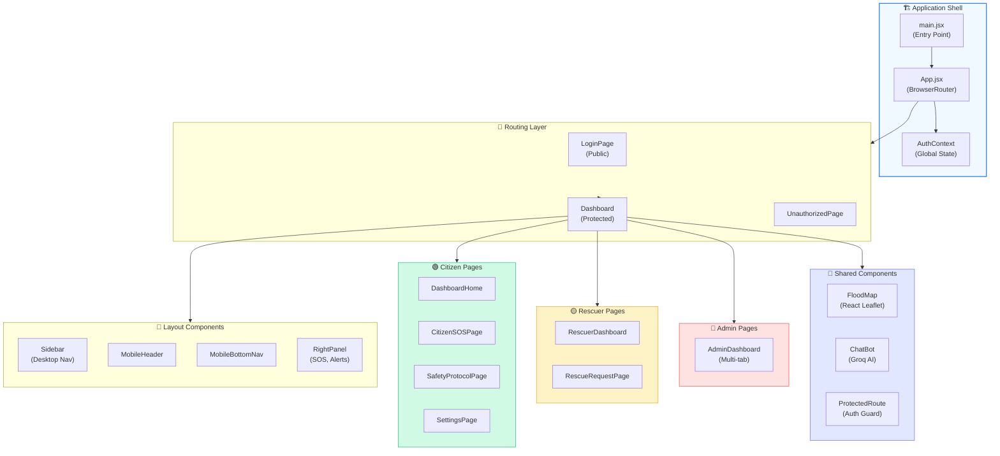

### 5.2 Frontend Directory Structure

```
frontend/src/
├── main.jsx                    # Entry point
├── App.jsx                     # Root + BrowserRouter
├── index.css                   # Global CSS (TailwindCSS 4)
├── config/
│   ├── firebase.js             # Firebase lazy initialization
│   └── rbac.js                 # RBAC roles & permissions
├── contexts/
│   └── AuthContext.jsx         # Authentication state (JWT, role, user)
├── hooks/                      # Custom React hooks
├── services/
│   └── api.js                  # HTTP client (Fetch wrapper)
├── translations/               # i18n (Vietnamese/English)
├── utils/                      # Utility functions
├── pages/
│   ├── LoginPage.jsx           # Phone + Password authentication
│   ├── Dashboard.jsx           # Main layout shell
│   ├── DashboardHome.jsx       # Home dashboard
│   ├── SettingsPage.jsx        # Profile, Family, Theme
│   ├── citizen/
│   │   └── CitizenSOSPage.jsx
│   ├── rescuer/
│   │   └── RescuerDashboard.jsx
│   └── admin/
│       └── AdminDashboard.jsx  # Multi-tab admin panel
└── components/
    ├── auth/                   # ProtectedRoute, RoleSelectionModal
    ├── layout/                 # Sidebar, Header, MobileNav
    ├── map/                    # FloodMap, AdminFloodMapEditor
    ├── chat/                   # ChatBot (Groq AI)
    ├── dashboard/              # Widgets, charts
    ├── rescue/                 # Rescue cards & forms
    └── common/                 # Reusable UI components
```

---

## 6. Backend Architecture

### 6.1 Backend Architecture Diagram

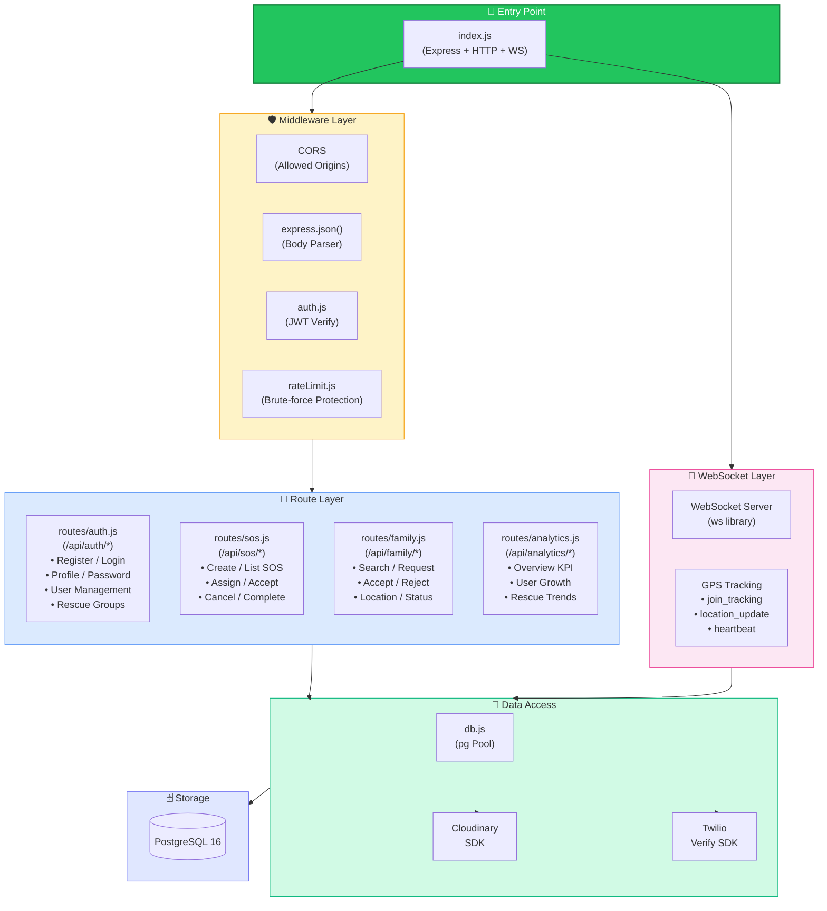

### 6.2 Backend Directory Structure

```
backend/
├── index.js                  # Express app + HTTP server + WebSocket server
├── db.js                     # PostgreSQL connection pool (pg)
├── package.json              # Dependencies
├── Dockerfile                # Docker build
├── .env                      # Environment variables
├── middleware/
│   ├── auth.js               # JWT verification middleware
│   └── rateLimit.js          # Rate limiting (sliding window)
├── routes/
│   ├── auth.js               # Authentication & User management (~46KB)
│   ├── sos.js                # SOS/Rescue request management
│   ├── family.js             # Family connection & tracking
│   └── analytics.js          # Analytics & reporting
├── utils/                    # Utility functions
└── migrations/               # Database migration scripts
```

### 6.3 API Endpoint Map

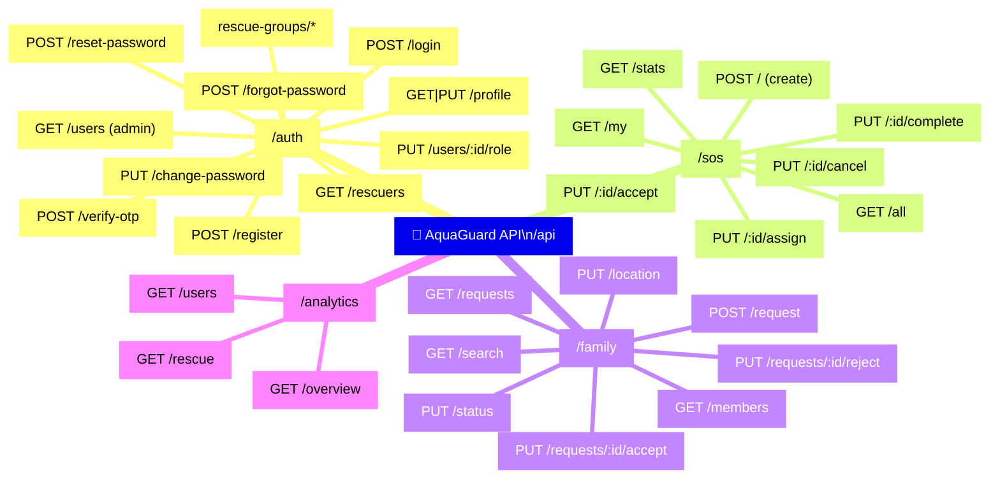

---

## 7. Database Architecture

### 7.1 Data Stores Overview Diagram

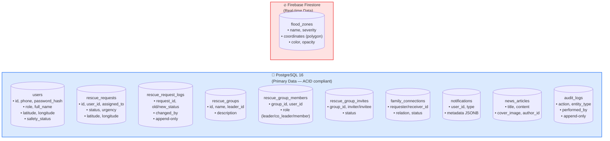

### 7.2 Rationale for Dual-Database

| Criterion | PostgreSQL | Firebase Firestore |
|-----------|------------|-------------------|
| **Purpose** | Primary data (users, SOS, family, ...) | Real-time map data (flood zones) |
| **Consistency** | ACID, strong consistency | Eventual consistency |
| **Real-time** | Requires polling or WebSocket | Native `onSnapshot()` real-time listener |
| **Querying** | Complex SQL (JOIN, aggregate) | NoSQL, document-based |
| **Deployment** | Self-hosted (Docker) | Managed cloud service (Google) |
| **Use case** | CRUD, authentication, analytics | Map overlay, geo-polygon rendering |

---

## 8. Communication Protocols

### 8.1 Communication Protocol Diagram

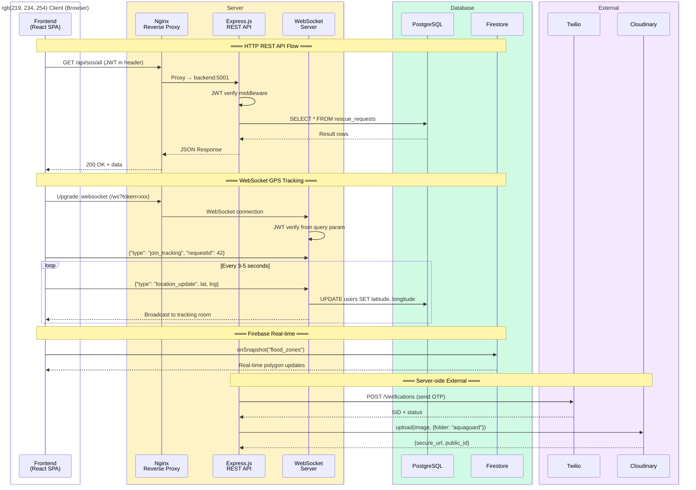

### 8.2 Protocol Summary

| Communication | Protocol | Direction | Purpose |
|---------------|----------|-----------|---------|
| Frontend → Backend | HTTP/HTTPS (REST) | Request-Response | CRUD operations, authentication |
| Frontend ↔ Backend | WebSocket (ws://) | Bidirectional | GPS tracking real-time |
| Frontend ↔ Firestore | Firestore SDK | Real-time listener | Flood zone polygon data |
| Frontend → Groq AI | HTTPS (REST) | Request-Response | AI chatbot (client-direct) |
| Frontend → OWM/Windy | HTTPS (Tile/API) | Request-Response | Weather tiles, wind forecast |
| Backend → PostgreSQL | TCP (pg protocol) | Connection pool | SQL queries |
| Backend → Twilio | HTTPS (REST) | Request-Response | SMS OTP |
| Backend → Cloudinary | HTTPS (SDK) | Request-Response | Image upload/management |

---

## 9. External Services Integration

### 9.1 Integration Diagram

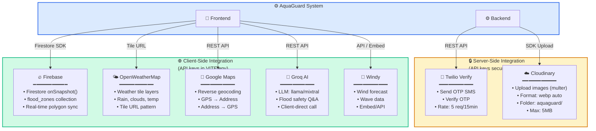

### 9.2 Integration Details

| Service | Type | Side | Purpose | Authentication |
|---------|------|------|---------|----------------|
| **Twilio Verify** | SMS Gateway | Server | Send & verify OTP via SMS | Account SID + Auth Token |
| **Cloudinary** | Image CDN | Server | Upload, store, optimize images (avatar, SOS, articles) | Cloud Name + API Key + Secret |
| **Firebase Firestore** | NoSQL DB | Client | Real-time subscribe to flood zones (polygon data) | Firebase Config (API Key + Project ID) |
| **OpenWeatherMap** | Weather API | Client | Map tile layers (rain, clouds, temperature) | API Key (URL param) |
| **Google Maps** | Geocoding API | Client | GPS ↔ text address conversion | API Key (URL param) |
| **Groq AI** | LLM API | Client | Flood prevention advisory chatbot | API Key (Header) |
| **Windy** | Forecast API | Client | Wind, pressure, and wave forecast | API Key |

---

## 10. Security Architecture

### 10.1 Security Diagram

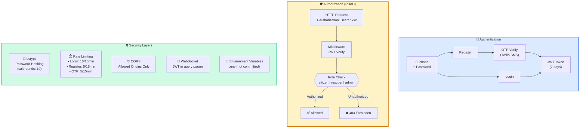

### 10.2 Security Measures Summary

| Security Layer | Measure | Details |
|----------------|---------|---------|
| **Authentication** | Phone + Password + OTP | Registration requires SMS OTP verification; login via phone number + password |
| **Password Storage** | bcrypt hashing | Salt rounds = 10, no plain text storage |
| **Session** | JWT (7 days) | Token stored in `localStorage`, sent via `Authorization: Bearer` header |
| **Authorization** | RBAC 3-role | `citizen`, `rescuer`, `admin` — enforced on both frontend and backend |
| **Rate Limiting** | Sliding window | Login: 10 req/15min, Register: 5 req/15min, OTP: 5 req/15min |
| **CORS** | Whitelist origins | Only allows `localhost:5173`, `localhost:5174`, and FRONTEND_URL |
| **WebSocket Auth** | JWT in query param | Token passed via `ws://host?token=xxx`, verified before accepting |
| **File Upload** | Multer + Cloudinary | Size limited, images only, uploaded through server |
| **Environment** | `.env` files | API keys, secrets not committed to Git (`.gitignore`) |
| **Database** | Internal network | PostgreSQL port not exposed in production |

---

## 11. Tech Stack Summary

### 11.1 Tech Stack Diagram

```mermaid
flowchart TB
    subgraph FRONTEND_STACK["📱 Frontend Stack"]
        direction TB
        R19["⚛️ React 19.0.0\n(UI Framework)"]
        VITE6["⚡ Vite 6.0.0\n(Build Tool)"]
        TW4["🎨 TailwindCSS 4.0.0\n(Styling)"]
        RR7["🧭 React Router DOM 7.13\n(Routing)"]
        RL5["🗺️ React Leaflet 5.0.0\n(Map)"]
        L19["📍 Leaflet 1.9.4\n(Map Engine)"]
        RC3["📊 Recharts 3.8.1\n(Charts)"]
        FB12["🔥 Firebase 12.10.0\n(Firestore)"]
    end

    subgraph BACKEND_STACK["⚙️ Backend Stack"]
        direction TB
        NODE["🟢 Node.js\n(Runtime)"]
        EXP4["📡 Express 4.21.2\n(Web Framework)"]
        WS8["🔌 ws 8.20.0\n(WebSocket)"]
        PG8["🐘 pg 8.13.1\n(PostgreSQL Client)"]
        JWT9["🔑 jsonwebtoken 9.0.2\n(JWT)"]
        BC5["🔒 bcrypt 5.1.1\n(Password Hash)"]
        ML2["📎 multer 2.1.1\n(File Upload)"]
        CL2["☁️ cloudinary 2.9.0\n(Image CDN)"]
        TW5["📱 twilio 5.13.1\n(SMS OTP)"]
    end

    subgraph INFRA_STACK["🏗️ Infrastructure Stack"]
        direction TB
        DOCKER["🐳 Docker\n(Containerization)"]
        DC["🐳 Docker Compose\n(Orchestration)"]
        NGX["🔀 Nginx Alpine\n(Reverse Proxy)"]
        PGDB["🐘 PostgreSQL 16 Alpine\n(Database)"]
        MAKE["📝 Makefile\n(Task Runner)"]
    end

    subgraph EXTERNAL_STACK["☁️ External Services"]
        direction TB
        FIREBASE_SVC["🔥 Firebase Firestore"]
        TWILIO_SVC2["📱 Twilio Verify"]
        CLOUD_SVC["☁️ Cloudinary"]
        OWM_SVC2["🌤️ OpenWeatherMap"]
        GMAPS["📍 Google Maps"]
        GROQ["🤖 Groq AI"]
        WINDY2["💨 Windy"]
    end

    style FRONTEND_STACK fill:#dbeafe,stroke:#2563eb,stroke-width:2px
    style BACKEND_STACK fill:#d1fae5,stroke:#10b981,stroke-width:2px
    style INFRA_STACK fill:#fef3c7,stroke:#d97706,stroke-width:2px
    style EXTERNAL_STACK fill:#f3e8ff,stroke:#9333ea,stroke-width:2px
```

### 11.2 Tech Stack Summary Tables

#### Frontend

| Technology | Version | Role |
|------------|---------|------|
| React | 19.0.0 | UI component framework |
| Vite | 6.0.0 | Build tool & dev server (HMR) |
| TailwindCSS | 4.0.0 | Utility-first CSS framework |
| React Router DOM | 7.13.1 | Client-side routing (SPA) |
| React Leaflet | 5.0.0 | React wrapper for Leaflet map |
| Leaflet | 1.9.4 | Interactive map (OpenStreetMap) |
| Recharts | 3.8.1 | Chart & data visualization |
| Firebase SDK | 12.10.0 | Firestore real-time database |

#### Backend

| Technology | Version | Role |
|------------|---------|------|
| Node.js | — | JavaScript runtime |
| Express.js | 4.21.2 | Web framework (REST API) |
| ws | 8.20.0 | WebSocket server (GPS tracking) |
| pg | 8.13.1 | PostgreSQL client (connection pool) |
| jsonwebtoken | 9.0.2 | JWT token generation & verification |
| bcrypt | 5.1.1 | Password hashing (10 salt rounds) |
| multer | 2.1.1 | Multipart file upload middleware |
| cloudinary | 2.9.0 | Image upload & CDN management |
| twilio | 5.13.1 | SMS OTP (Verify API) |
| dotenv | 16.6.1 | Environment variable management |
| cors | 2.8.5 | Cross-Origin Resource Sharing |

#### Infrastructure

| Technology | Version | Role |
|------------|---------|------|
| Docker | — | Containerization |
| Docker Compose | — | Multi-container orchestration |
| Nginx | Alpine | Reverse proxy, static serving, SSL termination |
| PostgreSQL | 16 Alpine | Relational database (ACID) |
| Makefile | — | Task automation (build, deploy, logs) |

#### External Services

| Service | Role | Protocol |
|---------|------|----------|
| Firebase Firestore | Real-time polygon data (flood zones) | Firestore SDK (client) |
| Twilio Verify | SMS OTP authentication | REST API (server) |
| Cloudinary | Image CDN & management | SDK (server) |
| OpenWeatherMap | Weather tile layers | Tile URL (client) |
| Google Maps | Geocoding (GPS ↔ Address) | REST API (client) |
| Groq AI | LLM chatbot (flood safety Q&A) | REST API (client) |
| Windy | Wind & wave forecast | API/Embed (client) |

---

> *System Architecture document for AquaGuard v2.0. Any architectural changes should be reflected in this document accordingly.*
