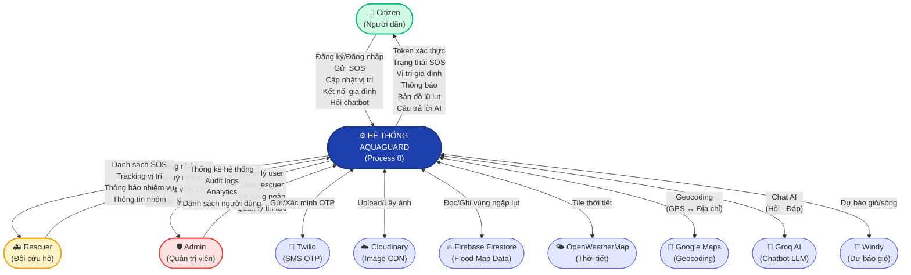
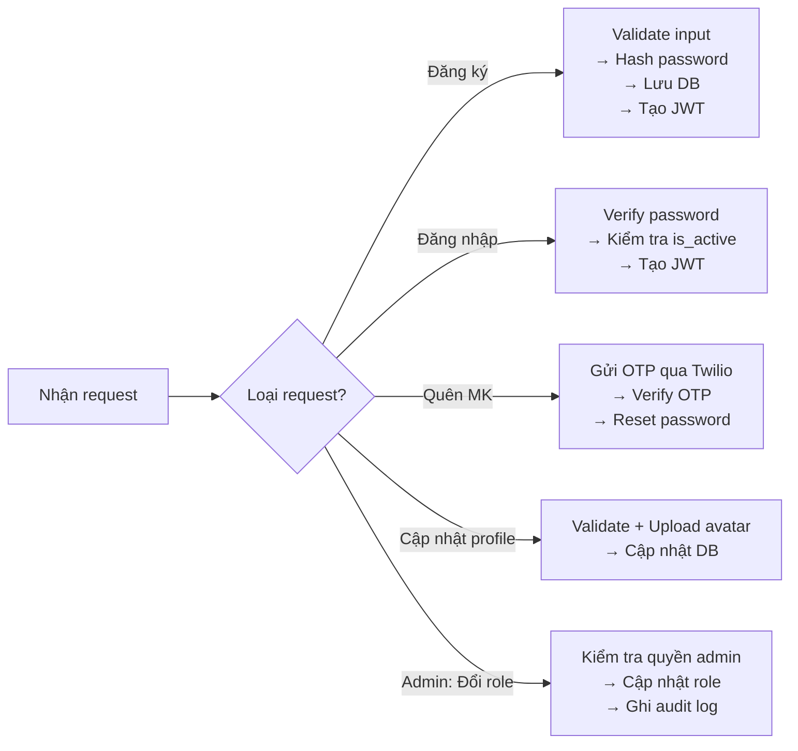
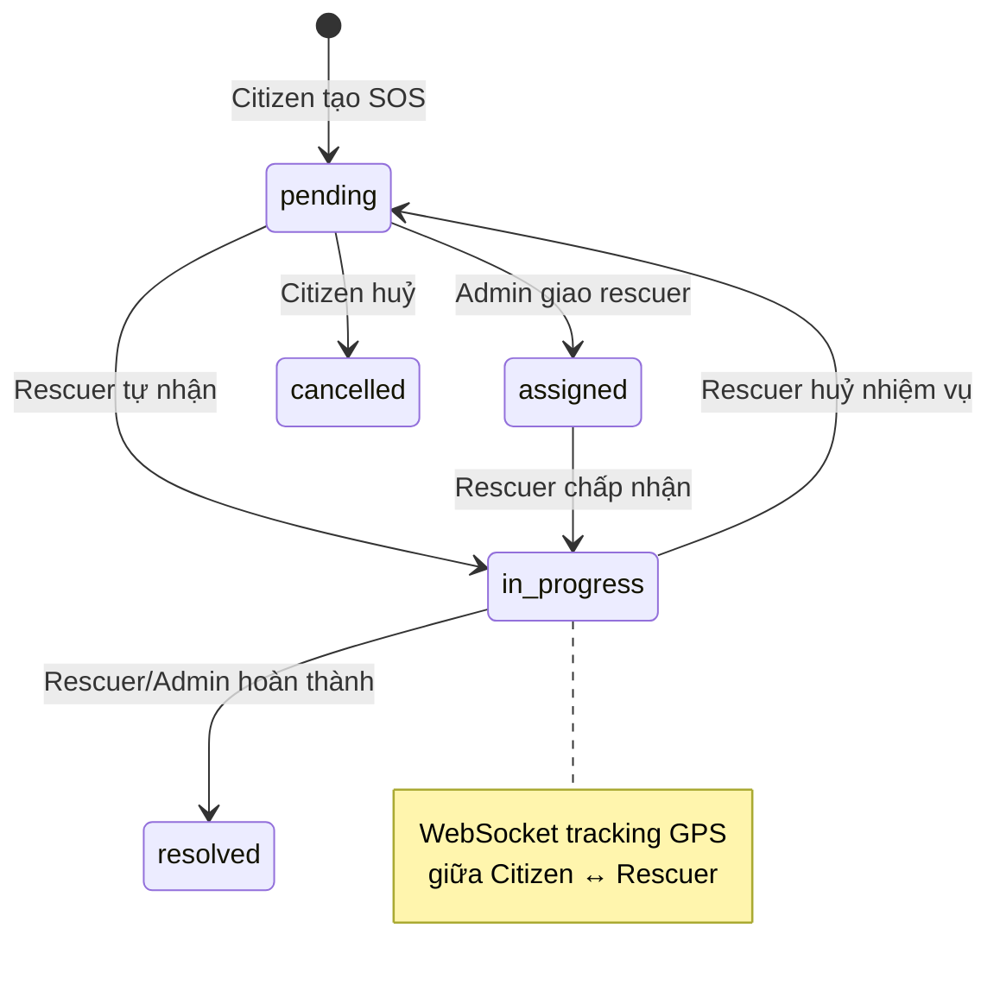
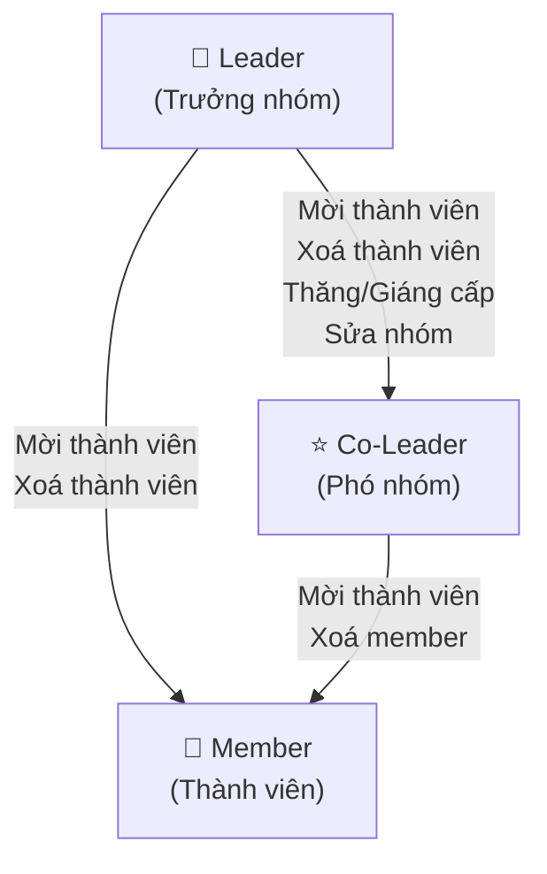
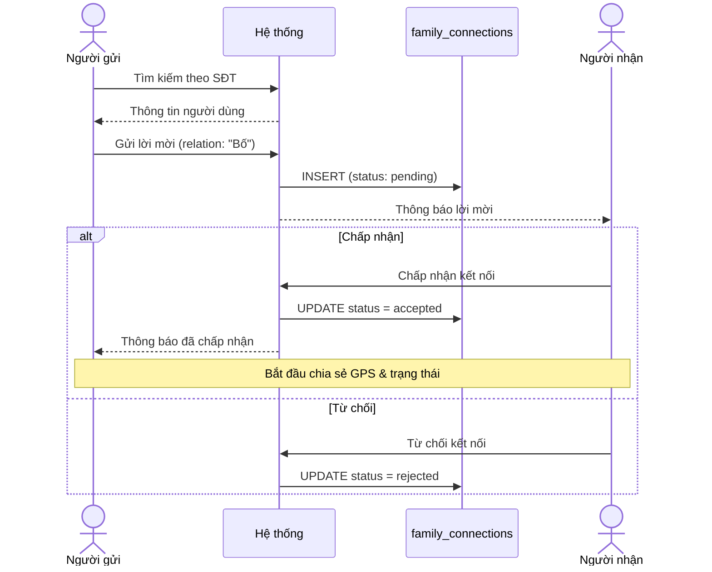
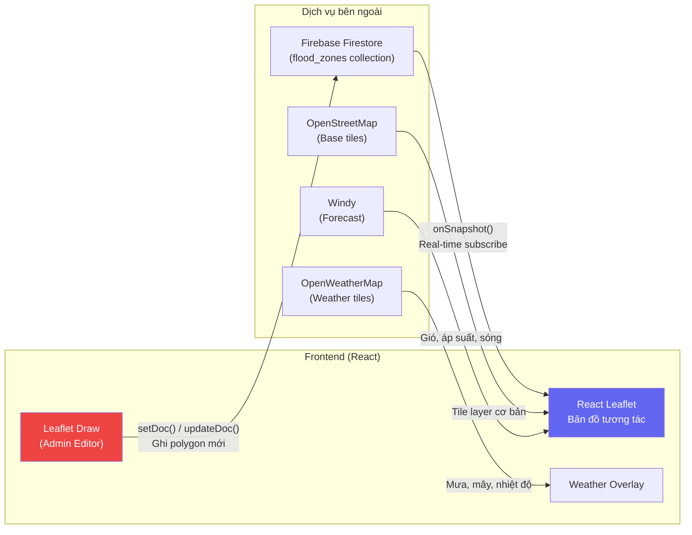

# AquaGuard — Sơ Đồ Luồng Dữ Liệu (Data Flow Diagram)

> **Version:** 2.0 | **Cập nhật lần cuối:** 2026-04-14  
> Tài liệu mô tả sơ đồ luồng dữ liệu Level 0 (Context Diagram) và Level 1 cho hệ thống AquaGuard.

---

## Mục Lục

1. [Giới thiệu](#1-giới-thiệu)
2. [Context Diagram (Level 0)](#2-context-diagram-level-0)
3. [Level 1 DFD](#3-level-1-dfd)
4. [Chi tiết các Tiến trình (Process)](#4-chi-tiết-các-tiến-trình)
5. [Chi tiết các Kho dữ liệu (Data Store)](#5-chi-tiết-các-kho-dữ-liệu)
6. [Chi tiết các Thực thể ngoài (External Entity)](#6-chi-tiết-các-thực-thể-ngoài)
7. [Bảng tổng hợp Luồng dữ liệu](#7-bảng-tổng-hợp-luồng-dữ-liệu)

---

## 1. Giới thiệu

### 1.1 Mục đích tài liệu

Tài liệu này mô tả **Data Flow Diagram (DFD)** của hệ thống **AquaGuard** — ứng dụng web quản lý thiên tai lũ lụt, cứu hộ và theo dõi gia đình. DFD giúp trực quan hóa:

- Cách dữ liệu di chuyển giữa các tiến trình trong hệ thống
- Các kho dữ liệu (data store) được sử dụng
- Tương tác giữa hệ thống và các thực thể ngoài (external entities)

### 1.2 Quy ước ký hiệu

| Ký hiệu | Hình dạng | Ý nghĩa |
|----------|-----------|---------|
| **Thực thể ngoài** (External Entity) | Hình chữ nhật | Người dùng hoặc hệ thống bên ngoài tương tác với hệ thống |
| **Tiến trình** (Process) | Hình tròn / oval | Xử lý, biến đổi dữ liệu bên trong hệ thống |
| **Kho dữ liệu** (Data Store) | Hai đường song song | Nơi lưu trữ dữ liệu |
| **Luồng dữ liệu** (Data Flow) | Mũi tên | Hướng di chuyển dữ liệu |

---

## 2. Context Diagram (Level 0)

> Sơ đồ ngữ cảnh thể hiện toàn bộ hệ thống AquaGuard như **một tiến trình duy nhất** và các tương tác với thực thể bên ngoài.



### Bảng tóm tắt Context Diagram

| Thực thể ngoài | Dữ liệu đến hệ thống (Input) | Dữ liệu từ hệ thống (Output) |
|----------------|-------------------------------|-------------------------------|
| **Citizen** | Thông tin đăng ký, SOS request, vị trí GPS, yêu cầu kết nối gia đình, câu hỏi chatbot | Token xác thực, trạng thái SOS, vị trí gia đình, thông báo, bản đồ, câu trả lời AI |
| **Rescuer** | Thông tin đăng nhập, chấp nhận/huỷ nhiệm vụ, vị trí GPS, quản lý nhóm | Danh sách SOS, tracking vị trí, thông báo, thông tin nhóm |
| **Admin** | Quản lý user, giao rescuer, dữ liệu vùng ngập, quản lý tin tức | Thống kê, analytics, audit logs, danh sách user |
| **Twilio** | Kết quả xác minh OTP | Yêu cầu gửi OTP SMS |
| **Cloudinary** | URL ảnh đã upload | File ảnh (avatar, SOS, bài viết) |
| **Firebase** | Dữ liệu vùng ngập real-time | Polygon vùng ngập mới/chỉnh sửa |
| **OpenWeatherMap** | Tile thời tiết | Yêu cầu tile theo toạ độ |
| **Google Maps** | Địa chỉ văn bản / Toạ độ GPS | Toạ độ GPS / Địa chỉ văn bản |
| **Groq AI** | Câu trả lời tư vấn | Câu hỏi người dùng |
| **Windy** | Dữ liệu dự báo gió/sóng | Yêu cầu forecast |

---

## 3. Level 1 DFD

> Sơ đồ Level 1 phân rã **Process 0** thành **7 tiến trình con** chính, thể hiện chi tiết hơn cách dữ liệu luân chuyển trong hệ thống.

```mermaid
flowchart TB
    %% ── External Entities ──
    CITIZEN(["👤 Citizen"])
    RESCUER(["🚑 Rescuer"])
    ADMIN(["🛡️ Admin"])
    TWILIO(["📱 Twilio"])
    CLOUDINARY(["☁️ Cloudinary"])
    FIREBASE(["🔥 Firebase"])
    OWM(["🌤️ OpenWeatherMap"])
    GOOGLE(["📍 Google Maps"])
    GROQ(["🤖 Groq AI"])

    %% ── Data Stores ──
    D1[("D1: users")]
    D2[("D2: rescue_requests")]
    D3[("D3: rescue_request_logs")]
    D4[("D4: rescue_groups\n+ rescue_group_members\n+ rescue_group_invites")]
    D5[("D5: family_connections")]
    D6[("D6: notifications")]
    D7[("D7: news_articles")]
    D8[("D8: audit_logs")]

    %% ── Processes ──
    P1(["1.0\nXác thực &\nQuản lý người dùng"])
    P2(["2.0\nQuản lý\nSOS / Cứu hộ"])
    P3(["3.0\nQuản lý\nNhóm cứu hộ"])
    P4(["4.0\nKết nối &\nTheo dõi gia đình"])
    P5(["5.0\nBản đồ lũ lụt\n& Thời tiết"])
    P6(["6.0\nThống kê &\nPhân tích"])
    P7(["7.0\nThông báo &\nTin tức"])

    %% ── Flows: Citizen → P1 ──
    CITIZEN -->|"Thông tin đăng ký\n(SĐT, mật khẩu, tên)"| P1
    CITIZEN -->|"Thông tin đăng nhập\n(SĐT, mật khẩu)"| P1
    CITIZEN -->|"OTP xác minh"| P1
    P1 -->|"JWT Token\nThông tin profile"| CITIZEN

    %% ── Flows: P1 ↔ Data Stores ──
    P1 <-->|"Đọc/Ghi thông tin\nngười dùng"| D1
    P1 -->|"Ghi audit log\n(thay đổi role)"| D8
    P1 <-->|"Gửi/Xác minh OTP"| TWILIO
    P1 <-->|"Upload avatar"| CLOUDINARY

    %% ── Flows: Citizen → P2 ──
    CITIZEN -->|"Yêu cầu SOS\n(vị trí, mô tả, ảnh)"| P2
    P2 -->|"Trạng thái SOS\nThông tin rescuer"| CITIZEN

    %% ── Flows: Rescuer → P2 ──
    RESCUER -->|"Chấp nhận/Huỷ\nnhiệm vụ"| P2
    RESCUER -->|"Hoàn thành\nnhiệm vụ"| P2
    P2 -->|"Danh sách SOS\nChi tiết nhiệm vụ"| RESCUER

    %% ── Flows: Admin → P2 ──
    ADMIN -->|"Giao rescuer\ncho SOS"| P2

    %% ── Flows: P2 ↔ Data Stores ──
    P2 <-->|"Đọc/Ghi\nSOS request"| D2
    P2 -->|"Ghi log\nthay đổi trạng thái"| D3
    P2 -->|"Tạo thông báo\nSOS"| D6
    P2 <-->|"Upload ảnh SOS"| CLOUDINARY
    P2 -->|"Đọc thông tin\nuser/rescuer"| D1

    %% ── Flows: P2 ↔ WebSocket (implicit in tracking) ──

    %% ── Flows: Rescuer → P3 ──
    RESCUER -->|"Tạo/Sửa nhóm\nMời thành viên"| P3
    P3 -->|"Thông tin nhóm\nDanh sách thành viên"| RESCUER

    %% ── Flows: P3 ↔ Data Stores ──
    P3 <-->|"Đọc/Ghi\nnhóm & thành viên"| D4
    P3 -->|"Tạo thông báo\nmời nhóm"| D6
    P3 -->|"Đọc thông tin\nrescuer"| D1

    %% ── Flows: Citizen → P4 ──
    CITIZEN -->|"Gửi lời mời\nkết nối gia đình"| P4
    CITIZEN -->|"Cập nhật vị trí GPS\nTrạng thái an toàn"| P4
    P4 -->|"Vị trí gia đình\nTrạng thái an toàn"| CITIZEN

    %% ── Flows: P4 ↔ Data Stores ──
    P4 <-->|"Đọc/Ghi\nkết nối gia đình"| D5
    P4 <-->|"Cập nhật vị trí\ntrạng thái user"| D1
    P4 -->|"Tạo thông báo\nkết nối"| D6
    P4 <-->|"Geocoding\nGPS ↔ Địa chỉ"| GOOGLE

    %% ── Flows: Users → P5 ──
    CITIZEN -->|"Xem bản đồ"| P5
    RESCUER -->|"Xem bản đồ"| P5
    P5 -->|"Bản đồ lũ lụt\nLớp thời tiết"| CITIZEN
    P5 -->|"Bản đồ lũ lụt\nLớp thời tiết"| RESCUER

    %% ── Flows: Admin → P5 ──
    ADMIN -->|"Vẽ/Sửa vùng ngập"| P5
    P5 -->|"Bản đồ + Editor"| ADMIN

    %% ── Flows: P5 ↔ External ──
    P5 <-->|"Đọc/Ghi polygon\nvùng ngập lụt"| FIREBASE
    P5 <-->|"Tile layer\nthời tiết"| OWM

    %% ── Flows: Admin → P6 ──
    ADMIN -->|"Yêu cầu\nthống kê"| P6
    P6 -->|"Dashboard KPI\nBiểu đồ analytics"| ADMIN

    %% ── Flows: P6 ↔ Data Stores ──
    P6 -->|"Đọc thống kê\nuser"| D1
    P6 -->|"Đọc thống kê\nSOS"| D2
    P6 -->|"Đọc audit trail"| D8

    %% ── Flows: P7 (Notifications & News) ──
    P7 <-->|"Đọc/Ghi\nthông báo"| D6
    P7 <-->|"Đọc/Ghi\nbài viết"| D7
    P7 -->|"Thông báo\ntin tức"| CITIZEN
    P7 -->|"Thông báo\nnhiệm vụ"| RESCUER
    ADMIN -->|"Tạo/Quản lý\nbài viết"| P7
    P7 <-->|"Upload ảnh bìa"| CLOUDINARY

    %% ── Flows: Chatbot (part of P5 or separate) ──
    CITIZEN -->|"Câu hỏi\ntư vấn"| GROQ
    GROQ -->|"Câu trả lời AI"| CITIZEN

    %% ── Admin access P1 ──
    ADMIN -->|"Quản lý user\nĐổi role"| P1
    P1 -->|"Danh sách user\nThông tin chi tiết"| ADMIN
    RESCUER -->|"Đăng nhập"| P1
    P1 -->|"JWT Token"| RESCUER

    %% ── Styles ──
    style P1 fill:#3b82f6,color:#fff,stroke:#1e40af,stroke-width:2px
    style P2 fill:#ef4444,color:#fff,stroke:#b91c1c,stroke-width:2px
    style P3 fill:#f59e0b,color:#fff,stroke:#d97706,stroke-width:2px
    style P4 fill:#10b981,color:#fff,stroke:#059669,stroke-width:2px
    style P5 fill:#6366f1,color:#fff,stroke:#4338ca,stroke-width:2px
    style P6 fill:#8b5cf6,color:#fff,stroke:#6d28d9,stroke-width:2px
    style P7 fill:#ec4899,color:#fff,stroke:#be185d,stroke-width:2px

    style CITIZEN fill:#d1fae5,stroke:#10b981,stroke-width:2px
    style RESCUER fill:#fef3c7,stroke:#f59e0b,stroke-width:2px
    style ADMIN fill:#fee2e2,stroke:#ef4444,stroke-width:2px

    style D1 fill:#f0f9ff,stroke:#3b82f6
    style D2 fill:#fef2f2,stroke:#ef4444
    style D3 fill:#fef2f2,stroke:#ef4444
    style D4 fill:#fffbeb,stroke:#f59e0b
    style D5 fill:#ecfdf5,stroke:#10b981
    style D6 fill:#fdf4ff,stroke:#d946ef
    style D7 fill:#fff7ed,stroke:#f97316
    style D8 fill:#f5f3ff,stroke:#8b5cf6
```



---

## 4. Chi tiết các Tiến trình

### 4.1 Process 1.0 — Xác thực & Quản lý người dùng

| Thuộc tính | Mô tả |
|-----------|-------|
| **Mã tiến trình** | 1.0 |
| **Tên** | Xác thực & Quản lý người dùng (Authentication & User Management) |
| **Input** | Thông tin đăng ký, thông tin đăng nhập, OTP, yêu cầu đổi mật khẩu, file avatar, yêu cầu quản lý user (admin) |
| **Output** | JWT Token (7 ngày), thông tin profile, danh sách user, audit log |
| **Mô tả** | Xử lý toàn bộ luồng xác thực (đăng ký, đăng nhập, quên mật khẩu OTP), quản lý hồ sơ cá nhân, phân quyền RBAC (citizen/rescuer/admin), và quản trị user bởi admin |

**Luồng xử lý chính:**



**API Endpoints liên quan:**

| Method | Endpoint | Mô tả |
|--------|----------|-------|
| `POST` | `/api/auth/register` | Đăng ký tài khoản |
| `POST` | `/api/auth/login` | Đăng nhập |
| `POST` | `/api/auth/forgot-password` | Gửi OTP quên mật khẩu |
| `POST` | `/api/auth/verify-otp` | Xác minh OTP |
| `POST` | `/api/auth/reset-password` | Đặt lại mật khẩu |
| `GET` | `/api/auth/profile` | Lấy thông tin cá nhân |
| `PUT` | `/api/auth/profile` | Cập nhật profile |
| `PUT` | `/api/auth/change-password` | Đổi mật khẩu |
| `GET` | `/api/auth/users` | Danh sách user (admin) |
| `PUT` | `/api/auth/users/:id/role` | Đổi role user (admin) |
| `GET` | `/api/auth/rescuers` | Danh sách rescuer |

---

### 4.2 Process 2.0 — Quản lý SOS / Cứu hộ

| Thuộc tính | Mô tả |
|-----------|-------|
| **Mã tiến trình** | 2.0 |
| **Tên** | Quản lý SOS / Cứu hộ (SOS & Rescue Management) |
| **Input** | Yêu cầu SOS (vị trí, mô tả, ảnh), chấp nhận/huỷ/hoàn thành nhiệm vụ, giao rescuer, vị trí GPS real-time |
| **Output** | Trạng thái SOS, danh sách SOS, thông tin rescuer, tracking vị trí real-time qua WebSocket |
| **Mô tả** | Xử lý toàn bộ vòng đời yêu cầu cứu hộ: tạo → giao → nhận → theo dõi GPS → hoàn thành. Bao gồm cả WebSocket tracking giữa citizen và rescuer |

**Vòng đời trạng thái SOS:**



**API Endpoints liên quan:**

| Method | Endpoint | Mô tả |
|--------|----------|-------|
| `POST` | `/api/sos` | Tạo yêu cầu SOS (multipart/form-data) |
| `GET` | `/api/sos/my` | SOS của tôi (citizen) |
| `GET` | `/api/sos/all` | Tất cả SOS (rescuer, admin) |
| `GET` | `/api/sos/stats` | Thống kê nhanh SOS |
| `PUT` | `/api/sos/:id/assign` | Admin giao rescuer |
| `PUT` | `/api/sos/:id/accept` | Rescuer nhận nhiệm vụ |
| `PUT` | `/api/sos/:id/cancel` | Rescuer huỷ nhiệm vụ |
| `PUT` | `/api/sos/:id/complete` | Hoàn thành nhiệm vụ |

**WebSocket Events:**

| Event | Hướng | Mô tả |
|-------|-------|-------|
| `join_tracking` | Client → Server | Tham gia phòng tracking theo `requestId` |
| `location_update` | Hai chiều | Gửi/Nhận vị trí GPS real-time |
| `tracking_started` | Server → Client | Rescuer vừa nhận nhiệm vụ |
| `tracking_cancelled` | Server → Client | Rescuer huỷ nhiệm vụ |
| `tracking_ended` | Server → Client | Nhiệm vụ hoàn thành |

---

### 4.3 Process 3.0 — Quản lý Nhóm cứu hộ

| Thuộc tính | Mô tả |
|-----------|-------|
| **Mã tiến trình** | 3.0 |
| **Tên** | Quản lý Nhóm cứu hộ (Rescue Group Management) |
| **Input** | Tạo/Sửa nhóm, mời thành viên, chấp nhận/từ chối lời mời, thăng/giáng cấp, rời nhóm |
| **Output** | Thông tin nhóm, danh sách thành viên, thống kê nhóm, thông báo lời mời |
| **Mô tả** | Quản lý đội cứu hộ theo nhóm: tạo nhóm, mời thành viên qua số điện thoại, phân quyền leader/co_leader/member, xem thống kê hoạt động nhóm |

**Cấu trúc phân quyền nhóm:**



**API Endpoints liên quan:**

| Method | Endpoint | Mô tả |
|--------|----------|-------|
| `GET` | `/api/auth/rescue-groups/my` | Nhóm hiện tại của tôi |
| `POST` | `/api/auth/rescue-groups` | Tạo nhóm mới |
| `PUT` | `/api/auth/rescue-groups/:id` | Sửa thông tin nhóm |
| `GET` | `/api/auth/rescue-groups/:id/stats` | Thống kê nhóm |
| `POST` | `/api/auth/rescue-groups/:id/invite` | Mời thành viên |
| `POST` | `/api/auth/rescue-group-invites/:id/accept` | Chấp nhận lời mời |
| `POST` | `/api/auth/rescue-group-invites/:id/decline` | Từ chối lời mời |
| `DELETE` | `/api/auth/rescue-groups/:id/leave` | Rời nhóm |
| `DELETE` | `/api/auth/rescue-groups/:id/members/:userId` | Xoá thành viên |
| `PUT` | `/api/auth/rescue-groups/:id/members/:userId/role` | Thăng/giáng cấp |

---

### 4.4 Process 4.0 — Kết nối & Theo dõi Gia đình

| Thuộc tính | Mô tả |
|-----------|-------|
| **Mã tiến trình** | 4.0 |
| **Tên** | Kết nối & Theo dõi Gia đình (Family Connection & Tracking) |
| **Input** | Lời mời kết nối (SĐT, quan hệ), chấp nhận/từ chối, vị trí GPS, trạng thái an toàn, ghi chú sức khỏe |
| **Output** | Danh sách gia đình, vị trí GPS thành viên, trạng thái an toàn, địa chỉ văn bản |
| **Mô tả** | Cho phép người dùng kết nối với thành viên gia đình, theo dõi vị trí GPS real-time và trạng thái an toàn (safe/danger/injured) của nhau trên bản đồ |

**Luồng kết nối gia đình:**



**API Endpoints liên quan:**

| Method | Endpoint | Mô tả |
|--------|----------|-------|
| `GET` | `/api/family/search?phone=...` | Tìm user theo SĐT |
| `POST` | `/api/family/request` | Gửi lời mời kết nối |
| `GET` | `/api/family/requests` | Lời mời đang chờ |
| `PUT` | `/api/family/requests/:id/accept` | Chấp nhận |
| `PUT` | `/api/family/requests/:id/reject` | Từ chối |
| `GET` | `/api/family/members` | Danh sách gia đình |
| `DELETE` | `/api/family/members/:connectionId` | Xoá kết nối |
| `PUT` | `/api/family/status` | Cập nhật trạng thái an toàn |
| `PUT` | `/api/family/location` | Cập nhật vị trí GPS |

---

### 4.5 Process 5.0 — Bản đồ Lũ lụt & Thời tiết

| Thuộc tính | Mô tả |
|-----------|-------|
| **Mã tiến trình** | 5.0 |
| **Tên** | Bản đồ Lũ lụt & Thời tiết (Flood Map & Weather) |
| **Input** | Polygon vùng ngập (admin vẽ), yêu cầu xem bản đồ, toạ độ GPS |
| **Output** | Bản đồ Leaflet tương tác, vùng ngập lụt real-time, lớp thời tiết overlay, dự báo gió |
| **Mô tả** | Hiển thị bản đồ OpenStreetMap tương tác với dữ liệu vùng ngập lụt từ Firebase Firestore (real-time), overlay thời tiết từ OpenWeatherMap, và dự báo gió từ Windy. Admin có thể vẽ/chỉnh sửa polygon vùng ngập trực tiếp trên bản đồ |

**Luồng dữ liệu bản đồ:**



---

### 4.6 Process 6.0 — Thống kê & Phân tích

| Thuộc tính | Mô tả |
|-----------|-------|
| **Mã tiến trình** | 6.0 |
| **Tên** | Thống kê & Phân tích (Analytics & Reporting) |
| **Input** | Yêu cầu xem thống kê (admin) |
| **Output** | KPI Dashboard, biểu đồ tăng trưởng user, xu hướng cứu hộ, performance metrics |
| **Mô tả** | Tổng hợp và phân tích dữ liệu từ nhiều bảng để cung cấp dashboard KPI cho admin: tổng user, SOS request, tỷ lệ giải quyết, thời gian phản hồi trung bình |

**Dữ liệu thống kê chính:**

| KPI | Nguồn dữ liệu | Mô tả |
|-----|---------------|-------|
| `totalUsers` | `D1: users` | Tổng số người dùng |
| `newUsers7d` | `D1: users` | User mới trong 7 ngày |
| `totalRequests` | `D2: rescue_requests` | Tổng SOS request |
| `pendingRequests` | `D2: rescue_requests` | SOS đang chờ xử lý |
| `activeRequests` | `D2: rescue_requests` | SOS đang thực hiện |
| `resolvedRequests` | `D2: rescue_requests` | SOS đã giải quyết |
| `avgResponseMinutes` | `D2: rescue_requests` | Thời gian phản hồi trung bình (phút) |
| `resolutionRate` | `D2: rescue_requests` | Tỷ lệ giải quyết (%) |

**API Endpoints liên quan:**

| Method | Endpoint | Mô tả |
|--------|----------|-------|
| `GET` | `/api/analytics/overview` | Tổng quan KPI |
| `GET` | `/api/analytics/users` | Tăng trưởng user (30 ngày) |
| `GET` | `/api/analytics/rescue` | Xu hướng cứu hộ + performance |

---

### 4.7 Process 7.0 — Thông báo & Tin tức

| Thuộc tính | Mô tả |
|-----------|-------|
| **Mã tiến trình** | 7.0 |
| **Tên** | Thông báo & Tin tức (Notifications & News) |
| **Input** | Sự kiện hệ thống (SOS, nhóm, gia đình), bài viết tin tức (admin), đánh dấu đã đọc |
| **Output** | Thông báo in-app, feed tin tức, badge chưa đọc |
| **Mô tả** | Quản lý thông báo hệ thống (tự động tạo khi có sự kiện) và tin tức/bài viết do admin tạo. Thông báo được phân loại theo type và hỗ trợ metadata JSONB |

**Các loại thông báo:**

| Type | Nguồn | Người nhận | Mô tả |
|------|-------|-----------|-------|
| `sos_accepted` | P2 | Citizen | Rescuer đã nhận nhiệm vụ SOS |
| `sos_assigned` | P2 | Rescuer | Admin giao nhiệm vụ SOS |
| `sos_completed` | P2 | Citizen | Nhiệm vụ SOS hoàn thành |
| `sos_cancelled` | P2 | Citizen | Rescuer huỷ nhiệm vụ |
| `family_request` | P4 | User | Nhận lời mời kết nối gia đình |
| `family_accepted` | P4 | User | Lời mời gia đình được chấp nhận |
| `group_invite` | P3 | Rescuer | Nhận lời mời vào nhóm cứu hộ |
| `role_changed` | P1 | User | Admin thay đổi vai trò |

---

## 5. Chi tiết các Kho dữ liệu

| Mã | Tên | Công nghệ | Mô tả | Tiến trình truy cập |
|----|-----|-----------|-------|---------------------|
| **D1** | `users` | PostgreSQL | Bảng người dùng trung tâm: thông tin cá nhân, xác thực, vị trí GPS, trạng thái an toàn | P1, P2, P3, P4, P6 |
| **D2** | `rescue_requests` | PostgreSQL | Yêu cầu cứu hộ SOS: vị trí, mô tả, trạng thái, rescuer được giao | P2, P6 |
| **D3** | `rescue_request_logs` | PostgreSQL | Nhật ký thay đổi trạng thái SOS (audit trail bất biến) | P2 |
| **D4** | `rescue_groups` + `rescue_group_members` + `rescue_group_invites` | PostgreSQL | Nhóm cứu hộ, thành viên, lời mời | P3 |
| **D5** | `family_connections` | PostgreSQL | Kết nối gia đình (quan hệ N:N giữa users) | P4 |
| **D6** | `notifications` | PostgreSQL | Thông báo in-app cho người dùng | P2, P3, P4, P7 |
| **D7** | `news_articles` | PostgreSQL | Bài viết tin tức do admin tạo | P7 |
| **D8** | `audit_logs` | PostgreSQL | Nhật ký kiểm toán toàn hệ thống (append-only) | P1, P6 |
| **D9** | `flood_zones` | Firebase Firestore | Dữ liệu polygon vùng ngập lụt (real-time) | P5 |

---

## 6. Chi tiết các Thực thể ngoài

### 6.1 Người dùng (Actor)

| Thực thể | Vai trò (Role) | Mô tả | Tương tác chính |
|----------|---------------|-------|-----------------|
| **Citizen** | `citizen` | Người dân — user mặc định | Đăng ký, gửi SOS, xem bản đồ, kết nối gia đình, chatbot |
| **Rescuer** | `rescuer` | Đội cứu hộ | Nhận/xử lý SOS, tracking GPS, quản lý nhóm |
| **Admin** | `admin` | Quản trị viên hệ thống | Quản lý user, giao rescuer, vẽ bản đồ, xem analytics, quản lý tin tức |

### 6.2 Hệ thống bên ngoài (External System)

| Thực thể | Loại | Giao thức | Dữ liệu trao đổi |
|----------|------|-----------|-------------------|
| **Twilio Verify** | SMS Gateway | REST API (server-side) | Gửi & xác minh OTP qua SMS |
| **Cloudinary** | Image CDN | REST API + SDK (server-side) | Upload & lưu trữ ảnh (avatar, SOS, bài viết) |
| **Firebase Firestore** | NoSQL Database | SDK (client-side, real-time) | Đọc/Ghi polygon vùng ngập lụt |
| **OpenWeatherMap** | Weather Service | Tile URL (client-side) | Lớp bản đồ mưa, mây, nhiệt độ |
| **Google Maps** | Geocoding Service | REST API (client-side) | Chuyển đổi GPS ↔ Địa chỉ |
| **Groq AI** | LLM Service | REST API (client-side) | Chatbot tư vấn phòng chống lũ lụt |
| **Windy** | Forecast Service | API/Embed (client-side) | Dự báo gió, áp suất, sóng |

---

## 7. Bảng tổng hợp Luồng dữ liệu

### 7.1 Luồng dữ liệu giữa Thực thể ngoài và Tiến trình

| # | Từ | Đến | Dữ liệu | Phương thức |
|---|-----|-----|---------|-------------|
| F1 | Citizen | P1 | Thông tin đăng ký (SĐT, mật khẩu, tên, giới tính, ngày sinh) | `POST /api/auth/register` |
| F2 | Citizen | P1 | Thông tin đăng nhập (SĐT, mật khẩu) | `POST /api/auth/login` |
| F3 | Citizen | P1 | OTP xác minh | `POST /api/auth/verify-otp` |
| F4 | P1 | Citizen | JWT Token + thông tin user | JSON Response |
| F5 | Citizen | P2 | Yêu cầu SOS (vị trí, mô tả, ảnh, mức khẩn cấp) | `POST /api/sos` (multipart) |
| F6 | P2 | Citizen | Trạng thái SOS + thông tin rescuer | JSON Response |
| F7 | Rescuer | P2 | Chấp nhận nhiệm vụ (vị trí GPS, chế độ nhận) | `PUT /api/sos/:id/accept` |
| F8 | Rescuer | P2 | Huỷ nhiệm vụ | `PUT /api/sos/:id/cancel` |
| F9 | Rescuer | P2 | Hoàn thành nhiệm vụ | `PUT /api/sos/:id/complete` |
| F10 | P2 | Rescuer | Danh sách SOS + chi tiết | JSON Response |
| F11 | Admin | P2 | Giao rescuer cho SOS | `PUT /api/sos/:id/assign` |
| F12 | Citizen | P4 | Lời mời kết nối gia đình (receiver_id, relation) | `POST /api/family/request` |
| F13 | Citizen | P4 | Vị trí GPS + trạng thái an toàn | `PUT /api/family/location` |
| F14 | P4 | Citizen | Vị trí gia đình + trạng thái an toàn | JSON Response |
| F15 | Rescuer | P3 | Tạo/Sửa nhóm, mời thành viên | `POST /api/auth/rescue-groups` |
| F16 | P3 | Rescuer | Thông tin nhóm, danh sách thành viên, thống kê | JSON Response |
| F17 | Admin | P5 | Polygon vùng ngập (lat/lng array) | Firebase SDK `setDoc()` |
| F18 | Admin | P6 | Yêu cầu xem thống kê | `GET /api/analytics/*` |
| F19 | P6 | Admin | KPI Dashboard, biểu đồ, analytics | JSON Response |
| F20 | Admin | P7 | Tạo/Quản lý bài viết tin tức | REST API |
| F21 | Admin | P1 | Quản lý user, đổi role | `PUT /api/auth/users/:id/role` |

### 7.2 Luồng dữ liệu giữa Tiến trình và Kho dữ liệu

| # | Từ | Đến | Dữ liệu | Thao tác |
|---|-----|-----|---------|----------|
| F22 | P1 | D1 | Thông tin đăng ký user mới | INSERT |
| F23 | P1 | D1 | Cập nhật profile, password, avatar | UPDATE |
| F24 | D1 | P1 | Thông tin xác thực (password_hash, role, is_active) | SELECT |
| F25 | P1 | D8 | Audit log khi đổi role | INSERT |
| F26 | P2 | D2 | Tạo yêu cầu SOS mới | INSERT |
| F27 | P2 | D2 | Cập nhật trạng thái, giao rescuer, vị trí GPS | UPDATE |
| F28 | D2 | P2 | Danh sách/Chi tiết SOS request | SELECT |
| F29 | P2 | D3 | Log thay đổi trạng thái SOS | INSERT |
| F30 | P2 | D6 | Tạo thông báo SOS mới | INSERT |
| F31 | P3 | D4 | Tạo/Sửa nhóm, thêm/xoá thành viên, gửi lời mời | INSERT/UPDATE |
| F32 | D4 | P3 | Thông tin nhóm, danh sách thành viên | SELECT |
| F33 | P3 | D6 | Tạo thông báo mời nhóm | INSERT |
| F34 | P4 | D5 | Tạo/Cập nhật kết nối gia đình | INSERT/UPDATE |
| F35 | D5 | P4 | Danh sách kết nối gia đình (accepted) | SELECT |
| F36 | P4 | D1 | Cập nhật vị trí GPS, trạng thái an toàn | UPDATE |
| F37 | P4 | D6 | Tạo thông báo kết nối gia đình | INSERT |
| F38 | P5 | D9 | Ghi polygon vùng ngập (admin) | setDoc/updateDoc |
| F39 | D9 | P5 | Dữ liệu vùng ngập real-time | onSnapshot |
| F40 | D1 | P6 | Thống kê user (tổng, tăng trưởng, theo role) | SELECT (aggregate) |
| F41 | D2 | P6 | Thống kê SOS (trend, urgency, performance) | SELECT (aggregate) |
| F42 | D8 | P6 | Audit trail | SELECT |
| F43 | P7 | D6 | Đọc/Ghi thông báo | SELECT/INSERT/UPDATE |
| F44 | P7 | D7 | Đọc/Ghi bài viết tin tức | SELECT/INSERT/UPDATE |

### 7.3 Luồng dữ liệu với Hệ thống bên ngoài

| # | Từ | Đến | Dữ liệu | Giao thức |
|---|-----|-----|---------|-----------|
| F45 | P1 | Twilio | Yêu cầu gửi OTP SMS (SĐT) | REST API (server) |
| F46 | Twilio | P1 | Kết quả xác minh OTP | REST API (server) |
| F47 | P1/P2/P7 | Cloudinary | File ảnh upload (avatar, SOS, bài viết) | SDK (server) |
| F48 | Cloudinary | P1/P2/P7 | URL ảnh HTTPS công khai | SDK Response |
| F49 | P5 | Firebase | Ghi polygon vùng ngập | Firestore SDK (client) |
| F50 | Firebase | P5 | Dữ liệu vùng ngập real-time | Firestore onSnapshot (client) |
| F51 | P5 | OWM | Yêu cầu tile thời tiết | Tile URL (client) |
| F52 | OWM | P5 | Tile PNG thời tiết | HTTP Response |
| F53 | P4 | Google Maps | Toạ độ GPS cần geocode | REST API (client) |
| F54 | Google Maps | P4 | Địa chỉ văn bản | JSON Response |
| F55 | Citizen | Groq AI | Câu hỏi tư vấn | REST API (client-direct) |
| F56 | Groq AI | Citizen | Câu trả lời AI | JSON Response |
| F57 | P5 | Windy | Yêu cầu forecast | API/Embed (client) |
| F58 | Windy | P5 | Dữ liệu dự báo gió/sóng | JSON/Embed |

---

## Phụ lục: Sơ đồ kiến trúc vật lý

> Mapping giữa các tiến trình logic trong DFD và thành phần vật lý thực tế.

```
┌──────────────────────────────────────────────────────────────────┐
│                        NGINX Reverse Proxy                       │
│                        :80 / :443                                │
└──────────────────┬───────────────────────┬───────────────────────┘
                   │                       │
         ┌─────────▼──────────┐  ┌─────────▼──────────────────┐
         │   Frontend (Vite)  │  │   Backend (Express.js)      │
         │   React 19         │  │   Node.js + WebSocket        │
         │   :5173            │  │   :5001                      │
         │                    │  │                              │
         │   P5: Bản đồ       │  │   P1: Auth & User Mgmt      │
         │   (Leaflet +       │  │   P2: SOS Management        │
         │    Firebase +      │  │   P3: Group Management      │
         │    OWM + Windy)    │  │   P4: Family Connection     │
         │                    │  │   P6: Analytics              │
         │   Groq AI (direct) │  │   P7: Notifications & News  │
         └────────────────────┘  └───────────────┬─────────────┘
                                                 │
                                       ┌─────────▼──────────┐
                                       │   PostgreSQL        │
                                       │   :5432             │
                                       │                     │
                                       │   D1–D8: Tất cả    │
                                       │   bảng dữ liệu     │
                                       └─────────────────────┘
```

| Tiến trình DFD | Nơi chạy | Ghi chú |
|----------------|----------|---------|
| P1 — Auth & User | Backend (Express) | `server/routes/auth.js` |
| P2 — SOS | Backend (Express + WebSocket) | `server/routes/sos.js` + `server/index.js` (WS) |
| P3 — Rescue Groups | Backend (Express) | `server/routes/auth.js` (rescue-groups sub-routes) |
| P4 — Family | Backend (Express) | `server/routes/family.js` |
| P5 — Flood Map & Weather | Frontend (React) | `src/components/map/*` + Firebase SDK + OWM tiles |
| P6 — Analytics | Backend (Express) | `server/routes/analytics.js` |
| P7 — Notifications & News | Backend (Express) | Embedded trong các routes khác |

---

*Tài liệu DFD Level 1 cho AquaGuard v2.0. Mọi thay đổi kiến trúc hoặc luồng dữ liệu cần cập nhật tài liệu này đồng bộ.*
