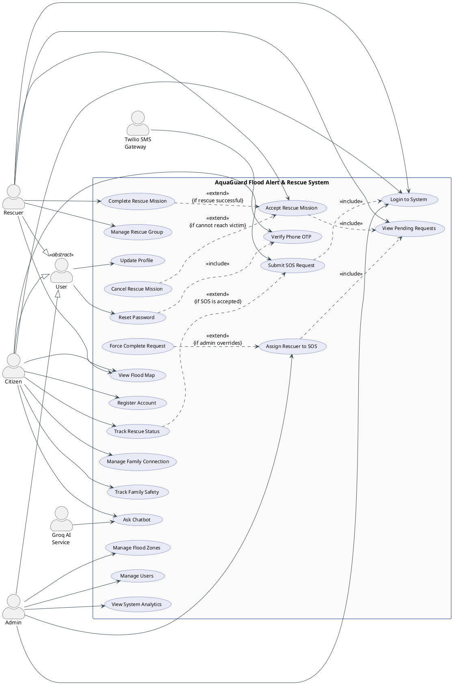
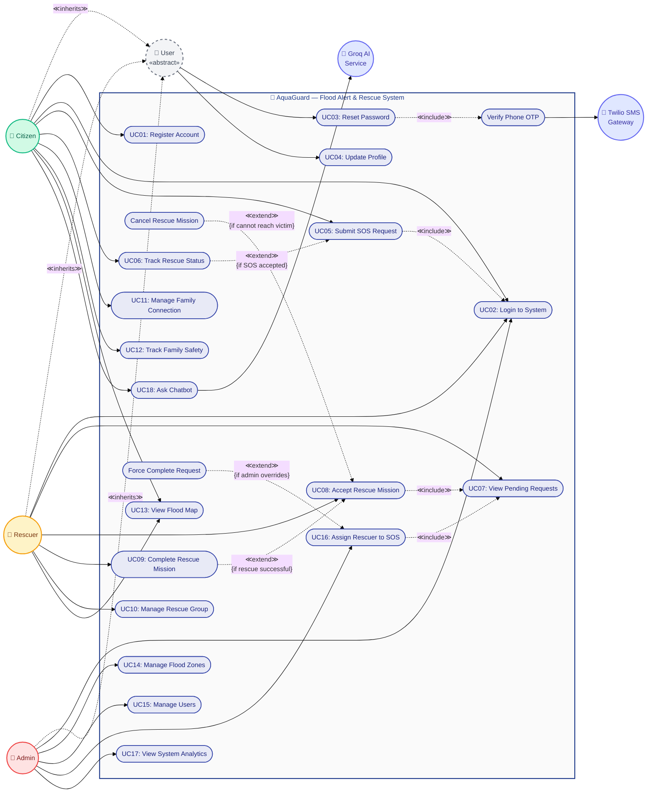

# AquaGuard — UML Use Case Diagram & Narratives

> **Version:** 1.0 | **Date:** 2026-04-15  
> **System:** AquaGuard — Flood Alert & Rescue Web Platform  
> **Total Use Cases:** 18 | **Actors:** 5 (3 Primary + 2 Secondary)

---

## Part A — Structured Text Description

### SYSTEM BOUNDARY: AquaGuard Flood Alert & Rescue System

### ACTORS:

- **Primary (LEFT side — initiate actions):**
  - **Citizen** — Registered resident who submits SOS requests, tracks family members, and views the flood map
  - **Rescuer** — Rescue team member who accepts missions, manages rescue groups, and tracks victim locations
  - **Admin** — System administrator who manages users, flood zones, news articles, and system analytics

- **Secondary (RIGHT side — respond/support):**
  - **Twilio SMS Gateway** — External system that sends and verifies OTP codes for phone-based authentication and password reset
  - **Groq AI Service** — External LLM service that processes citizen chatbot queries and returns flood-safety advice

- **Actor Generalisation:**
  - Citizen ──▷ User (general authenticated user)
  - Rescuer ──▷ User
  - Admin ──▷ User

### USE CASES:

| ID | Use Case Name | Description |
|----|--------------|-------------|
| UC01 | Register Account | Create a new user account with phone, password, name, and role selection |
| UC02 | Login to System | Authenticate via phone/password or Google OAuth |
| UC03 | Reset Password | Recover account access by verifying phone OTP and setting a new password |
| UC04 | Update Profile | Modify personal information, avatar, and contact details |
| UC05 | Submit SOS Request | Create an emergency rescue request with location, description, urgency, and photos |
| UC06 | Track Rescue Status | Monitor the real-time status and rescuer location for an active SOS request |
| UC07 | View Pending Requests | Browse the queue of unassigned SOS requests filtered by urgency |
| UC08 | Accept Rescue Mission | Claim a pending SOS request and begin GPS-tracked navigation to the victim |
| UC09 | Complete Rescue Mission | Mark an in-progress rescue mission as resolved |
| UC10 | Manage Rescue Group | Create, edit, or archive a rescue team and invite/remove members |
| UC11 | Manage Family Connection | Send, accept, or reject family link requests and remove existing connections |
| UC12 | Track Family Safety | View real-time GPS locations and safety statuses of connected family members |
| UC13 | View Flood Map | Display live flood zones, weather overlays, and SOS markers on an interactive map |
| UC14 | Manage Flood Zones | Create, edit, or delete flood zone polygons on the map editor |
| UC15 | Manage Users | View all users, change roles, and deactivate accounts |
| UC16 | Assign Rescuer to SOS | Manually assign a specific rescuer to a pending SOS request |
| UC17 | View System Analytics | Access KPI dashboards, user growth trends, and rescue performance metrics |
| UC18 | Ask Chatbot | Submit a flood-safety question and receive an AI-generated answer |

### RELATIONSHIPS:

#### Associations (Actor → Use Case)

| Actor | Use Case | Notes |
|-------|----------|-------|
| Citizen | UC01: Register Account | |
| Citizen | UC02: Login to System | Shared with Rescuer, Admin |
| Citizen | UC03: Reset Password | Shared with Rescuer, Admin |
| Citizen | UC04: Update Profile | Shared with Rescuer, Admin |
| Citizen | UC05: Submit SOS Request | |
| Citizen | UC06: Track Rescue Status | |
| Citizen | UC11: Manage Family Connection | |
| Citizen | UC12: Track Family Safety | |
| Citizen | UC13: View Flood Map | Shared with Rescuer |
| Citizen | UC18: Ask Chatbot | |
| Rescuer | UC02: Login to System | |
| Rescuer | UC03: Reset Password | |
| Rescuer | UC04: Update Profile | |
| Rescuer | UC07: View Pending Requests | |
| Rescuer | UC08: Accept Rescue Mission | |
| Rescuer | UC09: Complete Rescue Mission | |
| Rescuer | UC10: Manage Rescue Group | |
| Rescuer | UC13: View Flood Map | |
| Admin | UC02: Login to System | |
| Admin | UC03: Reset Password | |
| Admin | UC04: Update Profile | |
| Admin | UC14: Manage Flood Zones | |
| Admin | UC15: Manage Users | |
| Admin | UC16: Assign Rescuer to SOS | |
| Admin | UC17: View System Analytics | |

#### Include Relationships (mandatory sub-function)

| Base Use Case | Included Use Case | Rationale |
|--------------|-------------------|-----------|
| UC05: Submit SOS Request | UC02: Login to System | User must be authenticated before submitting SOS |
| UC03: Reset Password | Verify Phone OTP (internal step) | OTP verification is always required for password reset |
| UC08: Accept Rescue Mission | UC07: View Pending Requests | Rescuer must view queue before accepting |
| UC16: Assign Rescuer to SOS | UC07: View Pending Requests | Admin must view requests to assign |

#### Extend Relationships (optional/conditional)

| Extending Use Case | Base Use Case | Condition |
|-------------------|--------------|-----------|
| UC06: Track Rescue Status | UC05: Submit SOS Request | {if SOS is accepted by rescuer} |
| UC09: Complete Rescue Mission | UC08: Accept Rescue Mission | {if rescue is successful} |
| Cancel Rescue Mission | UC08: Accept Rescue Mission | {if rescuer cannot reach victim} |
| Force Complete Request | UC16: Assign Rescuer to SOS | {if admin overrides} |

#### Generalisation (Actor hierarchy)

| Child Actor | Parent Actor |
|------------|-------------|
| Citizen | User |
| Rescuer | User |
| Admin | User |

---

## Part A.2 — PlantUML Code

---

## Part A.3 — Mermaid Code

> **Legend**
> | Symbol | Meaning |
> |--------|---------|
> | `(("👤 ..."))` | Actor (double-circle node) |
> | `(["UC: ..."])` | Use Case (stadium/oval node) |
> | `subgraph` | System Boundary |
> | `-->` solid arrow | Association (actor ↔ use case) |
> | `-. ≪include≫ .->` | Mandatory sub-function |
> | `-. ≪extend≫ .->` | Optional/conditional extension |
> | `-. ≪inherits≫ .->` | Actor generalisation |

---

---

# Part B — Use Case Narratives (18 Narratives)

---

## UC01 — Register Account

### SECTION 1 — HEADER

| Field | Value |
|-------|-------|
| **Use Case ID** | UC-001 |
| **Use Case Name** | Register Account |
| **Use Case Description** | Allows a new user to create an account by providing personal information, selecting a role (Citizen or Rescuer), and completing registration to gain access to the AquaGuard platform. |
| **Primary Actor** | Citizen (unregistered user) |
| **Secondary Actor(s)** | Twilio SMS Gateway (for OTP verification during phone registration) |
| **Trigger** | User navigates to the AquaGuard registration page and selects "Register" |
| **Preconditions** | 1. User has not already registered with the provided phone number. 2. User has a valid phone number. 3. The AquaGuard system is operational and accessible. |
| **Postconditions** | 1. A new user account exists in the database with the chosen role. 2. The user is authenticated and redirected to the appropriate dashboard. 3. A JWT token is stored in the user's browser. |

### SECTION 2 — MAIN FLOW

| Step | Actor/System | Action |
|------|-------------|--------|
| 1 | User | Navigates to the AquaGuard login page and clicks the "Register" tab |
| 2 | System | Displays the registration form with fields: display name, phone number, password, confirm password, gender, and date of birth |
| 3 | User | Enters display name, phone number, password, confirm password, gender, and date of birth |
| 4 | User | Selects a role: "Citizen" or "Rescuer" |
| 5 | User | Clicks the "Register" button |
| 6 | System | Validates all input fields (non-empty, phone format, password minimum 6 characters, password confirmation match) |
| 7 | System | Checks that the phone number does not already exist in the users table |
| 8 | System | Hashes the password using bcrypt |
| 9 | System | Inserts a new user record into the `users` table with the provided data and selected role |
| 10 | System | Generates a JWT token valid for 7 days |
| 11 | System | Returns the JWT token and user profile data to the client |
| 12 | System | Stores the token, role, and user profile in localStorage |
| 13 | System | Redirects the user to the dashboard corresponding to their role |

### SECTION 3 — FOOTER

| Field | Value |
|-------|-------|
| **Frequency of Use** | Occasional — once per new user |
| **Special Requirements** | 1. Passwords must be at least 6 characters. 2. Password hashes must use bcrypt with salt rounds ≥ 10. 3. Phone numbers must be unique across the system. |
| **Assumptions** | 1. The user has a modern web browser. 2. The backend API server and PostgreSQL database are running. |
| **Notes** | Selecting "Rescuer" role requires entering an organisational password to prevent unauthorised role access. |

### SECTION 4 — ALTERNATIVES

**Alternative A — Registration via Google OAuth**
| Step | Action |
|------|--------|
| 3a | User clicks the "Sign in with Google" button instead of filling the form |
| 3b | System opens a Google OAuth popup window |
| 3c | User signs in with their Google account |
| 3d | System receives the Firebase user object and ID token |
| 3e | System checks Firestore `users/{uid}` for an existing document |
| 3f | System finds no existing document (new user) and displays the Role Selection Modal |
| 3g | User selects a role (Citizen/Rescuer/Admin) |
| 3h | System saves the role to Firestore `users/{uid}` |
| 3i | Resume at Step 10 of main flow |

### SECTION 5 — EXCEPTIONS

**Exception 1 — Phone Number Already Registered**
| Step | Action |
|------|--------|
| 7e | System detects that the phone number already exists in the `users` table |
| 7.1e | System displays error message: "Số điện thoại đã được đăng ký" (Phone number already registered) |
| 7.2e | User is returned to the registration form with the phone number field highlighted |

**Exception 2 — Password Confirmation Mismatch**
| Step | Action |
|------|--------|
| 6e | System detects that the password and confirm password fields do not match |
| 6.1e | System displays error message: "Mật khẩu xác nhận không khớp" (Password confirmation does not match) |
| 6.2e | User corrects the password fields and resubmits |

**Exception 3 — Invalid Input Fields**
| Step | Action |
|------|--------|
| 6e | System detects that one or more required fields are empty or in an invalid format |
| 6.1e | System displays validation error messages next to each invalid field |
| 6.2e | User corrects the inputs and resubmits |

**Exception 4 — Server Connection Error**
| Step | Action |
|------|--------|
| 9e | System fails to connect to the backend API |
| 9.1e | System displays error message: "Lỗi kết nối, vui lòng thử lại" (Connection error, please try again) |
| 9.2e | Use case terminates; user may retry |

---

## UC02 — Login to System

### SECTION 1 — HEADER

| Field | Value |
|-------|-------|
| **Use Case ID** | UC-002 |
| **Use Case Name** | Login to System |
| **Use Case Description** | Allows a registered user to authenticate via phone/password credentials or Google OAuth, and redirects them to the role-appropriate dashboard. |
| **Primary Actor** | User (Citizen, Rescuer, or Admin) |
| **Secondary Actor(s)** | None |
| **Trigger** | User navigates to the AquaGuard login page |
| **Preconditions** | 1. User has a registered account in the system. 2. The AquaGuard system is operational. |
| **Postconditions** | 1. User is authenticated with a valid JWT token. 2. User's role and profile are loaded into the application state. 3. User is redirected to the role-appropriate dashboard. |

### SECTION 2 — MAIN FLOW

| Step | Actor/System | Action |
|------|-------------|--------|
| 1 | User | Navigates to the AquaGuard login page |
| 2 | System | Displays the login form with phone number and password fields |
| 3 | User | Enters phone number and password |
| 4 | User | Clicks the "Login" button |
| 5 | System | Sends POST request to `/api/auth/login` with phone and password |
| 6 | System | Validates the phone number exists in the database |
| 7 | System | Compares the entered password hash against the stored hash using bcrypt |
| 8 | System | Verifies the user account is active (`is_active = true`) |
| 9 | System | Generates a JWT token with user ID and role, valid for 7 days |
| 10 | System | Returns the JWT token, user role, and profile data |
| 11 | System | Stores the token (`aquaguard_token`), role (`aquaguard_role`), and user data (`aquaguard_user`) in localStorage |
| 12 | System | Redirects to the dashboard: Citizen→Dashboard, Rescuer→Rescue Missions, Admin→Admin Dashboard |

### SECTION 3 — FOOTER

| Field | Value |
|-------|-------|
| **Frequency of Use** | High — multiple times daily per user |
| **Special Requirements** | 1. JWT tokens expire after 7 days. 2. Inactive accounts must be blocked from login. |
| **Assumptions** | 1. User remembers their credentials. 2. Backend and database services are running. |
| **Notes** | Google login flow uses Firebase Auth popup and syncs with the backend for JWT creation. |

### SECTION 4 — ALTERNATIVES

**Alternative A — Login via Google OAuth**
| Step | Action |
|------|--------|
| 3a | User clicks "Sign in with Google" button |
| 3b | System opens a Google OAuth popup via Firebase `signInWithPopup()` |
| 3c | User selects a Google account and authorises |
| 3d | Firebase returns a user object and ID token |
| 3e | System checks Firestore `users/{uid}` for the user's role |
| 3f | System sends `POST /api/auth/login` with the Firebase ID token |
| 3g | Resume at Step 9 of main flow |

### SECTION 5 — EXCEPTIONS

**Exception 1 — Invalid Credentials**
| Step | Action |
|------|--------|
| 7e | System detects that the password does not match the stored hash |
| 7.1e | System displays error message: "Số điện thoại hoặc mật khẩu không đúng" (Phone number or password is incorrect) |
| 7.2e | User re-enters credentials |

**Exception 2 — Account Deactivated**
| Step | Action |
|------|--------|
| 8e | System detects that the user's `is_active` flag is `false` |
| 8.1e | System displays error message: "Tài khoản đã bị vô hiệu hóa" (Account has been deactivated) |
| 8.2e | Use case terminates |

**Exception 3 — Phone Number Not Found**
| Step | Action |
|------|--------|
| 6e | System finds no user record matching the entered phone number |
| 6.1e | System displays error message: "Số điện thoại hoặc mật khẩu không đúng" (Phone number or password is incorrect) |
| 6.2e | User re-enters credentials or navigates to registration |

---

## UC03 — Reset Password

### SECTION 1 — HEADER

| Field | Value |
|-------|-------|
| **Use Case ID** | UC-003 |
| **Use Case Name** | Reset Password |
| **Use Case Description** | Allows a user who has forgotten their password to verify their identity via phone OTP and set a new password. |
| **Primary Actor** | User (Citizen, Rescuer, or Admin) |
| **Secondary Actor(s)** | Twilio SMS Gateway |
| **Trigger** | User clicks "Forgot Password" on the login page |
| **Preconditions** | 1. User has a registered account with a valid phone number. 2. Twilio SMS service is operational. |
| **Postconditions** | 1. User's password hash is updated in the database. 2. User can log in with the new password. |

### SECTION 2 — MAIN FLOW

| Step | Actor/System | Action |
|------|-------------|--------|
| 1 | User | Clicks "Forgot Password" on the login page |
| 2 | System | Displays the password reset form requesting the registered phone number |
| 3 | User | Enters the phone number and clicks "Send OTP" |
| 4 | System | Verifies the phone number exists in the database |
| 5 | System | Sends OTP request to Twilio Verify API |
| 6 | Twilio | Delivers a 6-digit OTP code to the user's phone via SMS |
| 7 | System | Displays the OTP input field |
| 8 | User | Enters the 6-digit OTP code received via SMS |
| 9 | System | Sends verification request to Twilio Verify API to validate the OTP |
| 10 | Twilio | Returns verification status: "approved" |
| 11 | System | Generates a session token and displays the new password form |
| 12 | User | Enters a new password and confirms it |
| 13 | User | Clicks "Reset Password" |
| 14 | System | Validates the session token and password requirements (minimum 6 characters) |
| 15 | System | Hashes the new password and updates the user record in the database |
| 16 | System | Displays success message and redirects to the login page |

### SECTION 3 — FOOTER

| Field | Value |
|-------|-------|
| **Frequency of Use** | Low — occasional use when user forgets password |
| **Special Requirements** | 1. OTP expires after 10 minutes. 2. Session token is single-use. 3. Twilio API rate limits apply. |
| **Assumptions** | 1. User has access to the registered phone number. 2. Twilio SMS delivery is functional. |
| **Notes** | The system uses Twilio Verify service, not raw SMS, for OTP management. |

### SECTION 4 — ALTERNATIVES

None — this flow has a single path to success.

### SECTION 5 — EXCEPTIONS

**Exception 1 — Phone Number Not Found**
| Step | Action |
|------|--------|
| 4e | System finds no user record matching the entered phone number |
| 4.1e | System displays error message: "Không tìm thấy tài khoản với số điện thoại này" (No account found with this phone number) |
| 4.2e | User re-enters the phone number or navigates back to login |

**Exception 2 — Invalid OTP**
| Step | Action |
|------|--------|
| 10e | Twilio returns verification status: "pending" (incorrect OTP) |
| 10.1e | System displays error message: "Mã OTP không đúng" (Incorrect OTP code) |
| 10.2e | User re-enters the OTP code |

**Exception 3 — OTP Expired**
| Step | Action |
|------|--------|
| 10e | Twilio returns an error indicating the verification has expired |
| 10.1e | System displays error message: "Mã OTP đã hết hạn, vui lòng gửi lại" (OTP expired, please resend) |
| 10.2e | User clicks "Resend OTP" to restart from Step 5 |

**Exception 4 — Session Token Invalid**
| Step | Action |
|------|--------|
| 14e | System detects the session token is invalid or already used |
| 14.1e | System displays error message: "Phiên đặt lại mật khẩu không hợp lệ" (Invalid password reset session) |
| 14.2e | Use case terminates; user must restart from Step 1 |

---

## UC04 — Update Profile

### SECTION 1 — HEADER

| Field | Value |
|-------|-------|
| **Use Case ID** | UC-004 |
| **Use Case Name** | Update Profile |
| **Use Case Description** | Allows an authenticated user to modify their personal information including display name, email, gender, date of birth, emergency contact, address, and avatar image. |
| **Primary Actor** | User (Citizen, Rescuer, or Admin) |
| **Secondary Actor(s)** | Cloudinary (for avatar image upload) |
| **Trigger** | User navigates to the Settings page and selects the Profile tab |
| **Preconditions** | 1. User is authenticated with a valid JWT token. 2. User's profile data is loaded. |
| **Postconditions** | 1. User's profile data is updated in the database. 2. Updated profile is reflected in the application state. |

### SECTION 2 — MAIN FLOW

| Step | Actor/System | Action |
|------|-------------|--------|
| 1 | User | Navigates to the Settings page from the sidebar |
| 2 | System | Loads and displays the current user profile data in editable fields |
| 3 | User | Modifies one or more fields: display name, email, gender, date of birth, emergency contact, or address |
| 4 | User | Clicks the "Save" button |
| 5 | System | Validates the modified fields (non-empty name, valid email format) |
| 6 | System | Sends PUT request to `/api/auth/profile` with the updated data |
| 7 | System | Updates the user record in the `users` table |
| 8 | System | Returns the updated profile data |
| 9 | System | Updates the local application state and localStorage with new profile data |
| 10 | System | Displays a success notification: "Cập nhật thành công" (Update successful) |

### SECTION 3 — FOOTER

| Field | Value |
|-------|-------|
| **Frequency of Use** | Low — occasional profile updates |
| **Special Requirements** | 1. Avatar file size must not exceed 5 MB. 2. Supported avatar formats: JPEG, PNG, WebP. |
| **Assumptions** | User is authenticated and has a valid session. |
| **Notes** | Avatar upload is processed through Cloudinary, and the returned URL is stored in the database. |

### SECTION 4 — ALTERNATIVES

**Alternative A — Upload New Avatar**
| Step | Action |
|------|--------|
| 3a | User clicks the avatar image area |
| 3b | System opens a file picker dialog |
| 3c | User selects an image file |
| 3d | System sends the file to `/api/auth/profile/avatar` via multipart upload |
| 3e | Backend uploads the image to Cloudinary and receives a public URL |
| 3f | System updates the avatar URL in the database and refreshes the displayed avatar |
| 3g | Resume at Step 10 of main flow |

**Alternative B — Change Password**
| Step | Action |
|------|--------|
| 3a | User navigates to the "Change Password" section within Settings |
| 3b | User enters current password, new password, and confirm new password |
| 3c | User clicks "Change Password" |
| 3d | System verifies the current password is correct |
| 3e | System hashes the new password and updates the database |
| 3f | System displays success message: "Đổi mật khẩu thành công" (Password changed successfully) |

### SECTION 5 — EXCEPTIONS

**Exception 1 — Invalid Email Format**
| Step | Action |
|------|--------|
| 5e | System detects the email field contains an invalid format |
| 5.1e | System displays error message: "Email không hợp lệ" (Invalid email) |
| 5.2e | User corrects the email and resubmits |

**Exception 2 — Current Password Incorrect (Change Password)**
| Step | Action |
|------|--------|
| 3de | System detects the current password does not match |
| 3d.1e | System displays error message: "Mật khẩu hiện tại không đúng" (Current password is incorrect) |
| 3d.2e | User re-enters the correct current password |

**Exception 3 — Avatar Upload Failure**
| Step | Action |
|------|--------|
| 3ee | Cloudinary upload fails (network error or service down) |
| 3e.1e | System displays error message: "Lỗi tải ảnh lên, vui lòng thử lại" (Image upload error, please try again) |
| 3e.2e | User retries the upload or skips avatar update |

---

## UC05 — Submit SOS Request

### SECTION 1 — HEADER

| Field | Value |
|-------|-------|
| **Use Case ID** | UC-005 |
| **Use Case Name** | Submit SOS Request |
| **Use Case Description** | Allows a citizen to create an emergency rescue request by providing their location, a description of the emergency, urgency level, and optional photographic evidence. |
| **Primary Actor** | Citizen |
| **Secondary Actor(s)** | Cloudinary (for SOS image upload), Google Maps (for geocoding) |
| **Trigger** | Citizen opens the SOS page during a flood emergency |
| **Preconditions** | 1. Citizen is authenticated. 2. Citizen has enabled GPS/location services on their device. |
| **Postconditions** | 1. A new rescue request record exists in the `rescue_requests` table with status "pending". 2. The request appears in the rescue queue visible to all rescuers. 3. A notification is generated for available rescuers. |

### SECTION 2 — MAIN FLOW

| Step | Actor/System | Action |
|------|-------------|--------|
| 1 | Citizen | Opens the SOS page from the navigation menu |
| 2 | System | Displays the SOS request form |
| 3 | System | Captures the citizen's GPS coordinates from the browser geolocation API |
| 4 | System | Reverse-geocodes the GPS coordinates into a human-readable address via Google Maps API |
| 5 | System | Auto-fills the location field with the geocoded address |
| 6 | Citizen | Reviews the location and optionally edits it |
| 7 | Citizen | Enters a description of the emergency situation |
| 8 | Citizen | Selects the urgency level: "low", "medium", "high", or "critical" |
| 9 | Citizen | Optionally attaches up to 3 photos of the situation |
| 10 | Citizen | Clicks the "Send SOS" button |
| 11 | System | Validates all required fields (location and description are non-empty) |
| 12 | System | Uploads attached photos to Cloudinary and receives URLs |
| 13 | System | Sends POST request to `/api/sos` with location, coordinates, description, urgency, and image URLs |
| 14 | System | Creates a new `rescue_requests` record with status "pending" |
| 15 | System | Creates a corresponding `rescue_request_logs` entry for the creation event |
| 16 | System | Displays confirmation: "Yêu cầu SOS đã được gửi" (SOS request has been sent) |
| 17 | System | Redirects the citizen to the SOS tracking view |

### SECTION 3 — FOOTER

| Field | Value |
|-------|-------|
| **Frequency of Use** | Variable — during flood emergencies, high frequency |
| **Special Requirements** | 1. GPS accuracy must be within 50 metres. 2. Photos are limited to 3 per request, max 5 MB each. 3. Response time for submission must be under 5 seconds. |
| **Assumptions** | 1. Citizen has an active internet connection. 2. Citizen's device supports geolocation. |
| **Notes** | The SOS form uses `multipart/form-data` encoding to support image uploads alongside text fields. |

### SECTION 4 — ALTERNATIVES

**Alternative A — Manual Location Entry**
| Step | Action |
|------|--------|
| 3a | System fails to detect GPS (e.g., user denied location permission) |
| 3b | System displays a text input for manual address entry |
| 3c | Citizen types their address manually |
| 3d | Resume at Step 7 of main flow |

### SECTION 5 — EXCEPTIONS

**Exception 1 — Missing Required Fields**
| Step | Action |
|------|--------|
| 11e | System detects that location or description fields are empty |
| 11.1e | System displays error message: "Vui lòng điền đầy đủ thông tin" (Please fill in all required information) |
| 11.2e | Citizen fills in the missing fields and resubmits |

**Exception 2 — Image Upload Failure**
| Step | Action |
|------|--------|
| 12e | Cloudinary upload fails for one or more images |
| 12.1e | System displays warning: "Không thể tải ảnh lên, yêu cầu sẽ được gửi không có ảnh" (Cannot upload photos, request will be sent without photos) |
| 12.2e | System proceeds with submission without images |

**Exception 3 — Server Error**
| Step | Action |
|------|--------|
| 14e | Backend returns a 500 error during request creation |
| 14.1e | System displays error message: "Lỗi hệ thống, vui lòng thử lại" (System error, please try again) |
| 14.2e | Citizen may retry submission |

---

## UC06 — Track Rescue Status

### SECTION 1 — HEADER

| Field | Value |
|-------|-------|
| **Use Case ID** | UC-006 |
| **Use Case Name** | Track Rescue Status |
| **Use Case Description** | Allows a citizen to monitor the real-time status of their submitted SOS request, including the rescuer's live GPS position and estimated arrival. |
| **Primary Actor** | Citizen |
| **Secondary Actor(s)** | None |
| **Trigger** | Citizen's SOS request status changes to "in_progress" (rescuer accepted) |
| **Preconditions** | 1. Citizen has an active SOS request. 2. A rescuer has accepted the SOS request. 3. WebSocket connection is available. |
| **Postconditions** | 1. Citizen has viewed the rescuer's real-time location. 2. Citizen is aware of the current request status. |

### SECTION 2 — MAIN FLOW

| Step | Actor/System | Action |
|------|-------------|--------|
| 1 | System | Detects that the SOS request status has changed to "in_progress" |
| 2 | System | Sends a notification to the citizen: "Rescuer đang đến!" |
| 3 | Citizen | Opens the SOS tracking view |
| 4 | System | Establishes a WebSocket connection and joins the tracking room for the request ID |
| 5 | System | Displays the live flood map centred on the citizen's location |
| 6 | System | Shows the rescuer's pin on the map with real-time GPS updates |
| 7 | System | Updates the rescuer's position on the map as `location_update` events arrive via WebSocket |
| 8 | System | Displays current request status: "In Progress", rescuer name, and contact info |
| 9 | Citizen | Monitors the rescuer's approach on the map |
| 10 | System | Receives a `tracking_ended` WebSocket event when the mission is marked complete |
| 11 | System | Updates the status display to "Resolved" |
| 12 | System | Displays completion message: "Nhiệm vụ cứu hộ hoàn thành" (Rescue mission completed) |

### SECTION 3 — FOOTER

| Field | Value |
|-------|-------|
| **Frequency of Use** | High — every time an SOS is accepted until resolved |
| **Special Requirements** | 1. WebSocket must support real-time updates with ≤ 2 second latency. 2. Map must update rescuer position smoothly. |
| **Assumptions** | 1. Both citizen and rescuer have active internet connections. 2. Rescuer is sharing their GPS location. |
| **Notes** | The tracking uses Socket.IO for WebSocket communication with `join_tracking` and `location_update` events. |

### SECTION 4 — ALTERNATIVES

**Alternative A — Rescuer Cancels Mission**
| Step | Action |
|------|--------|
| 7a | System receives a `tracking_cancelled` WebSocket event |
| 7b | System updates the status to "Pending" |
| 7c | System displays message: "Rescuer đã huỷ, yêu cầu đang chờ rescuer mới" (Rescuer cancelled, waiting for new rescuer) |
| 7d | Citizen waits for another rescuer to accept |

### SECTION 5 — EXCEPTIONS

**Exception 1 — WebSocket Connection Lost**
| Step | Action |
|------|--------|
| 4e | WebSocket fails to establish or loses connection |
| 4.1e | System displays warning: "Mất kết nối, đang thử kết nối lại..." (Connection lost, reconnecting...) |
| 4.2e | System attempts automatic reconnection every 5 seconds |

---

## UC07 — View Pending Requests

### SECTION 1 — HEADER

| Field | Value |
|-------|-------|
| **Use Case ID** | UC-007 |
| **Use Case Name** | View Pending Requests |
| **Use Case Description** | Allows a rescuer or admin to browse the queue of unassigned SOS requests, filtered by urgency, creation time, and location. |
| **Primary Actor** | Rescuer |
| **Secondary Actor(s)** | Admin (can also view) |
| **Trigger** | Rescuer navigates to the Rescue Requests page |
| **Preconditions** | 1. Rescuer is authenticated with role "rescuer". 2. There are SOS requests in the system. |
| **Postconditions** | 1. Rescuer has viewed the list of pending SOS requests with details. |

### SECTION 2 — MAIN FLOW

| Step | Actor/System | Action |
|------|-------------|--------|
| 1 | Rescuer | Navigates to the "Rescue Requests" page from the sidebar |
| 2 | System | Sends GET request to `/api/sos/all` with the rescuer's JWT token |
| 3 | System | Retrieves all SOS requests with status "pending", "assigned", or "in_progress" |
| 4 | System | Displays the list of requests as cards, each showing: location, description, urgency badge, creation time, and citizen name |
| 5 | Rescuer | Scrolls through the list and reviews request details |
| 6 | Rescuer | Optionally filters requests by urgency level (critical, high, medium, low) |
| 7 | System | Filters and re-renders the list based on the selected filter |
| 8 | Rescuer | Selects a specific request to view full details |
| 9 | System | Displays the full SOS details including description, photos, exact location on map, and citizen contact information |

### SECTION 3 — FOOTER

| Field | Value |
|-------|-------|
| **Frequency of Use** | High — rescuers check this frequently during emergencies |
| **Special Requirements** | 1. List must load within 3 seconds. 2. Urgency badges must be colour-coded (critical=red, high=orange, medium=yellow, low=green). |
| **Assumptions** | 1. Rescuer has an active internet connection. 2. At least one SOS request exists in the system. |
| **Notes** | Requests with "critical" urgency are displayed at the top of the list regardless of creation time. |

### SECTION 4 — ALTERNATIVES

None — this is a read-only view use case.

### SECTION 5 — EXCEPTIONS

**Exception 1 — No Pending Requests**
| Step | Action |
|------|--------|
| 3e | System finds no SOS requests matching the filter criteria |
| 3.1e | System displays an empty state message: "Không có yêu cầu cứu hộ nào" (No rescue requests found) |
| 3.2e | Rescuer waits or navigates away |

**Exception 2 — Authorisation Failure**
| Step | Action |
|------|--------|
| 2e | System detects that the JWT token is expired or invalid |
| 2.1e | System redirects the user to the login page |
| 2.2e | Use case terminates |

---

## UC08 — Accept Rescue Mission

### SECTION 1 — HEADER

| Field | Value |
|-------|-------|
| **Use Case ID** | UC-008 |
| **Use Case Name** | Accept Rescue Mission |
| **Use Case Description** | Allows a rescuer to claim a pending SOS request and begin GPS-tracked navigation to the victim's location, either individually or as a team. |
| **Primary Actor** | Rescuer |
| **Secondary Actor(s)** | None |
| **Trigger** | Rescuer selects a pending SOS request and clicks "Accept Mission" |
| **Preconditions** | 1. Rescuer is authenticated. 2. The SOS request has status "pending" or "assigned". 3. Rescuer has GPS enabled. |
| **Postconditions** | 1. SOS request status is updated to "in_progress". 2. Rescuer is assigned to the request. 3. WebSocket GPS tracking is activated between rescuer and citizen. 4. A notification is sent to the citizen. |

### SECTION 2 — MAIN FLOW

| Step | Actor/System | Action |
|------|-------------|--------|
| 1 | Rescuer | Views a pending SOS request details (includes UC07) |
| 2 | Rescuer | Selects acceptance mode: "Individual" or "Team" |
| 3 | Rescuer | Clicks the "Accept Mission" button |
| 4 | System | Captures the rescuer's current GPS coordinates |
| 5 | System | Sends PUT request to `/api/sos/:id/accept` with rescuer's coordinates and acceptance mode |
| 6 | System | Updates the SOS request: sets status to "in_progress", assigns the rescuer ID, records rescuer coordinates |
| 7 | System | Creates a `rescue_request_logs` entry: status changed from "pending" to "in_progress" |
| 8 | System | Creates a notification for the citizen: "Rescuer đã nhận nhiệm vụ và đang đến!" |
| 9 | System | Establishes WebSocket tracking room for the request ID |
| 10 | System | Emits `tracking_started` event to the citizen's WebSocket connection |
| 11 | System | Redirects the rescuer to the live tracking view with navigation to the victim's location |
| 12 | Rescuer | Navigates to the victim using the map and GPS guidance |
| 13 | System | Continuously sends `location_update` events with the rescuer's GPS position |

### SECTION 3 — FOOTER

| Field | Value |
|-------|-------|
| **Frequency of Use** | High — every time a rescuer takes on a mission |
| **Special Requirements** | 1. GPS must update every 3 seconds during tracking. 2. WebSocket connection must be persistent throughout the mission. |
| **Assumptions** | 1. Rescuer's GPS is enabled and accurate. 2. No other rescuer has accepted the same request simultaneously. |
| **Notes** | Team acceptance mode links the rescue group to the request, allowing all team members to see the mission. |

### SECTION 4 — ALTERNATIVES

**Alternative A — Accept as Team**
| Step | Action |
|------|--------|
| 2a | Rescuer selects "Team" mode |
| 2b | System validates that the rescuer belongs to an active rescue group |
| 2c | System assigns both the rescuer and the rescue group to the SOS request |
| 2d | Resume at Step 5 of main flow |

### SECTION 5 — EXCEPTIONS

**Exception 1 — Request Already Accepted by Another Rescuer**
| Step | Action |
|------|--------|
| 6e | System detects the request status is no longer "pending" (race condition) |
| 6.1e | System displays error message: "Yêu cầu này đã được rescuer khác nhận" (This request has been accepted by another rescuer) |
| 6.2e | Rescuer returns to the pending requests list |

**Exception 2 — GPS Unavailable**
| Step | Action |
|------|--------|
| 4e | System fails to capture rescuer GPS coordinates |
| 4.1e | System displays error message: "Vui lòng bật GPS để nhận nhiệm vụ" (Please enable GPS to accept mission) |
| 4.2e | Rescuer enables GPS and retries |

**Exception 3 — Rescuer Not in Any Group (Team Mode)**
| Step | Action |
|------|--------|
| 2be | System detects the rescuer does not belong to any rescue group |
| 2b.1e | System displays error message: "Bạn chưa tham gia nhóm cứu hộ nào" (You have not joined any rescue group) |
| 2b.2e | Rescuer selects "Individual" mode instead |

---

## UC09 — Complete Rescue Mission

### SECTION 1 — HEADER

| Field | Value |
|-------|-------|
| **Use Case ID** | UC-009 |
| **Use Case Name** | Complete Rescue Mission |
| **Use Case Description** | Allows a rescuer to mark an in-progress rescue mission as resolved once the victim has been safely rescued. |
| **Primary Actor** | Rescuer |
| **Secondary Actor(s)** | None |
| **Trigger** | Rescuer has reached the victim and completed the rescue operation |
| **Preconditions** | 1. Rescuer is assigned to an active SOS request with status "in_progress". 2. Rescue operation has been performed. |
| **Postconditions** | 1. SOS request status is updated to "resolved". 2. `resolved_at` timestamp is recorded. 3. WebSocket tracking is terminated. 4. Citizen receives a completion notification. |

### SECTION 2 — MAIN FLOW

| Step | Actor/System | Action |
|------|-------------|--------|
| 1 | Rescuer | Opens the active mission tracking view |
| 2 | Rescuer | Clicks the "Complete Mission" button |
| 3 | System | Displays a confirmation dialog: "Xác nhận hoàn thành nhiệm vụ cứu hộ?" (Confirm rescue mission completion?) |
| 4 | Rescuer | Confirms the completion |
| 5 | System | Sends PUT request to `/api/sos/:id/complete` |
| 6 | System | Updates the SOS request: status to "resolved", sets `resolved_at` to current timestamp |
| 7 | System | Creates a `rescue_request_logs` entry: status changed from "in_progress" to "resolved" |
| 8 | System | Creates a notification for the citizen: "Nhiệm vụ cứu hộ đã hoàn thành" (Rescue mission completed) |
| 9 | System | Emits `tracking_ended` WebSocket event to the tracking room |
| 10 | System | Closes the WebSocket tracking room |
| 11 | System | Redirects the rescuer back to the pending requests list |

### SECTION 3 — FOOTER

| Field | Value |
|-------|-------|
| **Frequency of Use** | Matches UC08 frequency — once per accepted mission |
| **Special Requirements** | 1. Completion must be irreversible. 2. Timestamp precision must be in seconds. |
| **Assumptions** | The rescue has been successfully performed before marking complete. |
| **Notes** | Admin can also force-complete a mission via UC16x (Force Complete Request). |

### SECTION 4 — ALTERNATIVES

**Alternative A — Cancel Mission Instead**
| Step | Action |
|------|--------|
| 2a | Rescuer clicks "Cancel Mission" instead of "Complete" |
| 2b | System displays confirmation: "Bạn sẽ huỷ nhiệm vụ này?" (Will you cancel this mission?) |
| 2c | Rescuer confirms cancellation |
| 2d | System updates status back to "pending" and unassigns the rescuer |
| 2e | System creates a log entry and notification for the citizen |
| 2f | SOS request returns to the rescue queue |

### SECTION 5 — EXCEPTIONS

**Exception 1 — Request Already Resolved**
| Step | Action |
|------|--------|
| 6e | System detects the request is already in "resolved" status |
| 6.1e | System displays message: "Nhiệm vụ này đã được hoàn thành" (This mission has already been completed) |
| 6.2e | Rescuer is redirected to the requests list |

---

## UC10 — Manage Rescue Group

### SECTION 1 — HEADER

| Field | Value |
|-------|-------|
| **Use Case ID** | UC-010 |
| **Use Case Name** | Manage Rescue Group |
| **Use Case Description** | Allows a rescuer to create a rescue team, invite members by phone number, manage member roles (leader, co-leader, member), and coordinate team-based rescue operations. |
| **Primary Actor** | Rescuer (group leader) |
| **Secondary Actor(s)** | Rescuer (invited member) |
| **Trigger** | Rescuer navigates to the Team management section on the Rescuer Dashboard |
| **Preconditions** | 1. Rescuer is authenticated with role "rescuer". |
| **Postconditions** | 1. A rescue group exists (created or modified). 2. Members are invited/added/removed as specified. |

### SECTION 2 — MAIN FLOW

| Step | Actor/System | Action |
|------|-------------|--------|
| 1 | Rescuer | Navigates to the Rescuer Dashboard and opens the Team management tab |
| 2 | System | Checks if the rescuer already belongs to a group |
| 3 | System | Displays "Create Team" option (if no group exists) |
| 4 | Rescuer | Enters team name and description |
| 5 | Rescuer | Clicks "Create Group" |
| 6 | System | Sends POST request to `/api/auth/rescue-groups` |
| 7 | System | Creates a new `rescue_groups` record with the rescuer as leader |
| 8 | System | Adds the rescuer as a `rescue_group_members` record with role "leader" |
| 9 | System | Displays the newly created group with an "Invite Member" option |
| 10 | Rescuer | Enters a phone number to invite a fellow rescuer |
| 11 | Rescuer | Clicks "Send Invite" |
| 12 | System | Validates: the phone number belongs to a user with role "rescuer" and they don't already belong to another group |
| 13 | System | Creates a `rescue_group_invites` record with status "pending" |
| 14 | System | Creates a notification for the invited rescuer |
| 15 | System | Displays the invite in the "Pending Invites" section |

### SECTION 3 — FOOTER

| Field | Value |
|-------|-------|
| **Frequency of Use** | Low — teams are created infrequently, invites sent occasionally |
| **Special Requirements** | 1. Only users with role "rescuer" can be invited. 2. A user can only belong to one rescue group at a time. |
| **Assumptions** | 1. Invited rescuers have registered accounts. 2. Invited rescuers are not already in another group. |
| **Notes** | Group hierarchy: Leader → Co-Leader → Member. Leaders have full management rights; co-leaders can invite and remove members. |

### SECTION 4 — ALTERNATIVES

**Alternative A — Edit Existing Group**
| Step | Action |
|------|--------|
| 3a | System finds the rescuer already belongs to a group as leader |
| 3b | System displays the existing group details with edit options |
| 3c | Rescuer modifies group name or description and clicks "Save" |
| 3d | System updates the group record |
| 3e | Resume at Step 9 (invite management) |

**Alternative B — Promote/Demote Member**
| Step | Action |
|------|--------|
| 9a | Leader views the member list |
| 9b | Leader clicks "Promote" on a member |
| 9c | System changes the member's role from "member" to "co_leader" |
| 9d | System sends a notification to the promoted member |

**Alternative C — Remove Member**
| Step | Action |
|------|--------|
| 9a | Leader views the member list |
| 9b | Leader clicks "Remove" on a member |
| 9c | System displays confirmation dialog |
| 9d | Leader confirms removal |
| 9e | System deletes the member from `rescue_group_members` |

### SECTION 5 — EXCEPTIONS

**Exception 1 — Invited User Not a Rescuer**
| Step | Action |
|------|--------|
| 12e | System detects the phone number belongs to a user whose role is not "rescuer" |
| 12.1e | System displays error: "Chỉ rescuer mới có thể được mời vào nhóm" (Only rescuers can be invited to a group) |
| 12.2e | Leader enters a different phone number |

**Exception 2 — Invited User Already in a Group**
| Step | Action |
|------|--------|
| 12e | System detects the invited user already belongs to an active rescue group |
| 12.1e | System displays error: "Người dùng này đã thuộc một nhóm khác" (This user already belongs to another group) |
| 12.2e | Leader enters a different phone number |

**Exception 3 — Phone Number Not Found**
| Step | Action |
|------|--------|
| 12e | System finds no user with the entered phone number |
| 12.1e | System displays error: "Không tìm thấy người dùng" (User not found) |
| 12.2e | Leader verifies the phone number and retries |

---

## UC11 — Manage Family Connection

### SECTION 1 — HEADER

| Field | Value |
|-------|-------|
| **Use Case ID** | UC-011 |
| **Use Case Name** | Manage Family Connection |
| **Use Case Description** | Allows a citizen to send family connection requests by phone number, define the relationship, and accept or reject incoming connection requests. |
| **Primary Actor** | Citizen |
| **Secondary Actor(s)** | None |
| **Trigger** | Citizen navigates to Settings → Family tab |
| **Preconditions** | 1. Citizen is authenticated. |
| **Postconditions** | 1. A family connection is created/accepted/rejected between two users. 2. Connected users can view each other's safety status and location. |

### SECTION 2 — MAIN FLOW

| Step | Actor/System | Action |
|------|-------------|--------|
| 1 | Citizen | Navigates to Settings and opens the "Family" tab |
| 2 | System | Displays the list of current family members and pending requests |
| 3 | Citizen | Clicks "Add Family Member" |
| 4 | Citizen | Enters the phone number of the family member |
| 5 | System | Sends GET request to `/api/family/search?phone=...` to find the user |
| 6 | System | Displays the found user's name and avatar |
| 7 | Citizen | Selects the relationship type (e.g., "Father", "Mother", "Sibling", "Spouse") |
| 8 | Citizen | Clicks "Send Request" |
| 9 | System | Sends POST request to `/api/family/request` with receiver ID and relation |
| 10 | System | Creates a `family_connections` record with status "pending" |
| 11 | System | Creates a notification for the receiving user |
| 12 | System | Displays confirmation: "Đã gửi lời mời kết nối" (Connection request sent) |

### SECTION 3 — FOOTER

| Field | Value |
|-------|-------|
| **Frequency of Use** | Low — family connections are set up once and rarely changed |
| **Special Requirements** | 1. Duplicate connection requests between the same two users must be prevented. |
| **Assumptions** | 1. The target family member has a registered AquaGuard account. |
| **Notes** | Family connections are bidirectional once accepted; both users can see each other's location and safety status. |

### SECTION 4 — ALTERNATIVES

**Alternative A — Accept Incoming Request**
| Step | Action |
|------|--------|
| 2a | System shows a pending incoming request from another user |
| 2b | Citizen clicks "Accept" on the incoming request |
| 2c | System sends PUT request to `/api/family/requests/:id/accept` |
| 2d | System updates the connection status to "accepted" |
| 2e | System creates a notification for the sender: "Lời mời đã được chấp nhận" |
| 2f | Both users can now see each other's location and safety status |

**Alternative B — Reject Incoming Request**
| Step | Action |
|------|--------|
| 2a | System shows a pending incoming request |
| 2b | Citizen clicks "Reject" on the incoming request |
| 2c | System sends PUT request to `/api/family/requests/:id/reject` |
| 2d | System updates the connection status to "rejected" |

**Alternative C — Remove Existing Connection**
| Step | Action |
|------|--------|
| 2a | Citizen clicks "Remove" on an existing family member |
| 2b | System displays confirmation dialog |
| 2c | Citizen confirms removal |
| 2d | System sends DELETE request to `/api/family/members/:connectionId` |
| 2e | System removes the connection; mutual tracking stops |

### SECTION 5 — EXCEPTIONS

**Exception 1 — User Not Found**
| Step | Action |
|------|--------|
| 5e | System finds no user with the entered phone number |
| 5.1e | System displays error: "Không tìm thấy người dùng với số điện thoại này" (No user found with this phone number) |
| 5.2e | Citizen re-enters the phone number |

**Exception 2 — Duplicate Connection Request**
| Step | Action |
|------|--------|
| 10e | System detects an existing connection (pending or accepted) between the two users |
| 10.1e | System displays error: "Đã tồn tại kết nối với người dùng này" (A connection with this user already exists) |
| 10.2e | Use case terminates |

**Exception 3 — Self-Connection Attempt**
| Step | Action |
|------|--------|
| 5e | System detects the citizen is trying to connect with their own phone number |
| 5.1e | System displays error: "Không thể kết nối với chính mình" (Cannot connect with yourself) |
| 5.2e | Citizen enters a different phone number |

---

## UC12 — Track Family Safety

### SECTION 1 — HEADER

| Field | Value |
|-------|-------|
| **Use Case ID** | UC-012 |
| **Use Case Name** | Track Family Safety |
| **Use Case Description** | Allows a citizen to view the real-time GPS locations and safety statuses (safe, danger, injured) of their connected family members on the flood map. |
| **Primary Actor** | Citizen |
| **Secondary Actor(s)** | Google Maps (for geocoding) |
| **Trigger** | Citizen opens the Dashboard or the Flood Map with family layer enabled |
| **Preconditions** | 1. Citizen is authenticated. 2. Citizen has at least one accepted family connection. 3. Connected family members have updated their location. |
| **Postconditions** | 1. Citizen has viewed family members' locations and safety statuses on the map. |

### SECTION 2 — MAIN FLOW

| Step | Actor/System | Action |
|------|-------------|--------|
| 1 | Citizen | Opens the Dashboard or enables the "Family" layer on the Flood Map |
| 2 | System | Sends GET request to `/api/family/members` |
| 3 | System | Retrieves the list of accepted family connections with members' GPS coordinates, safety status, and health notes |
| 4 | System | Displays family member cards showing: name, safety status badge (safe=green, danger=red, injured=orange), last known address, and time since last update |
| 5 | Citizen | Views the family safety overview |
| 6 | Citizen | Clicks on a specific family member card |
| 7 | System | Centres the map on the selected family member's GPS coordinates |
| 8 | System | Shows the family member's pin with colour-coded safety status |
| 9 | Citizen | Optionally updates their own safety status ("Safe", "In Danger", "Injured") |
| 10 | System | Sends PUT request to `/api/family/status` with the new safety status and optional health note |
| 11 | System | Updates the citizen's safety status in the database, visible to all connected family members |

### SECTION 3 — FOOTER

| Field | Value |
|-------|-------|
| **Frequency of Use** | High — checked frequently during flood emergencies |
| **Special Requirements** | 1. Safety status must update across family members within 10 seconds. 2. Location data must include a "last updated" timestamp. |
| **Assumptions** | 1. Family members have their GPS enabled and have shared their location recently. |
| **Notes** | Safety status colours: 🟢 Safe, 🔴 In Danger, 🟠 Injured. Location data is shared via REST API (not real-time WebSocket for family). |

### SECTION 4 — ALTERNATIVES

None — this is primarily a monitoring use case.

### SECTION 5 — EXCEPTIONS

**Exception 1 — No Family Members Connected**
| Step | Action |
|------|--------|
| 3e | System returns an empty family member list |
| 3.1e | System displays message: "Chưa có thành viên gia đình nào" (No family members yet) with a link to add members |
| 3.2e | Citizen may navigate to UC11 to add family connections |

**Exception 2 — Family Member Location Unavailable**
| Step | Action |
|------|--------|
| 3e | A family member has no GPS coordinates (null latitude/longitude) |
| 3.1e | System displays the member with status "Vị trí không khả dụng" (Location unavailable) |
| 3.2e | Citizen notes the unavailability; no action required |

---

## UC13 — View Flood Map

### SECTION 1 — HEADER

| Field | Value |
|-------|-------|
| **Use Case ID** | UC-013 |
| **Use Case Name** | View Flood Map |
| **Use Case Description** | Allows citizens and rescuers to view an interactive real-time flood map with flood zones, weather overlays, SOS markers, and wind forecasts. |
| **Primary Actor** | Citizen, Rescuer |
| **Secondary Actor(s)** | Firebase Firestore (flood zone data), OpenWeatherMap (weather tiles), Windy (wind forecast) |
| **Trigger** | User clicks "Live Flood Map" in the navigation |
| **Preconditions** | 1. User is authenticated. 2. Internet connection is active. |
| **Postconditions** | 1. User has viewed the interactive flood map with current flood zone and weather data. |

### SECTION 2 — MAIN FLOW

| Step | Actor/System | Action |
|------|-------------|--------|
| 1 | User | Clicks "Live Flood Map" in the sidebar navigation |
| 2 | System | Loads the React Leaflet map component |
| 3 | System | Renders the OpenStreetMap base tile layer |
| 4 | System | Subscribes to the Firebase Firestore `flood_zones` collection using `onSnapshot()` |
| 5 | System | Renders flood zone markers on the map with severity-coded colours (critical=red, high=orange, medium=yellow, low=green) |
| 6 | System | Displays the map legend explaining severity colours and zone information |
| 7 | User | Pans and zooms the map to explore different areas |
| 8 | User | Clicks on a flood zone marker |
| 9 | System | Displays a popup with zone details: name, severity, water level, and description |
| 10 | User | Optionally toggles weather overlay layers (rain, clouds, temperature) |
| 11 | System | Loads weather tile layers from OpenWeatherMap API |
| 12 | System | Overlays the selected weather layer on the map |

### SECTION 3 — FOOTER

| Field | Value |
|-------|-------|
| **Frequency of Use** | Very high — primary feature of the application |
| **Special Requirements** | 1. Map must load within 3 seconds. 2. Flood zones must update in real-time via Firestore subscription. 3. Map must be responsive on mobile and desktop. |
| **Assumptions** | 1. Firebase Firestore and OpenWeatherMap services are available. 2. User's browser supports WebGL for map rendering. |
| **Notes** | The map supports dark mode and light mode themes. Wind forecast data from Windy is embedded as an iframe or API layer. |

### SECTION 4 — ALTERNATIVES

**Alternative A — Toggle Wind Forecast Layer**
| Step | Action |
|------|--------|
| 10a | User toggles the "Wind" layer from the layer control |
| 10b | System loads the Windy forecast overlay |
| 10c | System displays wind direction and speed data on the map |

### SECTION 5 — EXCEPTIONS

**Exception 1 — Firebase Connection Failed**
| Step | Action |
|------|--------|
| 4e | System fails to connect to Firebase Firestore |
| 4.1e | System displays warning: "Không thể tải dữ liệu vùng ngập" (Cannot load flood zone data) |
| 4.2e | Map renders without flood zones; other layers remain functional |

**Exception 2 — Weather Tiles Unavailable**
| Step | Action |
|------|--------|
| 11e | OpenWeatherMap API is unreachable or returns an error |
| 11.1e | System displays warning: "Lớp thời tiết không khả dụng" (Weather layer unavailable) |
| 11.2e | Map continues functioning with base layer and flood zones |

---

## UC14 — Manage Flood Zones

### SECTION 1 — HEADER

| Field | Value |
|-------|-------|
| **Use Case ID** | UC-014 |
| **Use Case Name** | Manage Flood Zones |
| **Use Case Description** | Allows an admin to create, edit, or delete flood zone markers on the interactive map editor. Changes sync in real-time to all connected users via Firebase Firestore. |
| **Primary Actor** | Admin |
| **Secondary Actor(s)** | Firebase Firestore (data persistence and real-time sync) |
| **Trigger** | Admin opens the Flood Map Editor from the Admin Dashboard |
| **Preconditions** | 1. Admin is authenticated with role "admin". 2. Firebase Firestore is connected. |
| **Postconditions** | 1. Flood zone data is created/updated/deleted in Firestore. 2. Changes are visible in real-time to all users viewing the flood map. |

### SECTION 2 — MAIN FLOW

| Step | Actor/System | Action |
|------|-------------|--------|
| 1 | Admin | Opens the Admin Dashboard and navigates to the "Flood Sensors" tab |
| 2 | System | Loads the Admin Flood Map Editor with Leaflet Draw controls |
| 3 | System | Displays existing flood zone markers from Firestore |
| 4 | Admin | Clicks on an empty area of the map to add a new flood zone |
| 5 | System | Displays a form requesting: zone name, severity level (low/medium/high/critical), water level, and description |
| 6 | Admin | Fills in the zone details |
| 7 | Admin | Clicks "Save" |
| 8 | System | Writes the new flood zone document to Firestore using `setDoc()` |
| 9 | System | Firestore triggers `onSnapshot()` for all connected clients |
| 10 | System | All users viewing the flood map see the new zone marker appear in real-time |
| 11 | System | Displays success message: "Đã tạo vùng ngập mới" (New flood zone created) |

### SECTION 3 — FOOTER

| Field | Value |
|-------|-------|
| **Frequency of Use** | Moderate — during flood events, admins update zones frequently |
| **Special Requirements** | 1. Real-time sync latency must be under 3 seconds. 2. Polygon coordinates must be accurate to 6 decimal places. |
| **Assumptions** | 1. Admin has reliable internet for Firestore sync. 2. Firebase rules allow write access for admin users. |
| **Notes** | Flood zones are stored in Firebase Firestore (not PostgreSQL) for real-time capabilities. |

### SECTION 4 — ALTERNATIVES

**Alternative A — Edit Existing Zone**
| Step | Action |
|------|--------|
| 4a | Admin clicks on an existing flood zone marker |
| 4b | System displays the current zone details in an editable form |
| 4c | Admin modifies name, severity, water level, or description |
| 4d | Admin clicks "Update" |
| 4e | System writes the updated data to Firestore using `updateDoc()` |
| 4f | Changes sync to all users in real-time |

**Alternative B — Delete Existing Zone**
| Step | Action |
|------|--------|
| 4a | Admin clicks on an existing flood zone marker |
| 4b | Admin clicks the "Delete" button |
| 4c | System displays confirmation: "Bạn có chắc muốn xoá vùng ngập này?" (Are you sure you want to delete this flood zone?) |
| 4d | Admin confirms deletion |
| 4e | System deletes the document from Firestore |
| 4f | Marker disappears from all users' maps in real-time |

### SECTION 5 — EXCEPTIONS

**Exception 1 — Firestore Write Failure**
| Step | Action |
|------|--------|
| 8e | Firestore write operation fails (permission denied or network error) |
| 8.1e | System displays error: "Không thể lưu vùng ngập, vui lòng thử lại" (Cannot save flood zone, please try again) |
| 8.2e | Admin retries the save operation |

**Exception 2 — Invalid Zone Data**
| Step | Action |
|------|--------|
| 7e | System detects missing required fields (name or severity) |
| 7.1e | System highlights the missing fields with validation errors |
| 7.2e | Admin fills in the missing data and resubmits |

---

## UC15 — Manage Users

### SECTION 1 — HEADER

| Field | Value |
|-------|-------|
| **Use Case ID** | UC-015 |
| **Use Case Name** | Manage Users |
| **Use Case Description** | Allows an admin to view the full list of registered users, change user roles, and deactivate accounts. |
| **Primary Actor** | Admin |
| **Secondary Actor(s)** | None |
| **Trigger** | Admin navigates to the "User Management" tab on the Admin Dashboard |
| **Preconditions** | 1. Admin is authenticated with role "admin". |
| **Postconditions** | 1. User roles and/or account statuses have been updated as specified. 2. Audit log entries are created for role changes. |

### SECTION 2 — MAIN FLOW

| Step | Actor/System | Action |
|------|-------------|--------|
| 1 | Admin | Opens the Admin Dashboard and navigates to the "User Management" tab |
| 2 | System | Sends GET request to `/api/auth/users` |
| 3 | System | Retrieves and displays the list of all users with columns: name, phone, email, role, status, and registration date |
| 4 | Admin | Browses the user list |
| 5 | Admin | Selects a user to modify |
| 6 | Admin | Changes the user's role using a dropdown (citizen, rescuer, admin) |
| 7 | Admin | Clicks "Save" |
| 8 | System | Sends PUT request to `/api/auth/users/:id/role` with the new role |
| 9 | System | Updates the user's role in the database |
| 10 | System | Creates an `audit_logs` entry recording the role change (before and after values) |
| 11 | System | Creates a notification for the affected user: "Vai trò của bạn đã được thay đổi" (Your role has been changed) |
| 12 | System | Displays success message and refreshes the user list |

### SECTION 3 — FOOTER

| Field | Value |
|-------|-------|
| **Frequency of Use** | Low — occasional user management operations |
| **Special Requirements** | 1. All role changes must be logged in the audit trail. 2. Admins cannot demote themselves. |
| **Assumptions** | 1. Admin has appropriate privileges. 2. Users list is not excessively large (pagination for large datasets). |
| **Notes** | Role changes take effect on the user's next login or page refresh since the JWT token contains the role. |

### SECTION 4 — ALTERNATIVES

None — single primary workflow for user management.

### SECTION 5 — EXCEPTIONS

**Exception 1 — Admin Tries to Demote Self**
| Step | Action |
|------|--------|
| 8e | System detects the admin is attempting to change their own role |
| 8.1e | System displays error: "Không thể thay đổi vai trò của chính mình" (Cannot change your own role) |
| 8.2e | Admin cancels the operation |

**Exception 2 — Target User Not Found**
| Step | Action |
|------|--------|
| 8e | Backend cannot find the user with the specified ID (deleted between list load and action) |
| 8.1e | System displays error: "Người dùng không tồn tại" (User does not exist) |
| 8.2e | Admin refreshes the user list |

---

## UC16 — Assign Rescuer to SOS

### SECTION 1 — HEADER

| Field | Value |
|-------|-------|
| **Use Case ID** | UC-016 |
| **Use Case Name** | Assign Rescuer to SOS |
| **Use Case Description** | Allows an admin to manually assign a specific rescuer to a pending SOS request, escalating the request from "pending" to "assigned" status. |
| **Primary Actor** | Admin |
| **Secondary Actor(s)** | None |
| **Trigger** | Admin views a pending SOS request that has not been self-accepted by any rescuer |
| **Preconditions** | 1. Admin is authenticated with role "admin". 2. There is at least one pending SOS request. 3. There is at least one available rescuer in the system. |
| **Postconditions** | 1. SOS request status is changed to "assigned". 2. The selected rescuer is assigned to the request. 3. A notification is sent to the assigned rescuer. |

### SECTION 2 — MAIN FLOW

| Step | Actor/System | Action |
|------|-------------|--------|
| 1 | Admin | Views the list of all SOS requests on the Admin Dashboard (includes UC07) |
| 2 | Admin | Identifies a pending SOS request that needs manual assignment |
| 3 | Admin | Clicks "Assign Rescuer" on the selected SOS request |
| 4 | System | Sends GET request to `/api/auth/rescuers` to retrieve available rescuers |
| 5 | System | Displays a list of rescuers with their names, current status, and mission count |
| 6 | Admin | Selects a rescuer from the list |
| 7 | Admin | Clicks "Confirm Assignment" |
| 8 | System | Sends PUT request to `/api/sos/:id/assign` with the selected rescuer ID |
| 9 | System | Updates the SOS request: status to "assigned", `assigned_to` to the rescuer ID, `assigned_at` to current timestamp |
| 10 | System | Creates a `rescue_request_logs` entry: status changed from "pending" to "assigned" |
| 11 | System | Creates a notification for the assigned rescuer: "Bạn đã được giao nhiệm vụ cứu hộ" (You have been assigned a rescue mission) |
| 12 | System | Displays success message and refreshes the SOS list |

### SECTION 3 — FOOTER

| Field | Value |
|-------|-------|
| **Frequency of Use** | Moderate — when SOS requests remain unclaimed |
| **Special Requirements** | 1. The assignment must create an audit trail. 2. Assigned rescuers must accept the assignment before GPS tracking begins. |
| **Assumptions** | 1. Rescuers are available and reachable. |
| **Notes** | After assignment, the rescuer still needs to "accept" the mission (UC08) before tracking starts. The status goes pending → assigned → in_progress. |

### SECTION 4 — ALTERNATIVES

**Alternative A — Force Complete an In-Progress Request**
| Step | Action |
|------|--------|
| 2a | Admin identifies an in-progress SOS request that needs to be closed |
| 2b | Admin clicks "Force Complete" on the request |
| 2c | System displays confirmation dialog |
| 2d | Admin confirms |
| 2e | System updates the request status to "resolved" |
| 2f | System creates log entry and notification |

### SECTION 5 — EXCEPTIONS

**Exception 1 — No Available Rescuers**
| Step | Action |
|------|--------|
| 4e | System returns an empty list of rescuers |
| 4.1e | System displays message: "Không có rescuer khả dụng" (No available rescuers) |
| 4.2e | Admin waits or contacts rescuers offline |

**Exception 2 — SOS Already Accepted**
| Step | Action |
|------|--------|
| 9e | System detects the SOS request has already been accepted by a rescuer (race condition) |
| 9.1e | System displays message: "Yêu cầu này đã được nhận" (This request has already been accepted) |
| 9.2e | Admin refreshes the SOS list |

---

## UC17 — View System Analytics

### SECTION 1 — HEADER

| Field | Value |
|-------|-------|
| **Use Case ID** | UC-017 |
| **Use Case Name** | View System Analytics |
| **Use Case Description** | Allows an admin to access KPI dashboards showing user growth trends, rescue request statistics, performance metrics, and audit logs. |
| **Primary Actor** | Admin |
| **Secondary Actor(s)** | None |
| **Trigger** | Admin navigates to the "System Analytics" tab on the Admin Dashboard |
| **Preconditions** | 1. Admin is authenticated with role "admin". 2. Sufficient data exists in the system for meaningful analytics. |
| **Postconditions** | 1. Admin has viewed system performance metrics and trends. |

### SECTION 2 — MAIN FLOW

| Step | Actor/System | Action |
|------|-------------|--------|
| 1 | Admin | Opens the Admin Dashboard and navigates to "System Analytics" |
| 2 | System | Sends GET requests to `/api/analytics/overview`, `/api/analytics/users`, and `/api/analytics/rescue` |
| 3 | System | Aggregates data from `users`, `rescue_requests`, and `audit_logs` tables |
| 4 | System | Displays the KPI overview cards: total users, new users (7 days), total SOS requests, pending requests, active requests, resolved requests |
| 5 | System | Displays the average response time in minutes and resolution rate percentage |
| 6 | System | Renders a user growth line chart for the past 30 days |
| 7 | System | Renders a rescue request trend chart (daily new requests vs resolved) |
| 8 | Admin | Reviews the metrics and identifies trends or issues |
| 9 | Admin | Optionally navigates to the audit logs section for detailed activity tracking |
| 10 | System | Displays audit log entries showing: user, action, target, timestamp, and IP address |

### SECTION 3 — FOOTER

| Field | Value |
|-------|-------|
| **Frequency of Use** | Moderate — admins check analytics periodically |
| **Special Requirements** | 1. Dashboard must load within 5 seconds. 2. Charts must render with correct data labels. |
| **Assumptions** | 1. Aggregate queries are optimised with proper indexing. |
| **Notes** | Analytics data is calculated on-the-fly from transaction tables, not pre-aggregated. |

### SECTION 4 — ALTERNATIVES

None — this is a read-only analytics view.

### SECTION 5 — EXCEPTIONS

**Exception 1 — Insufficient Data**
| Step | Action |
|------|--------|
| 3e | System has no data to aggregate (new system deployment) |
| 3.1e | System displays default values (0) and empty charts with message: "Chưa có dữ liệu" (No data yet) |
| 3.2e | Admin notes the status |

**Exception 2 — Analytics API Timeout**
| Step | Action |
|------|--------|
| 2e | One or more analytics API endpoints timeout (> 10 seconds) |
| 2.1e | System displays partial data with warning: "Một số dữ liệu chưa tải xong" (Some data has not finished loading) |
| 2.2e | Admin may refresh the page |

---

## UC18 — Ask Chatbot

### SECTION 1 — HEADER

| Field | Value |
|-------|-------|
| **Use Case ID** | UC-018 |
| **Use Case Name** | Ask Chatbot |
| **Use Case Description** | Allows a citizen to submit a flood-safety question to the AI chatbot and receive an AI-generated answer with advice on flood preparedness, safety protocols, and emergency actions. |
| **Primary Actor** | Citizen |
| **Secondary Actor(s)** | Groq AI Service (LLM) |
| **Trigger** | Citizen clicks the Chatbot icon on the dashboard |
| **Preconditions** | 1. Citizen is authenticated. 2. Groq AI API is operational. |
| **Postconditions** | 1. Citizen has received an AI-generated answer to their question. |

### SECTION 2 — MAIN FLOW

| Step | Actor/System | Action |
|------|-------------|--------|
| 1 | Citizen | Clicks the Chatbot floating icon on any page |
| 2 | System | Opens the Chatbot panel with a conversation interface |
| 3 | System | Displays a greeting message and suggested topics |
| 4 | Citizen | Types a flood-safety question in the message input |
| 5 | Citizen | Presses "Send" or hits Enter |
| 6 | System | Displays the citizen's message in the chat and shows a "typing" indicator |
| 7 | System | Sends the question to the Groq AI API with a system prompt focused on flood safety advice |
| 8 | Groq AI | Processes the query and generates a response |
| 9 | System | Receives the AI response |
| 10 | System | Displays the AI-generated answer in the chat panel |
| 11 | Citizen | Reads the answer and optionally asks follow-up questions |
| 12 | System | Repeats steps 6–10 for each follow-up question |

### SECTION 3 — FOOTER

| Field | Value |
|-------|-------|
| **Frequency of Use** | Moderate — citizens use the chatbot during emergencies and for preparedness |
| **Special Requirements** | 1. AI response time must be under 10 seconds. 2. Responses must be in Vietnamese. 3. Chatbot must only answer flood/safety-related questions. |
| **Assumptions** | 1. Groq AI API rate limits are sufficient for the user base. 2. The system prompt constrains the AI to flood-safety topics. |
| **Notes** | The chatbot communicates directly with Groq AI from the frontend (client-side API call), not through the backend. |

### SECTION 4 — ALTERNATIVES

**Alternative A — Suggested Quick Questions**
| Step | Action |
|------|--------|
| 4a | Citizen clicks one of the suggested topic buttons instead of typing |
| 4b | System auto-fills the message input with the suggested question |
| 4c | Resume at Step 6 of main flow |

### SECTION 5 — EXCEPTIONS

**Exception 1 — Groq AI Service Unavailable**
| Step | Action |
|------|--------|
| 7e | System fails to reach the Groq AI API (network error or service down) |
| 7.1e | System displays error in chat: "Chatbot tạm thời không khả dụng, vui lòng thử lại sau" (Chatbot temporarily unavailable, please try again later) |
| 7.2e | Citizen may try again later |

**Exception 2 — Rate Limit Exceeded**
| Step | Action |
|------|--------|
| 7e | Groq AI API returns a 429 (rate limit) error |
| 7.1e | System displays message: "Bạn đã gửi quá nhiều câu hỏi, vui lòng đợi một chút" (Too many questions, please wait a moment) |
| 7.2e | Citizen waits before sending the next question |

**Exception 3 — Off-Topic Question**
| Step | Action |
|------|--------|
| 8e | Groq AI detects the question is not related to flood safety |
| 8.1e | System displays: "Tôi chỉ có thể trả lời các câu hỏi liên quan đến phòng chống lũ lụt" (I can only answer questions related to flood prevention) |
| 8.2e | Citizen rephrases with a flood-related question |

---

# Appendix — Summary Matrix

## Actor–Use Case Cross-Reference

| Use Case | Citizen | Rescuer | Admin | Twilio | Groq AI |
|----------|:-------:|:-------:|:-----:|:------:|:-------:|
| UC01: Register Account | ✅ | | | | |
| UC02: Login to System | ✅ | ✅ | ✅ | | |
| UC03: Reset Password | ✅ | ✅ | ✅ | ✅ | |
| UC04: Update Profile | ✅ | ✅ | ✅ | | |
| UC05: Submit SOS Request | ✅ | | | | |
| UC06: Track Rescue Status | ✅ | | | | |
| UC07: View Pending Requests | | ✅ | ✅ | | |
| UC08: Accept Rescue Mission | | ✅ | | | |
| UC09: Complete Rescue Mission | | ✅ | | | |
| UC10: Manage Rescue Group | | ✅ | | | |
| UC11: Manage Family Connection | ✅ | | | | |
| UC12: Track Family Safety | ✅ | | | | |
| UC13: View Flood Map | ✅ | ✅ | | | |
| UC14: Manage Flood Zones | | | ✅ | | |
| UC15: Manage Users | | | ✅ | | |
| UC16: Assign Rescuer to SOS | | | ✅ | | |
| UC17: View System Analytics | | | ✅ | | |
| UC18: Ask Chatbot | ✅ | | | | ✅ |

## Relationship Summary

| Count | Type |
|-------|------|
| 25 | Associations (actor ↔ use case) |
| 4 | Include relationships |
| 4 | Extend relationships |
| 3 | Actor generalisations |
| **36** | **Total relationships** |

---

*Document version 1.0 — AquaGuard Use Case Diagram & Narratives. All use case names start with a verb. All actors have at least one association. All use cases are inside the system boundary.*
